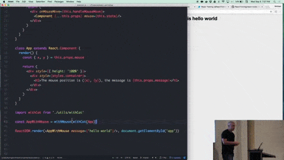

I don't know that I've ever been more excited about an
[egghead.io](http://egghead.io) course release before (having personally
published
[over 100 videos on egghead](https://egghead.io/instructors/react-vis), that's
saying something...). Two of my courses will be (have now been) released as part
of egghead's annual Christmas course release celebration 🎉 One is
[**The Beginner's Guide to ReactJS**](https://egghead.io/courses/the-beginner-s-guide-to-reactjs)
and the other is
[**Advanced React Component Patterns**](https://egghead.io/courses/advanced-react-component-patterns).
Combined they amount to about 2.5 hours of content. They're each 18 high-quality
videos. I can't wait for you all to see them!

I want to take this opportunity to talk about some of the patterns you'll learn
in the Advanced React Component Patterns course. I hope you find it helpful and
that this preview will help you be eager to give the course a look! 👀

The course starts with a single lesson where I
[implement](https://github.com/react-vis/advanced-react-patterns/blob/736bc941e629af5acae2e827356d6996e923780e/01-intro-to-react-toggled/index.html)
[a simple toggle component](https://cdn.rawgit.com/react-vis/advanced-react-patterns/736bc941e629af5acae2e827356d6996e923780e/01-intro-to-react-toggled/index.html)
that manages its own state. We use, refactor, and evolve this component to each
of the patterns. My hope is that by doing things this way you can quickly
identify the trade-offs of the different patterns and know when each pattern
would be most appropriate.

The course wraps up by
[refactoring](https://github.com/react-vis/advanced-react-patterns/blob/736bc941e629af5acae2e827356d6996e923780e/18-use-redux-with-render-props/index.html)
[the toggle component to a redux component](https://cdn.rawgit.com/react-vis/advanced-react-patterns/736bc941e629af5acae2e827356d6996e923780e/18-use-redux-with-render-props/index.html)
affectionately called "Rendux." I think that you'll be **blown away** by the
flexibility of some of these patterns to make this refactor a pretty
straightforward one.

Here's a high level overview of some of the patterns we cover in the course.

### Compound Components

Think of compound components like the `<select>` and `<option>` elements in
HTML. Apart they don't do too much, but together they allow you to create the
complete experience. The way they do this is by sharing implicit state between
the components. Compound components allow you to create and use components which
share this state implicitly.

In these lessons I show you how to create components which allow you to
show/hide the state for the component as well as choose where to render the
switch. We start with using `React.Children.map` to provide props to the
underlying components, then we switch to `context` to allow you to render the
components at the depth you like.

An interesting example of a compound component is
[seapig](https://www.npmjs.com/package/seapig).

### Higher Order Components

Higher Order Components (HOC) are functions which return a component (fun fact,
[the name "Higher Order Component"](https://twitter.com/react-vis/status/930832776907046912)
is a bit of
[a misnomer](https://twitter.com/react-vis/status/930844136617533441)). This
pattern is pretty widely popular. The most common example of a higher order
component is from [`react-redux`](https://www.npmjs.com/package/react-redux). It
allows you to share code by encapsulating logic in a "Wrapper" component which
renders a component you pass to the Higher Order Component function.

In this lesson we create a higher order component that adds the toggle
component's `context` to the props of the component we're "enhancing." This way
we can easily create custom components which have access to the toggle
component's `on` state and the `toggle` helper function.

There are actually six lessons dedicated to Higher Order Components in this
course. This is to give time to explain all the weird things we have to do to
make unobservable the fact your components use a Higher Order Components. If you
can't guess, I'm on team
["Use a Render Prop"](https://cdb.reacttraining.com/use-a-render-prop-50de598f11ce)
😉

That said, it's still valuable to understand this pattern as it's such a
widespread pattern and can still be useful. Later on, I show you how to
implement an HOC from a render prop, which leads us to our next pattern...

### Render Props

This is my favorite pattern! The earliest use of this pattern in React that I'm
aware of was in [`react-motion`](https://github.com/chenglou/react-motion) by
[Cheng Lou](https://twitter.com/_chenglou). In this lesson we go back to the
beginning a bit and slowly refactor our original toggle implementation to the
render prop pattern. Hopefully with this refactor you'll see both the power and
the simplicity of the render prop pattern.

The basic idea of the pattern is that rather than have the toggle component be
responsible for doing anything special in the `render` method, we delegate that
responsibility over to the user and we give them the state and functions
necessary to allow the user of the component to render what they need for their
use case.

My personal favorite implementation of this pattern (and some of the following
patterns) is [`downshift`](https://github.com/downshift-js/downshift)
[🏎](https://github.com/downshift-js/downshift), but
[I'm a little bit biased](/blog/introducing-downshift-for-react) 😅

### Prop Collections and Getters

Often when using the render prop, there are elements that commonly require the
same props applied for accessibility or interactivity purposes. In the toggle
example that applies to what we're calling the "toggler" or the button/element
that's responsible for changing the `on` state of our toggle component. So we
can take these common props and put them into an object collection which can be
applied to the element we want.

There's a problem with prop collections that has to do with composability and
leaky abstractions. If my prop collection uses an `onClick`, that's an
implementation detail, but if I want to apply an `onClick` to my toggle element
for my own behavior as well as apply your prop collection, that's going to lead
to some problems. So I show you how you can use prop (collection) getters to
avoid this shortcoming.

### State Initializers

This one's pretty simple and you've actually probably used this before, but I
show you a handy trick or two. Here we allow you to set the initial value
(similar to `defaultValue` in `<input />`) and then a nice way to expose a reset
helper function to allow users of the component to reset the component to its
initial state.

### Controlled Components

If you've ever "controlled" an `<input />` component before by using the `value`
prop, you might be interested to know how that works and how to implement it
yourself. That's what this is all about. The basic idea is that you take some
state which the component manages internally (like the `on` state in our Toggle
component) and give control over to props. That means you reference props
instead of state, and call prop callbacks instead of `setState`. It's an
interesting pattern that makes your component much more flexible: If a user of
your component doesn't like how your component manages state, they can manage it
themselves!

### Provider

You've very likely used a component that implements the Provider pattern before.
It's used by [`react-redux`](https://www.npmjs.com/package/react-redux),
[`react-router`](https://www.npmjs.com/package/react-router), and many other
popular libraries. The idea is actually similar to some of the things we did
when making the compound component work regardless of tree depth. We start by
using `context`, then change to use
[`react-broadcast`](https://www.npmjs.com/package/react-broadcast) so it works
through `shouldComponentUpdate`.

### Conclusion

Again, we wrap everything up by showing you that these patterns are powerful and
flexible enough to support both the state of a single boolean as well as our
entire application state with `redux`. I'm really excited for you to see this
one 😀

I really hope that this course will help you build more useful React components.
The course will hit [egghead.io](http://egghead.io) 🔜 Enjoy!

**Things to not miss**:

- [StackEdit](https://stackedit.io/app) is the tool I used to write this
  newsletter. It's a super duper awesome markdown editor :)
- [`ReactVR`](https://github.com/nitin42/React-AR) by the amazing
  [Nitin Tulswani](https://twitter.com/NTulswani/status/932165538318508033) 🕶
- [`chimi`](https://github.com/Huemul/chimi): Validate the JavaScript code of
  your Markdown files.
