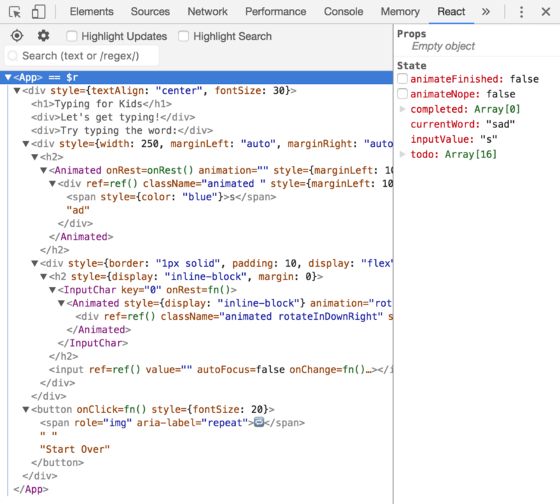
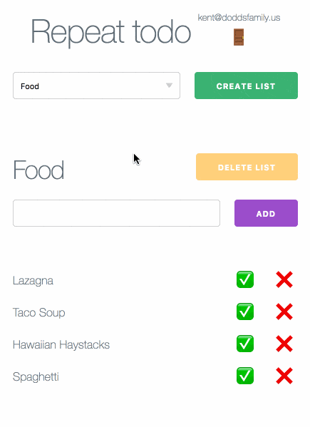

Earlier, [I mentioned](/blog/merry-christmas) that I made two apps for my
family. The first is [Typing for Kids](https://typing-for-kids.netlify.com)
which I made for my two oldest children, the second is
[Repeat Todo](https://repeat-todo.com) which I made for my wife.

Today I want to briefly talk about how I went about creating these apps as a way
to reiterate how awesome it is to build for the web these days.

### Typing for Kids ⌨️

I'll start with Typing for Kids because it's a fair amount simpler. I built it
because my kids often like to borrow my laptop to type like they see daddy
doing. The problem is
[my keyboard's repeat rate is set really fast](https://apple.stackexchange.com/questions/10467/how-to-increase-keyboard-key-repeat-rate-on-os-x),
so they have a hard time pressing the key fast enough to avoid the key repeating
many times. So the experience isn't altogether awesome. So I built typing for
kids to help them learn where the keys are on the keyboard and make it a more
enjoyable experience for them.

First off, my kids love it. So it's a super success. Also, it's only 3 files. It
_doesn't_ use redux or even react-router. In fact, all the state lives in the
top-level component. Here's the entire component tree:

You'll notice there are only 3 components. It's a ridiculously simple app. It
depends on `react`, `react-dom` and `animate.css`. I have a component to make
integrating with `animate.css` a little easier.

Another thing you'll find interesting is that I built the ENTIRE thing solely in
[CodeSandbox.io](http://codesandbox.io)! I never downloaded the source code
once. I used CodeSandbox's new
[GitHub integration](https://hackernoon.com/announcing-codesandbox-2-0-938cff3a0fcb)
feature to create
[the repository](https://github.com/kentcdodds/typing-for-kids), then their
[GitHub import](https://codesandbox.io/s/github) feature any time I wanted to
start working on it again. This is pretty amazing I think!

To get it deployed, I used the amazing [Netlify](https://netlify.com). They have
super GitHub integration as well which meant I didn't need to download anything
for that part either.

On top of that, because codesandbox's react template uses create-react-app, I
could leverage the
[service worker](https://github.com/facebook/create-react-app/blob/master/packages/react-scripts/template/README.md#making-a-progressive-web-app)
that the react-scripts build creates for me so this thing works totally offline.
I also added
[a manifest.json](https://github.com/kentcdodds/typing-for-kids/blob/7a8ff3fd0580258493b0963739dffbe596141277/public/manifest.json)
so when I pulled it up on my kids Chromebook I could add it directly to the
desktop like an installed app! So cool!

### Repeat Todo ✅

A while back I created [repeat todo](https://repeat-todo.surge.sh) for my wife
because she wanted an app where she could rotate chores/meals etc. Here's a
quick demo of the new version of the app to get an idea of what it's useful for:

It was awesome, but pretty limited because it uses local storage which means you
can only enter in the items on the device you'll use it on and if you get a new
device all the data is totally lost.

For a while I've been meaning to make an authenticated version with
[Firebase](https://firebase.google.com) as an authentication/storage provider to
solve these problems, so I decided to do that for her Christmas present.

Amazingly, I was able to build this just like the Typing for Kids app. 100% in
the browser without having to download anything.

This app is a little more complicated. Despite that it _still_ doesn't use
react-router or redux. It's a pretty simple app, and that's the beauty of it I
think. I did make a few more components via
[`glamorous`](https://glamorous.rocks) to make things visually consistent and
separate the styling components from the rest of the components. I also created
a few render prop components for the firebase authentication and data stuff.

You can find most of the interesting stuff in the
[`index.js`](https://github.com/kentcdodds/repeat-todo-v2/blob/master/src/index.js)
[file](https://github.com/kentcdodds/repeat-todo-v2/blob/master/src/index.js). I
think the thing that made it the most complicated is that
[Firebase doesn't work super well with arrays](https://firebase.googleblog.com/2014/04/best-practices-arrays-in-firebase.html)
and because order mattered (things will one day be resortable by the user,
[open issue, help wanted](https://github.com/kentcdodds/repeat-todo-v2/issues/2)),
I had to store it as an object and
[manually keep the order values correct](https://github.com/kentcdodds/repeat-todo-v2/blob/66e27104ba551f2637210347bab8ec06bdb90c47/src/index.js#L308-L337).

All-in-all it was a pretty fun experience and because **firebase works so well
offline**, this app can also leverage the service worker that react-scripts
gives me and can be an installable PWA on Android phones which I think is pretty
neat.

### Conclusion

What I love about this is how our tools have leveled the playing field. All of
these tools are 100% free so long as you have access to a computer with internet
access. Even if that computer is not yours, you don't have to download anything,
but you can still build amazing applications right in the browser and it's not a
terrible experience. It's a wonderful experience. The reason I didn't download
anything wasn't because I was trying to see if I could avoid it. It was because
I couldn't think of a reason why I'd really want to.

Another thing that I think you can take away from this is that as I built these
things, I learned stuff. I think that building things should be the way you
decide what to learn. Constantly consuming content just because it's out there
is fine, but it's hard to put it into context. If you're in the midst of
building something, it'll be a lot more valuable to you and stick much better.

**So try to identify a real (small) problem that you or your loved ones are
facing and build something to solve that problem. You'll learn a bunch!**

I hope this is helpful! Good luck!👍

**Things to not miss**:

- [Brandon Sanderson](https://brandonsanderson.com). Literally just read
  everything written by that man.
  [I recently read a bunch of stuff](https://twitter.com/kentcdodds/status/947657545056841728)
  and plan to read more.
- [JavaScript January](https://www.javascriptjanuary.com) is a cool thing that
  [Emily Freeman](https://twitter.com/editingemily) is doing. My article is the
  first one published!!
