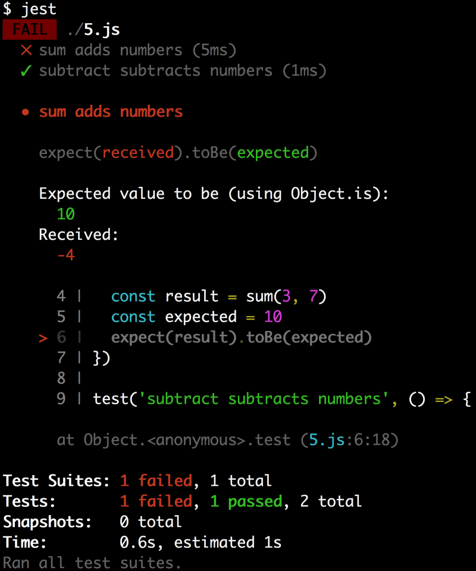

Testing software. There are a ton of reasons we do it. Here are a two of mine:

1.  Speeds up my workflow so I can develop software faster
2.  Helps me ensure I don't break existing code when making changes

That said, I have a few questions for you (these are twitter polls):

- [Have you ever written a JavaScript test?](https://twitter.com/react-vis/status/942625485829181441)
- [Have you ever used a JavaScript Testing Framework?](https://twitter.com/react-vis/status/942625486638759938)
- [Have you ever set up a JavaScript testing framework from scratch?](https://twitter.com/react-vis/status/942625487511154688)
- [Do you understand testing frameworks well enough to implement your own? (even a really simple one?)](https://twitter.com/react-vis/status/942625489348280320)

The goal of this post is to get each of you to be able to answer "Yes" to that
last question. So you have a fundamental understanding of what a test in
JavaScript even is which will help you write better tests.

So what we're going to do is take this simple `math.js` module and write tests
for the two functions it exposes:

```js
const sum = (a, b) => a + b
const subtract = (a, b) => a - b

module.exports = {sum, subtract}
```

**I've made**
[**a repo on GitHub**](https://github.com/react-vis/js-test-example) **you can
reference as well 🐙😸**

### Step 1

Here's the most basic form of a test I can think of:

```js
// basic-test.js
const actual = true
const expected = false
if (actual !== expected) {
  throw new Error('${actual} is not ${expected}')
}
```

You could run this test code by running `node basic-test.js`! That's a test! 🎉

**A test is code that throws an error when the actual result of something does
not match the expected output.** It can get more complicated when you're dealing
with code that depends on some state to be set up first (like a component needs
to be rendered to the document before you can fire browser events, or there
needs to be users in the database). However, it is relatively easy to test "pure
functions" like those in our `math.js` module (functions which will always
return the same output for a given input and not change the state of the world
around them).

**The part that says** `**actual !== expected**` **is called an
"assertion."**It's a way to say in code that one thing should be a certain value
or pass a certain... eh... test :) It could be an assertion that the `actual`
matches a regex, is an array with a certain length, or any number of things. The
key is that if our assertion fails, then we throw an error.

So here's what the most basic test would be for our `math.js`function:

```js
// 1.js
const {sum, subtract} = require('./math')

let result, expected

result = sum(3, 7)
expected = 10
if (result !== expected) {
  throw new Error(`${result} is not equal to ${expected}`)
}

result = subtract(7, 3)
expected = 4
if (result !== expected) {
  throw new Error(`${result} is not equal to ${expected}`)
}
```

There you go! Run that with `node` and the command will exit without error. Now,
let's break the `sum` function by changing the `+` to a `-` and run it again and
we'll see:

```
$ node 1.js
/Users/kdodds/Desktop/js-test-example/1.js:8
  throw new Error(`${result} is not equal to ${expected}`)
  ^

Error: -4 is not equal to 10
    at Object.<anonymous> (/Users/kdodds/Desktop/js-test-example/1.js:8:9)
    at Module._compile (module.js:635:30)
    at Object.Module._extensions..js (module.js:646:10)
    at Module.load (module.js:554:32)
    at tryModuleLoad (module.js:497:12)
    at Function.Module._load (module.js:489:3)
    at Function.Module.runMain (module.js:676:10)
    at startup (bootstrap_node.js:187:16)
    at bootstrap_node.js:608:3
```

Cool! We're benefitting from our basic tests already! We can't break the `sum`
function without breaking our automated test! Neato!

**One of the most important parts of testing frameworks (or assertion libraries)
is how helpful their error messages are.** Often when a test fails, the first
thing you'll see is the error message. If you can't figure out what the
underlying problem is from the error message, then you have to spend a few
minutes looking at the code to understand what went wrong. A lot of the quality
of the error message depends on how well you understand and use the assertions
provided by the framework you're using.

### Step 2

Did you know that Node actually has
[an](https://nodejs.org/api/assert.html#assert_assert)
[`assert`](https://nodejs.org/api/assert.html#assert_assert)
[module](https://nodejs.org/api/assert.html#assert_assert) for making assertions
like the one we have above 🤔? Let's refactor our test to use that module!

```js
// 2.js
const assert = require('assert')
const {sum, subtract} = require('./math')

let result, expected

result = sum(3, 7)
expected = 10
assert.strictEqual(result, expected)

result = subtract(7, 3)
expected = 4
assert.strictEqual(result, expected)
```

Nice! This is still a test module. This is functionally equivalent to what we
had before. The only difference is the error message:

```
$ node 2.js
assert.js:42
  throw new errors.AssertionError({
  ^

AssertionError [ERR_ASSERTION]: -4 === 10
    at Object.<anonymous> (/Users/kdodds/Desktop/js-test-example/2.js:8:8)
    at Module._compile (module.js:635:30)
    at Object.Module._extensions..js (module.js:646:10)
    at Module.load (module.js:554:32)
    at tryModuleLoad (module.js:497:12)
    at Function.Module._load (module.js:489:3)
    at Function.Module.runMain (module.js:676:10)
    at startup (bootstrap_node.js:187:16)
    at bootstrap_node.js:608:3
```

You'll notice that the error thrown no longer includes any of our own code in it
which is a shame... 😦 But let's keep going.

### Step 3

Let's go ahead and write our own simple testing "framework" and assertion
library. We'll start with the assertion library. So instead of Node's built-in
`assert` module we'll create a library we'll call `expect`. Here's our
refactored test with that change:

```js
// 3.js
const {sum, subtract} = require('./math')

let result, expected

result = sum(3, 7)
expected = 10
expect(result).toBe(expected)

result = subtract(7, 3)
expected = 4
expect(result).toBe(expected)

function expect(actual) {
  return {
    toBe(expected) {
      if (actual !== expected) {
        throw new Error(`${actual} is not equal to ${expected}`)
      }
    },
  }
}
```

Cool, so now we can add a bunch of assertions on that object we return (like
`toMatchRegex` or `toHaveLength`). Oh, and here's the error message now:

```
$ node 3.js
/Users/kdodds/Desktop/js-test-example/3.js:17
        throw new Error(`${actual} is not equal to ${expected}`)
        ^

Error: -4 is not equal to 10
    at Object.toBe (/Users/kdodds/Desktop/js-test-example/3.js:17:15)
    at Object.<anonymous> (/Users/kdodds/Desktop/js-test-example/3.js:7:16)
    at Module._compile (module.js:635:30)
    at Object.Module._extensions..js (module.js:646:10)
    at Module.load (module.js:554:32)
    at tryModuleLoad (module.js:497:12)
    at Function.Module._load (module.js:489:3)
    at Function.Module.runMain (module.js:676:10)
    at startup (bootstrap_node.js:187:16)
    at bootstrap_node.js:608:3
```

Ok, things are looking good.

### Step 4

But now here's the problem 😖... If I see that error message, how do I know that
the `sum` function is the one that's broken? It could be the `subtract` module.
Also, the source of the test doesn't do a good job of keeping tests isolated
(visually or otherwise).

So let's write a helper function to make that work:

```js
// 4.js
const {sum, subtract} = require('./math')

test('sum adds numbers', () => {
  const result = sum(3, 7)
  const expected = 10
  expect(result).toBe(expected)
})

test('subtract subtracts numbers', () => {
  const result = subtract(7, 3)
  const expected = 4
  expect(result).toBe(expected)
})

function test(title, callback) {
  try {
    callback()
    console.log(`✓ ${title}`)
  } catch (error) {
    console.error(`✕ ${title}`)
    console.error(error)
  }
}

function expect(actual) {
  return {
    toBe(expected) {
      if (actual !== expected) {
        throw new Error(`${actual} is not equal to ${expected}`)
      }
    },
  }
}
```

Now we can put everything relevant to a given test within our "test" callback
function and we can give that test a name. Then we use that `test` function to
not only give a more helpful error message but also run all the tests in the
file (without bailing on the first error)! Here's the output now:

```
$ node 4.js
✕ sum adds numbers
Error: -4 is not equal to 10
    at Object.toBe (/Users/kdodds/Desktop/js-test-example/4.js:29:15)
    at test (/Users/kdodds/Desktop/js-test-example/4.js:6:18)
    at test (/Users/kdodds/Desktop/js-test-example/4.js:17:5)
    at Object.<anonymous> (/Users/kdodds/Desktop/js-test-example/4.js:3:1)
    at Module._compile (module.js:635:30)
    at Object.Module._extensions..js (module.js:646:10)
    at Module.load (module.js:554:32)
    at tryModuleLoad (module.js:497:12)
    at Function.Module._load (module.js:489:3)
    at Function.Module.runMain (module.js:676:10)
✓ subtract subtracts numbers
```

Sweet! Now we see the error itself _and_ we see the title of the test so we know
which one to go about fixing.

### Step 5

So all we need to do now is
[write a CLI tool](/blog/tips-for-making-a-cli-based-tool-with-node) that will
search for all our test files and run them! That bit is pretty simple at first,
but there are a LOT of things we can add on top of it. 😅

At this point, we're building a testing framework and test runner. Luckily for
us, there are a bunch of these built already! I've tried a ton of them and
they're all great. That said, nothing comes close to serving my use cases better
than [Jest](https://facebook.github.io/jest) 🃏. It's an amazing tool
([learn more about Jest here](http://kcd.im/egghead-jest)).

So, instead of building our own framework, let's just go ahead and switch our
test file to work with Jest. As it so happens, it already does! All we have to
do is remove our own implementation of `test` and `expect` because Jest includes
those in our tests as global objects! So here's what it looks like now:

```js
// 5.js
const {sum, subtract} = require('./math')

test('sum adds numbers', () => {
  const result = sum(3, 7)
  const expected = 10
  expect(result).toBe(expected)
})

test('subtract subtracts numbers', () => {
  const result = subtract(7, 3)
  const expected = 4
  expect(result).toBe(expected)
})
```

When we run this file with Jest, here's what the output looks like:

```
$ jest
 FAIL  ./5.js
  ✕ sum adds numbers (5ms)
  ✓ subtract subtracts numbers (1ms)

● sum adds numbers

expect(received).toBe(expected)

    Expected value to be (using Object.is):
      10
    Received:
      -4

      4 |   const result = sum(3, 7)
      5 |   const expected = 10
    > 6 |   expect(result).toBe(expected)
      7 | })
      8 |
      9 | test('subtract subtracts numbers', () => {

      at Object.<anonymous>.test (5.js:6:18)

Test Suites: 1 failed, 1 total
Tests:       1 failed, 1 passed, 2 total
Snapshots:   0 total
Time:        0.6s, estimated 1s
Ran all test suites.
```

You can't tell from the text, but that output is colored. Here's an image of the
output:



It has color coding which is really helpful in identifying the parts that are
relevant 😀 **It also shows the code where the error was thrown! Now _that's_ a
helpful error message!**

### Conclusion

So, what's a JavaScript test? It's simply some code which sets up some state,
performs some action, and makes an assertion on the new state. We didn't talk
about
[common framework helper functions](https://facebook.github.io/jest/docs/en/api.html)
like
[`beforeEach`](https://facebook.github.io/jest/docs/en/api.html#beforeeachfn-timeout)
or
[`describe`](https://facebook.github.io/jest/docs/en/api.html#describename-fn),
and there are a lot more
[assertions](https://facebook.github.io/jest/docs/en/expect.html) we could add
like
[`toMatchObject`](https://facebook.github.io/jest/docs/en/expect.html#tomatchobjectobject)
or
[`toContain`](https://facebook.github.io/jest/docs/en/expect.html#tocontainitem).
But hopefully this gives you an idea of the fundamental concepts of testing with
JavaScript.

I hope this is helpful to you! Good luck! 👍
