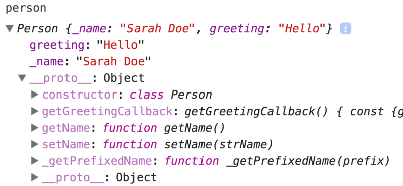
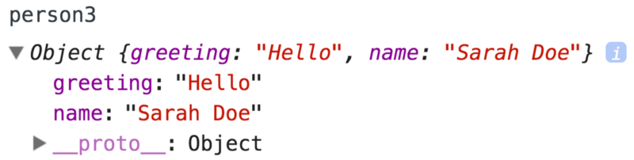
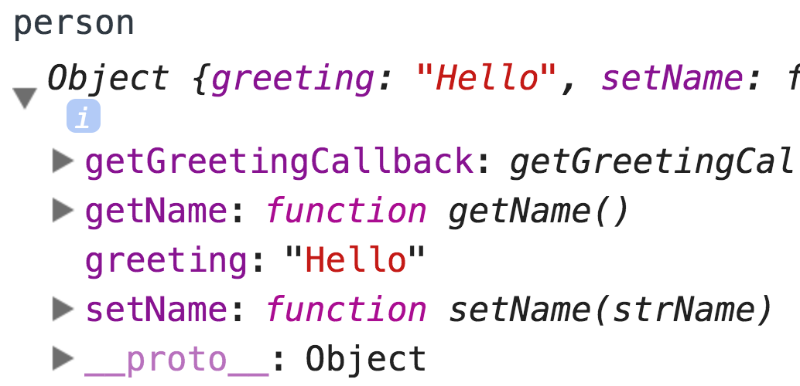

When it comes to applications intended to last, I think we all want to have
simple code that's easier to maintain. Where we often really disagree is how to
accomplish that. In this blog post I'm going to talk about how I see functions,
objects, and classes fitting into that discussion.

### A class

Let's take a look at an example of a class implementation to illustrate my
point:

```javascript
class Person {
  constructor(name) {
    // common convention is to prefix properties with `_`
    // if they're not supposed to be used. See the appendix
    // if you want to see an alternative
    this._name = name
    this.greeting = 'Hey there!'
  }
  setName(strName) {
    this._name = strName
  }
  getName() {
    return this._getPrefixedName('Name')
  }
  getGreetingCallback() {
    const {greeting, _name} = this
    return subject => `${greeting} ${subject}, I'm ${_name}`
  }
  _getPrefixedName(prefix) {
    return `${prefix}: ${this._name}`
  }
}
const person = new Person('Jane Doe')
person.setName('Sarah Doe')
person.greeting = 'Hello'
person.getName() // Name: John Doe
person.getGreetingCallback()('Jeff') // Hello Jeff, I'm Sarah Doe
```

So we've declared a `Person` class with a constructor instantiating a few member
properties as well as a couple of methods. With that, if we type out the
`person` object in the Chrome console, it looks like this:



The real benefit to notice here is that most of the properties for this `person`
live on the `prototype` (shown as `__proto__` in the screenshot) rather than the
instance of `person`. This is not insignificant because if we had ten thousand
instances of `person` they would all be able to share a reference to the same
methods rather than having ten thousand copies of those methods everywhere.

What I want to focus on now is how many concepts you have to learn to really
understand this code and how much complexity those concepts add to your code.

- Objects: Pretty basic. Definitely entry level stuff here. They don't add a
  whole lot of complexity by themselves.
- Functions (and
  [closures](https://developer.mozilla.org/en-US/docs/Web/JavaScript/Closures)):
  This is also pretty fundamental to the language. Closures do add a bit of
  complexity to your code (and can cause
  [problems](https://blog.meteor.com/an-interesting-kind-of-javascript-memory-leak-8b47d2e7f156)
  if you're not careful), but you really can't make it too far in JavaScript
  without having to learn these. (Learn more
  [here](https://developer.mozilla.org/en-US/docs/Web/JavaScript/Closures)).
- A function/method's `this` keyword: Definitely an important concept in
  JavaScript.

> My assertion is that `this` is hard to learn and can add unnecessary
> complexity to your codebase.

### The `this` keyword

Here's what
[MDN](https://developer.mozilla.org/en-US/docs/Web/JavaScript/Reference/Operators/this)
has to say about `this`:

> A function's `this` keyword behaves a little differently in JavaScript
> compared to other languages. It also has some differences between
> [strict mode](https://developer.mozilla.org/en-US/docs/Web/JavaScript/Reference/Functions_and_function_scope/Strict_mode)
> and non-strict mode.

> In most cases, the value of `this` is determined by how a function is called.
> It can't be set by assignment during execution, and it may be different each
> time the function is called. ES5 introduced the
> [`bind`](https://developer.mozilla.org/en-US/docs/Web/JavaScript/Reference/Global_Objects/Function/bind)method
> to
> [set the value of a function's](https://developer.mozilla.org/en-US/docs/Web/JavaScript/Reference/Operators/this#The_bind_method) >
> [`this`](https://developer.mozilla.org/en-US/docs/Web/JavaScript/Reference/Operators/this#The_bind_method) >
> [regardless of how it's called](https://developer.mozilla.org/en-US/docs/Web/JavaScript/Reference/Operators/this#The_bind_method),
> and ES2015 introduced
> [arrow functions](https://developer.mozilla.org/en-US/docs/Web/JavaScript/Reference/Functions/Arrow_functions)
> whose `this` is lexically scoped (it is set to the `this` value of the
> enclosing execution context).

Maybe not rocket science 🚀, but it's an implicit relationship and it's
definitely more complicated than just objects and closures. You can't get away
from objects and closures, but I believe you _can_ often get away with avoiding
classes and `this` most of the time.

Here's a (contrived) example of where things can break down with `this`.

```javascript
const person = new Person('Jane Doe')
const getGreeting = person.getGreeting
// later...
getGreeting() // Uncaught TypeError: Cannot read property 'greeting' of undefined at getGreeting
```

> The core issue is that your function has been
> "[complected](https://youtu.be/rI8tNMsozo0)" with wherever it is referenced
> because it uses `this`.

For a more real world example of the problem, you'll find that this is
especially evident in React ⚛️. If you've used React for a while, you've
probably made this mistake before as I have:

```jsx
class Counter extends React.Component {
  state = {clicks: 0}
  increment() {
    this.setState({clicks: this.state.clicks + 1})
  }
  render() {
    return (
      <button onClick={this.increment}>
        You have clicked me {this.state.clicks} times
      </button>
    )
  }
}
```

When you click the button you'll see:
`Uncaught TypeError: Cannot read property 'setState' of null at increment`

And this is all because of `this`, because we're passing it to `onClick` which
is not calling our `increment` function with `this` bound to our instance of the
component. There are various ways to fix this
([watch this free 🆓 egghead.io video 💻 about how](https://egghead.io/lessons/javascript-public-class-fields-with-react-components)).

> The fact that you have to think about `this` adds cognitive load that would be
> nice to avoid.

### How to avoid `this`

So, if `this` adds so much complexity (as I'm asserting), how do we avoid it
without adding even more complexity to our code? How about instead of the
object-oriented approach of classes, we try a more functional approach? This is
how things would look if we used
[pure functions](https://en.wikipedia.org/wiki/Pure_function):

```javascript
function setName(person, strName) {
  return Object.assign({}, person, {name: strName})
}

// bonus function!
function setGreeting(person, newGreeting) {
  return Object.assign({}, person, {greeting: newGreeting})
}

function getName(person) {
  return getPrefixedName('Name', person.name)
}

function getPrefixedName(prefix, name) {
  return `${prefix}: ${name}`
}

function getGreetingCallback(person) {
  const {greeting, name} = person
  return subject => `${greeting} ${subject}, I'm ${name}`
}

const person = {greeting: 'Hey there!', name: 'Jane Doe'}
const person2 = setName(person, 'Sarah Doe')
const person3 = setGreeting(person2, 'Hello')
getName(person3) // Name: Sarah Doe
getGreetingCallback(person3)('Jeff') // Hello Jeff, I'm Sarah Doe
```

With this solution we have no reference to `this`. We don't have to think about
it. As a result, it's easier to understand. Just functions and objects. There is
basically no state you need to keep in your head at all with these functions
which makes it very nice! And the person object is just data, so even easier to
think about:



Another nice property of functional programming that I won't delve into very far
is that it's very easy to unit test. You simply call a function with some input
and assert on its output. You don't need to set up any state beforehand. That's
a very handy property!

Note that functional programming is more about making code easier to understand
so long as it's "fast enough." Despite speed of execution not being the focus,
there are some reeeeally nice perf wins you _can_ get in certain scenarios (like
reliable `===` equality checks for objects for example). More often than not,
**your use of functional programming will _often be way down on the list of
bottlenecks that are making your application slow._**

### Cost and Benefit

Usage of `class` is not bad. It definitely has its place. If you have some
really
["hot" code](https://en.wikipedia.org/wiki/Hot_spot_%28computer_programming%29)
that's a bottleneck for your application, then using `class` can really speed
things up. But 99% of the time, that's not the case. And I don't see how
`class`es and the added complexity of `this` is worth it for most cases (let's
not even get started with
[prototypal inheritance](https://developer.mozilla.org/en-US/docs/Web/JavaScript/Inheritance_and_the_prototype_chain)).
I have yet to have a situation where I needed `class`es for performance. So I
_only_ use them for React components because that's what you have to do if you
need to use state/lifecycle methods (but maybe not in the
[future](https://github.com/reactjs/react-future/tree/master/07%20-%20Returning%20State)).

### Conclusion

Classes (and prototypes) have their place in JavaScript. But they're an
optimization. They don't make your code simpler, they make it more complex. It's
better to narrow your focus on things that are not only simple to learn but
simple to understand: functions and objects.


See you [around](https://twitter.com/react-vis) friends!

### Appendix

Here are a few extras for your viewing pleasure :)

#### The Module Pattern

Another way to avoid the complexities of `this` and leverages simple objects and
functions is the Module pattern. You can learn more about this pattern from
[Addy Osmani](https://twitter.com/addyosmani)’s
“[Learning JavaScript Design Patterns](https://addyosmani.com/resources/essentialjsdesignpatterns/book)”
book which is available to read for free
[here](https://addyosmani.com/resources/essentialjsdesignpatterns/book/#modulepatternjavascript).
Here’s an implementation of our `person` class based on Addy’s
“[Revealing Module Pattern](https://addyosmani.com/resources/essentialjsdesignpatterns/book/#revealingmodulepatternjavascript)”:

```javascript
function getPerson(initialName) {
  let name = initialName
  const person = {
    setName(strName) {
      name = strName
    },
    greeting: 'Hey there!',
    getName() {
      return getPrefixedName('Name')
    },
    getGreetingCallback() {
      const {greeting} = person
      return subject => `${greeting} ${subject}, I'm ${name}`
    },
  }
  function getPrefixedName(prefix) {
    return `${prefix}: ${name}`
  }
  return person
}

const person = getPerson('Jane Doe')
person.setName('Sarah Doe')
person.greeting = 'Hello'
person.getName() // Name: Sarah Doe
person.getGreetingCallback()('Jeff') // Hello Jeff, I'm Sarah Doe
```

What I love about this is that there are few concepts to understand. We have a
function which creates a few variables and returns an object — simple. Pretty
much just objects and functions. For reference, this is what the person object
looks like if you expand it in Chrome DevTools:



Just an object with a few properties.

One of the flaws of the module pattern above is that every `person` has its very
own copy of each property and function For example:

```javascript
const person1 = getPerson('Jane Doe')
const person2 = getPerson('Jane Doe')
person1.getGreetingCallback === person2.getGreetingCallback // false
```

Even though the contents of the `getGreetingCallback` function are identical,
they will each have their own copy of that function in memory. Most of the time
this doesn’t matter, but if you’re planning on making a ton of instances of
these, or you want creating these to be more than fast, this can be a bit of a
problem. With our `Person` class, every instance we create will have a reference
to the exact same method `getGreetingCallback`:

```javascript
const person1 = new Person('Jane Doe')
const person2 = new Person('Jane Doe')
person1.getGreetingCallback === person2.getGreetingCallback // true
// and to take it a tiny bit further, these are also both true:
person1.getGreetingCallback === Person.prototype.getGreetingCallback
person2.getGreetingCallback === Person.prototype.getGreetingCallback
```

The nice thing with the module pattern is that it avoids the issues with the
callsite we saw above.

```javascript
const person = getPerson('Jane Doe')
const getGreeting = person.getGreeting
// later...
getGreeting() // Hello Jane Doe
```

We don’t need to concern ourselves with `this` at all in that case. And there
are [other issues](https://twitter.com/BrendanEich/status/871876967796056067)
with relying heavily on closures to be aware of. It’s all about trade-offs.

#### Private properties with classes

If you really do want to use `class` and have private capabilities of closures,
then you may be interested in
[this proposal](https://github.com/littledan/proposal-class-fields) (currently
[stage-2](https://github.com/tc39/proposals), but unfortunately no babel support
[yet](https://github.com/babel/babel/issues/4408)):

```javascript
class Person {
  #name
  greeting = 'hey there'
  #getPrefixedName = (prefix) => `${prefix}: ${this.#name}`
  constructor(name) {
    this.#name = name
  }
  setName(strName) {
    #name = strName
    // look at this! shorthand for:
    // this.#name = strName
  }
  getName() {
    return #getPrefixedName('Name')
  }
  getGreetingCallback() {
    const {greeting} = this
    return (subject) => `${this.greeting} ${subject}, I'm ${#name}`
  }
}
const person = new Person('Jane Doe')
person.setName('Sarah Doe')
person.greeting = 'Hello'
person.getName() // Name: Sarah Doe
person.getGreetingCallback()('John') // Hello John, I'm Sarah Doe
person.#name // undefined or error or something... Either way it's totally inaccessible!
person.#getPrefixedName // same as above. Woo! 🎊 🎉
```

So we’ve got the solution to the privacy problem with that proposal. However it
doesn’t rid us of the complexities of `this`, so I’ll likely only use this in
places where I _really_ need performance gains of `class`.

I should also note that you _can_ use a WeakMap to get privacy for classes as
well, like I demonstrate in the
[WeakMap exercises](https://github.com/uber/react-vis/es6-workshop/blob/2a6bf446c95a387c8e87c1398444733618265c8a/exercises-final/13_weakmap.test.js#L10-L23)
in the [es6–workshop](https://github.com/uber/react-vis/es6-workshop).

#### Additional Reading

This article by [Tyler McGinnis](https://twitter.com/tylermcginnis) called
[“Object Creation in JavaScript”](https://tylermcginnis.com/object-creation-in-javascript-functional-instantiation-vs-prototypal-instantiation-vs-pseudo-e9287b6bbb32)
is a terrific read.

If you want to learn about functional programming, I highly suggest
“[The Mostly Adequate Guide to Functional Programming](https://drboolean.gitbooks.io/mostly-adequate-guide)”
by [Brian Lonsdorf](https://twitter.com/drboolean), and (for those of you with a
Frontend Masters subscription)
“[Functional-Lite JavaScript](https://frontendmasters.com/courses/functional-js-lite)”
by [Kyle Simpson](https://medium.com/@kylesimpson).
