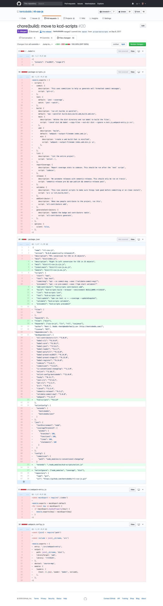

Current Translations:

- [Español](https://medium.com/@enbonnet/juegos-de-herramientas-toolkits-8f3df94404e9)
  by [Ender Bonnet](https://twitter.com/enBonnet)

About a month ago, I roped myself into a conversation about the merits of "zero
config" tools when jumped into a twitter thread with
[this](https://twitter.com/kentcdodds/status/941330985836208128):

https://twitter.com/kentcdodds/status/941330985836208128

There were some dissenting opinions about this. Because twitter is a pretty poor
medium to build a case for your opinion, I've decided to write out my thoughts
and justifications for "zero config" tools. Instead of "zero config" though,
we're going to refer to these as "toolkits" 🛠 📦 as coined in
[Dan Abramov](https://twitter.com/dan_abramov)'s
[talk](https://youtu.be/G39lKaONAlA&list=PLBnKlKpPeagkaVtpmZNK6XiWw8yNZmCxL).

### So what's a toolkit? 🛠 📦

Toolkits are "a set of tools in any form that allows you to create applications
with no build configuration." (via [Ronald Rey](https://twitter.com/reyronald)
in [awesome-toolkits](https://github.com/reyronald/awesome-toolkits)). For a few
examples:
[react-scripts](https://github.com/facebook/create-react-app/tree/master/packages/react-scripts)
(what [create-react-app](https://github.com/facebook/create-react-app) leaves
you with), my own [paypal-scripts/kcd-scripts](/blog/tools-without-config),
[parcel](https://github.com/parcel-bundler/parcel),
[preact-cli](https://github.com/developit/preact-cli),
[ember-cli](https://ember-cli.com) (the first widely used toolkit for JS), and
[many more](https://github.com/reyronald/awesome-toolkits).

The idea behind these tools is it allows you to install a single dependency in
your project which normally includes a CLI you can use to run scripts for your
projects. They generally will use tools under the hood to accomplish their job.
Some toolkits are focused on a specific part of your project's needs (like
parcel or preact-cli which focus on the build) while other tools cover much more
(like react-scripts which also covers testing and my scripts projects which
cover a TON of stuff like prettier auto-formatting, releasing, etc). The goal is
that they cover as many use cases as possible without requiring any
configuration, and in many cases allow for some additional configuration to
cover more use cases.

### Simple (loose) analogy 🚌

This morning I took my sons on a city bus ride. They loved it. While on the ride
I was thinking about this newsletter and realized that toolkits are similar to
city busses/public transit. A city bus system covers as many use cases as
possible by creating bus routes in the high traffic areas of the city. Some
people do need the power and flexibility of their own vehicle, but in big
cities, many people can get around exclusively using public transit. For those
people, they can be effective in the city without even learning how to drive
themselves let alone own a car 🚗.

Owning a car and learning to drive it is nice, but if you can get around without
worrying about it, then a whole category of problems can go away (like pushing
maintenance of the vehicle off to someone else). It's a bit of a loose analogy,
but maybe it'll help a bit with understanding the role that toolkits can play.

### Why toolkits?

People who are used to building/learning/configuring widely used tools have
asked me why I would ever want to build and help popularize toolkits. Here are a
few of the reasons [I'm working on toolkits](/blog/tools-without-config) for
paypal and
[my own open source projects](https://github.com/kentcdodds/kcd-scripts).

### Keeping config updated

If you've ever created more than one project with the same or similar tooling
use cases, then you've probably cloned a previous project, removed some or all
of the source code and left the tooling mostly the same. Raise your hand if
you've ever copy/pasted a webpack config before (/me ✋). What inevitably
happens for me is as I'm working on the second project, I realize something neat
and improve the configuration. Then later I'll go back to the original project
and realize that I haven't updated that configuration yet so I'll have to update
that project too.

This isn't a big deal... until you have dozens of projects and you're not the
only one working on them. Keeping configuration updated can be a real pain.

### Keeping tools updated

We're always excited when tools are updated. Especially with breaking changes!
Not because of the breaking changes, but because often maintainers of these
tools wait to push breaking changes until there's a compelling reason to do so:
big improvements by way of features/performance/etc.

That said, I don't think anyone's excited about actually updating their codebase
to handle these changes. This is another reason toolkits are so great. Check out
[this git diff](https://twitter.com/kentcdodds/status/906238861067657221):



<figcaption>That's a lot of config code removal 😍</figcaption>

Almost 2 dozen dependencies replaced with 1. And a bunch of configuration for
those dependencies entirely removed and replaced with a few simple scripts. And
this is one of my smaller/simpler projects.

That diff matches that of dozens of other open source projects I have. Managing
all the config was a nightmare 👻 🙀 before I built
[`kcd-scripts`](https://github.com/kentcdodds/kcd-scripts). Whenever there was a
change in babel or webpack config, or even a simple update in jest, I had to go
to every project to update them. Now however, **I can simply go to**
`**kcd-scripts**`**, address any breaking changes, and push out a patch release
with any version bumps to all underlying tools.**

As it turns out _most_ of the time when tools push out breaking changes, it's
because the configuration changed, not because you need to change your source
code. So putting all the config in one place and keeping it updated there is
really handy. On top of that, when I decided to switch from webpack to rollup
for my bundling tool, I didn't need to change how I used `kcd-scripts` at all!
Just push out a minor version bump and suddenly all projects have the new
feature. That's just... awesome 🕶

### Focus on shipping

All of these benefits get even more awesome when you're talking about working
with teams of people. At PayPal, we have a bunch of teams with expert engineers.
Some of the smartest people I know. Despite this, we're duplicating a TON of
effort by configuring tools. I recently did a search on our internal GitHub and
found we had 635 `webpack.config.js` files, 897 `.babelrc` files, and
5,657 `.eslintrc` files 😱 On top of this, several of those of us who have the
time and knowledge of these tools spend a LOT of time supporting and answer
questions about them.

Not every team can afford to have an expert in every tool they use. I agree that
people should understand their underlying tools, but at some point you've gotta
ship stuff 🚢 and it sure would be nice if folks could focus on the features and
bug fixes of their end product rather than honing their webpack config jitsu. By
consolidating common use cases into a single tool, you can enable that and folks
don't have to worry about keeping dozens of tools and plugins up to date. They
just rely on the single tool. On top of that, because they don't have to worry
about the configuration or keeping things updated, we get a lot fewer questions
and can focus our time on improving the user experience of the tool and other
things that are important to PayPal.

### Addressing common concerns with toolkits

#### But... use cases!?

In response to my tweet, [Sean T. Larkin](https://twitter.com/TheLarkInn)
[said](https://twitter.com/TheLarkInn/status/941375505730715648):

https://twitter.com/TheLarkInn/status/941375505730715648

This is a pretty common and legitimate rebuttal for toolkits. However, most
toolkits are at least one of two things:

1.  Made to support _common_ use cases, not all of them.
2.  Actually still configurable.

#### Common use cases

[`create-react-app`](https://github.com/facebook/create-react-app) generates a
very simple react app that leaves you with toolkit called
[`react-scripts`](https://github.com/facebook/create-react-app/tree/master/packages/react-scripts).
This covers the building, testing, and linting of your react application
projects. It's fantastic and used in a
[TON of projects on GitHub (180k search results)](https://github.com/search?l=JSON&q=react-scripts&type=Code&utf8=%E2%9C%93)
and you'll find some real world applications mentioned from
[my tweet question](https://twitter.com/kentcdodds/status/950924626317656064)
and
[Dan's tweet question](https://twitter.com/dan_abramov/status/952248179478745089).

While it's impressive that real-world production applications are built using
`react-scripts`, that's actually not the core goal of the project. "The purpose
of this tool is to provide the best experience for people getting started with
React"
([CONTRIBUTING.md#core-ideas](https://github.com/facebook/create-react-app/blob/master/CONTRIBUTING.md#core-ideas)).

**Toolkits don't try to handle the 10000 of use cases in the world. Instead,
they use underlying tools and some glue to put together a single tool that can
handle as many use cases as possible without complicating the tool too much or
requiring config.** If your use case is a special snowflake, then you do have a
recourse available. With `react-scripts` you can
[eject](https://github.com/facebook/create-react-app/blob/master/packages/react-scripts/template/README.md#npm-run-eject).
With most other tools however, you have another option...

#### Still configurable

Most other "zero config" tools (toolkits) are **actually still configurable.**
As [I tweeted](https://twitter.com/kentcdodds/status/942177631981649921) a while
back:

https://twitter.com/kentcdodds/status/942177631981649921

This allows toolkits to cover even more use cases. For example, folks who don't
want to eject from `react-scripts` (because they like all the aforementioned
benefits), can use
[react-app-rewired](https://github.com/timarney/react-app-rewired). People using
[Next.js](https://github.com/zeit/next.js) have a `next.config.js` file they can
use to tweak the default behavior. In fact, even
[`webpack`](https://webpack.js.org) (inspired in part by
[parcel](https://github.com/parcel-bundler/parcel) I assume) will soon enter the
world of toolkits but still configurable tools:

https://twitter.com/TheLarkInn/status/949050181261012992

With `kcd-scripts` and `paypal-scripts`, I've made most of the underlying
generated config "smart" in that it determines what configuration to use based
on your project. For example, if you have `react` as a dependency, then the
ESLint config will include
[rules for accessible JSX](https://github.com/evcohen/eslint-plugin-jsx-a11y).
There are a bunch of these nifty tricks that I think tools can and do use to
give you the best experience out of the box.

However, if that's not enough, there is a simple and intuitive way to override
the configuration. You simply start configuring the underlying tools... So if
you're not happy with the underlying Jest configuration, then you can simply add
a `jest` property to your `package.json` or a `jest.config.js` file to the root
of your repository and you're off to the races! `paypal-scripts` will use your
configuration instead of the built-in configuration.

On top of that, `paypal-scripts` exposes the built-in configuration. So if you
like most of the built-in config, but want to make a change, you could do this:

```js
// jest.config.js
const builtInJestConfig = require('paypal-scripts/jest')
builtInJestConfig.notify = true
module.exports = builtInJestConfig
```

And poof! Now you _still_ don't need to keep your tool up to date so long as the
parts of the config you're altering are never changed.

Oh, and if you'd rather use another testing framework, then you can do that too.
Just don't use the `paypal-scripts test` script. Use whatever parts of the tool
you want.

One argument that [Rich Harris](https://twitter.com/Rich_Harris) made against
the `paypal-scripts`approach is
[this](https://twitter.com/Rich_Harris/status/941355856674934784):

https://twitter.com/Rich_Harris/status/941355856674934784

I can understand that for sure and it is a shame that you lose discoverability.
But I think that's a fine trade-off for all the aforementioned benefits of not
having to configuring anything 80% of the time or worry about keeping tools
updated. If I forced you to make a configuration file for each of these tools,
it would be a hurdle to favor the 20% who need it forced upon the 80% who don't.
Also, everyone of you reading this right now already understand how
`paypal-scripts` works in this regard. 😉

And just to drive the point home a little further... Most devs using these kinds
of tools don't know or care how they work or are configured. They just want to
ship stuff. I really appreciated the perspective
[TJ Holowaychuk](https://twitter.com/tjholowaychuk)
[gave](https://twitter.com/tjholowaychuk/status/941361591861223424) in the
thread:

https://twitter.com/tjholowaychuk/status/941361591861223424

So while it's nice to think that everyone should just understand how the tools
work so they can fix their own problems, the fact is that most of the time the
tools are configured just enough until they barely work, and then engineers move
on to other tasks that are less arduous than tweaking a webpack config (let
alone continuing on to include tools that could really help their code quality
and prevent bugs like a good type checker or more helpful non-stylistic ESLint
rules).

### Conclusion

I realize this newsletter is a little bit more ranty than normal. I hope that
it's helpful though. I'd like to finish with a quote from
[Dan Abramov](https://twitter.com/dan_abramov)'s talk
["The Melting Pot of JavaScript" at Zeit Day](https://youtu.be/G39lKaONAlA&list=PLBnKlKpPeagkaVtpmZNK6XiWw8yNZmCxL):

> _I've heard from several people that they've consolidated their companies tool
> dependencies into a single package and this worked really well for them. I
> encourage you to try this approach out and let me know what you think..._

Give it a try and maybe you'll find that it's not horrible. I know I've been
loving `kcd-scripts` on my projects and I'm looking forward to getting more
adopters of `paypal-scripts` at PayPal 😀 Good luck! 👍

**Things to not miss**:

- [`babel-plugin-macros`](https://github.com/facebook/create-react-app/pull/3675)
  [merged into](https://github.com/facebook/create-react-app/pull/3675)
  [`create-react-app`](https://github.com/facebook/create-react-app/pull/3675)!!!
  CRA v2 will be released soon I think 😀
- Read
  [Zero Config with babel-plugin-macros](https://babeljs.io/blog/2017/09/11/zero-config-with-babel-macros)
  to learn more about why getting it in CRA is so awesome.
- [Tweet from Dan](https://twitter.com/dan_abramov/status/952510006548627461)
  saying "let's stop creating "boilerplates" and instead make reusable versioned
  toolkits."
