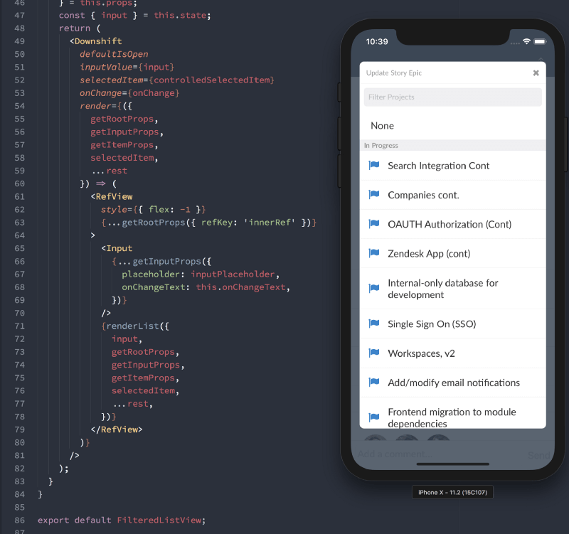

_Even better accessibility, React Native and ReasonReact support, even simpler
API, improved docs, new examples site, Flow and TypeScript support, and a new
online community ⚛️_

I'm excited to let the world know that downshift 2.0.0 has been released! So I'm
going to do it now:

> Hey world! downshift 2.0.0 has been released!

Woo! So what do you have to look forward to? Let's dive in! (If you haven't
heard of downshift, consider reading
[the original release post](/blog/introducing-downshift-for-react)).

### Improved Accessibility ([**#a11y**](https://twitter.com/hashtag/a11y))

Lead primarily by [Michael Ball](https://github.com/cycomachead) (with helpful
reviews from several others), we
[received](https://github.com/downshift-js/downshift/pull/285) a number of
improvements to the accessibility features baked-into downshift. He also added a
new
[`getMenuProps`](https://github.com/downshift-js/downshift/blob/master/README.md#getmenuprops)
[prop getter](/blog/how-to-give-rendering-control-to-users-with-prop-getters)
(which was also instrumental in fixing
[a bug with React Portals](https://github.com/downshift-js/downshift/issues/287)).
This allows us to add some `aria-` attributes to the menu you render that will
help assistive technologies use your enhanced input components! Woo! I've also
updated many of the examples to use more semantically correct elements.

### React Native Support

We've actually had this for a while in 1.x, but I wanted to include this in the
blog post because there was never really an official announcement and I think
that this is great! This is largely thanks to work by
[Eli Perkins](https://github.com/eliperkins)! They've already shipped downshift
to production in their iOS app:

### ReasonReact Support

We've actually had this for a while too, but I want to call it out especially.
Thanks to [Nicola Molinari](https://github.com/emmenko) there are
[official Reason bindings for downshift](https://github.com/downshift-js/downshift/blob/master/README.md#bindings-for-reasonml).
So you can build UIs for any platform you can imagine with downshift and
[ReasonML](https://reasonml.github.io). Soooo cool!

### Simpler API

It's generally a good idea to avoid APIs which allow two ways to do the same
thing. It's just another thing to list in docs, and you have to help people
understand what the differences are (if there are any).

Up until downshift 2.0.0, we had two props that could be used for your
[render prop](https://cdb.reacttraining.com/use-a-render-prop-50de598f11ce):
`render` and `children`. Then React released the official context API which uses
render props and they called it `children`. In an effort to develop consistency
throughout the ecosystem, we've dropped the prop called `render` and now only
support `children`.

### Improved Docs

After downshift was out for a while, I started to realize that folks missed out
on some of the more useful and necessary props (like
[`itemToString`](https://github.com/downshift-js/downshift/blob/master/README.md#itemtostring)).
I blame myself for this and recently reorganized the docs to make more relevant
information more apparent.

### New Examples Site

It's just getting started (so there are only a few examples), but it's here and
ready for contributions!

Find it and contribute
([right in the browser!](https://hackernoon.com/announcing-codesandbox-2-0-938cff3a0fcb))
on codesandbox!

- Codesandbox:
  [codesandbox.io/s/github/react-vis/downshift-examples](https://codesandbox.io/s/github/react-vis/downshift-examples)
- GitHub:
  [https://github.com/react-vis/downshift-examples](https://github.com/react-vis/downshift-examples)

<figcaption>The codesandbox for the examples site</figcaption>

### Improved TypeScript Support

A great effort lead primarily by
[@stereobooster](https://github.com/stereobooster) has lead to improved
TypeScript definitions for downshift. Even if you don't use TypeScript, you'll
benefit from these typings as they will help ensure we don't publish breaking
changes unknowingly and if you use VSCode you'll benefit from these typings with
the built-in Intellisense!

### Support for Flow!

Another awesome contribution by
[@stereobooster](https://github.com/stereobooster). We're now generating flow
type definitions from the TypeScript definitions, so if you're on the Flow
train, you'll get more type-safety when working with downshift!

### We're on spectrum!

[**downshift**](https://spectrum.chat/downshift)

Yeehaw! Join us there to talk about the present and future of downshift and get
help/help others.

### Thanks

This release and these amazing features would not be possible without help from
all our open source contributors. I'd like to especially thank these awesome
people:

[@stereobooster](https://github.com/stereobooster),
[@franklixuefei](https://github.com/franklixuefei),
[@dovidweisz](https://github.com/dovidweisz),
[@Antontelesh](https://github.com/Antontelesh),
[@tansongyang](https://github.com/tansongyang),
[@Andarist](https://github.com/Andarist),
[@cycomachead](https://github.com/cycomachead),
[@mperrotti](https://github.com/mperrotti),
[@SiTaggart](https://github.com/SiTaggart), and
[@1Copenut](https://github.com/1Copenut)

Thank you!

[_See the release notes for more info on this release_](https://github.com/downshift-js/downshift/releases/tag/v2.0.0)
