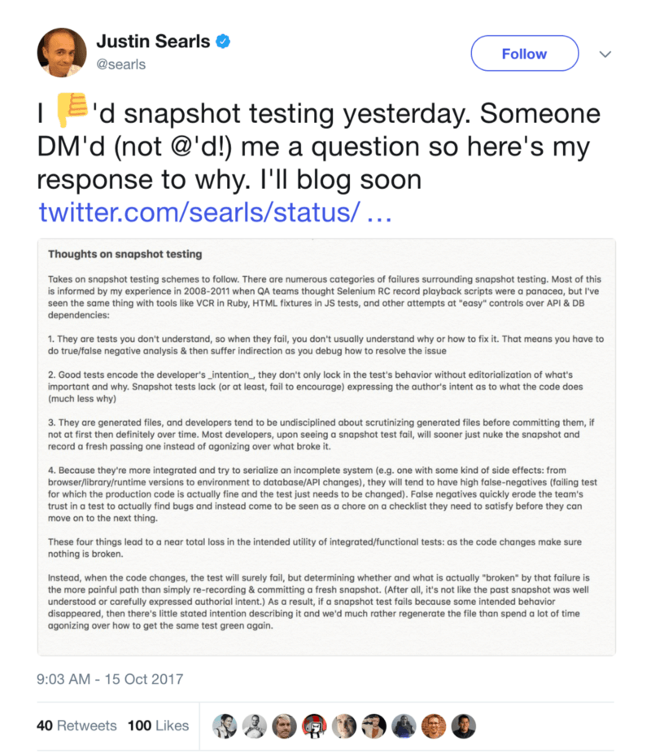

I guess I've been on a bit of a testing kick recently, I promise this newsletter
will delve into more stuff later. But I saw
[this tweet](https://twitter.com/searls/status/919594505938112512) from
[Justin Searls](https://twitter.com/searls) (a developer who I admire with a
great deal of experience in testing) and thought it would be a great subject to
write about.

In that tweet, Justin shares a screenshot of a bunch of his thoughts on snapshot
testing. For the sake of accessibility, I've typed out the entirety of what he
wrote below. I'll then talk about some of my thoughts on what he says.



> **_Thoughts on snapshot testing_**

> _Takes on snapshot testing schemes to follow. There are numerous categories of
> failures surrounding snapshot testing. Most of this is informed by my
> experience in 2008–2011 when QA teams thought Selenium RC record playback
> scripts were a panacea, but I've seen the same thing with tools like VCR in
> Ruby, HTML fixtures in JS tests, and other attempts at "easy" controls over
> API & DB dependencies:_

> They are tests you don't understand, so when they fail, you don't usually
> understand why or how to fix it. That means you have to do true/false negative
> analysis & then suffer indirection as you debug how to resolve the issue

> Good tests encode the developer's _intention_, they don't only lock in the
> test's behavior without editorialization of what's important and why. Snapshot
> tests lack (or at least, fail to encourage) expressing the author's intent as
> to what the code does (much less why)

> They are generated files, and developers tend to be undisciplined about
> scrutinizing generated files before committing them, if not at first then
> definitely over time. Most developers, upon seeing a snapshot test fail, will
> sooner just nuke the snapshot and record a fresh passing one instead of
> agonizing over what broke it.

> Because they're more integrated and try to serialize an incomplete system
> (e.g. one with some kind of side effects: from browser/library/runtime
> versions to environment to database/API changes), they will tend to have high
> false-negatives (failing test for which the production code is actually fine
> and the test just needs to be changed). False negatives quickly erode the
> team's trust in a test to actually find bugs and instead come to be seen as a
> chore on a checklist they need to satisfy before they can move on to the next
> thing.

> _These four things lead to a near total loss in the intended utility of
> integrated/functional tests: as the code changes make sure nothing is broken._

> _Instead, when the code changes, the tests will surely fail, but determining
> whether and what is actually "broken" by that failure is the more painful path
> than simply re-recording & committing a fresh snapshot. (After all, it's not
> like the past snapshot was well understood or carefully expressed authorial
> intent.) As a result, if a snapshot test fails because some intended behavior
> disappeared, then there's little stated intention describing it and we'd much
> rather regenerate the file than spend a lot of time agonizing over how to get
> the same test green again._

If you know me, you'll know that I really appreciate the
[Jest's snapshot testing feature](https://facebook.github.io/jest/docs/en/snapshot-testing.html).
(For those of you subscribed on egghead.io
[watch this](https://egghead.io/lessons/javascript-use-jest-s-snapshot-testing-feature?pl=testing-javascript-with-jest-a36c4074)).
That said, I share Justin's feelings about them on many levels. The quote above
from Justin is just full of golden insights that we should not ignore. I've
personally experienced many of the pitfalls with snapshot testing that Justin
calls out (with myself and with others). So thanks for sharing your thoughts
Justin!


_One thing I want to make clear before continuing is that snapshot testing is an
assertion, just like the_ `_toBe_` _in:_ `_expect('foo').toBe('foo')_`_. I think
there's sometimes confusion on this point, so I just wanted to clear that up._

Despite Justin's arguments against snapshots, I'd suggest that there is value in
them if you use them effectively. With that in mind, I thought I'd share a few
cases where snapshot testing really shines, things to avoid with snapshots, and
things you can do to make your snapshots more effective:

### Where snapshot testing shines

#### Error Messages and logs

If you're writing a tool for developers, it's a really common case that you want
to write a test to ensure that a good error or warning message is logged to the
console for the developers using your tool. Before snapshot testing I would
always write a silly regex that got the basic gist of what the message should
say, but with snapshot testing it's so much easier.

Here's an example of this from [kcd-scripts](/blog/tools-without-config):

- [Tests](https://github.com/uber/react-vis/kcd-scripts/blob/11f6218772ee2075cebddadd30a50a6d4bdec637/src/__tests__/index.js)
- [Snapshot output](https://github.com/uber/react-vis/kcd-scripts/blob/11f6218772ee2075cebddadd30a50a6d4bdec637/src/__tests__/__snapshots__/index.js.snap)

#### [`babel-plugin-tester`](https://github.com/babel-utils/babel-plugin-tester)

**I honestly don't know how I'd test babel plugins with anything but Jest
snapshot testing.** It would be prohibitively difficult to attempt asserting on
the resulting AST. `babel-plugin-tester` uses snapshots for its assertion and
they're fantastic. They avoid a lot of the pitfalls that Justin mentions because
of the way the results are serialized. Here's
[an example](https://github.com/uber/react-vis/import-all.macro/blob/0069f82e78e4af69444284b078e88ba424c550a4/src/__tests__/__snapshots__/macro.js.snap#L38-L59)
from [import-all.macro](https://github.com/uber/react-vis/import-all.macro):

```
exports[`importAll.sync uses static imports 1`] = `

import importAll from 'import-all.macro'

const a = importAll.sync('./files/*.js')

      ↓ ↓ ↓ ↓ ↓ ↓

import * as _filesAJs from './files/a.js'
import * as _filesBJs from './files/b.js'
import * as _filesCJs from './files/c.js'
import * as _filesDJs from './files/d.js'

const a = {
  './files/a.js': _filesAJs,
  './files/b.js': _filesBJs,
  './files/c.js': _filesCJs,
  './files/d.js': _filesDJs,
}
```

What makes this snapshot good is it can communicate the intent by the title of
the snapshot and the before/after (with the `↓` separating the before from the
after). What's cool about this is for any plugin using `babel-plugin-tester` I
can just look at the snapshot file and get a great idea for how the plugin
works. 😎

#### [`jest-glamor-react`](https://github.com/uber/react-vis/jest-glamor-react)

Have you ever shipped code that busted your app user experience because styling
wasn't applied properly? I have. Writing tests to ensure this kind of confidence
is really difficult. Even E2E tests can't reliably test this kind of thing.
There are tools that will take visual snapshots and do visual diff comparisons.
But these tools are difficult to set up, run, and are often quite flaky. On top
of that, they're basically snapshot tests, so they suffer from many of the same
things Justin calls out about snapshot tests too!

That said, we still get these bugs and it'd be nice to avoid them. If you're
using CSS-in-JS, there's a great way to use snapshot testing to reduce some of
the difficulty of testing these kinds of changes. If you use a tool like
`jest-glamor-react`then you can include the applicable CSS with whatever you
rendered.
[For example](https://github.com/uber/react-vis/jest-glamor-react/blob/84ace7c093d49344268b25a0d5a2518cd20922da/src/__snapshots__/serializer.test.js.snap#L101-L124):

```js
exports[`enzyme.render 1`] = `  
.glamor-1,  
[data-glamor-1] {  
  padding: 4em;  
  background: papayawhip;  
}  
  
.glamor-0,  
[data-glamor-0] {  
  font-size: 1.5em;  
  text-align: center;  
  color: palevioletred;  
}  
  
<section  
  class="glamor-1"  
>  
  <h1  
    class="glamor-0"  
  >  
    Hello World, this is my first glamor styled component!  
  </h1>  
</section>  
`
```

This is nice because now if we change logic so some styles aren't applied
properly we'll know about it. It does still suffer from the problems Justin
mentions, but I think it's worth it.

### Things to avoid with snapshots

#### HUGE snapshots

This is probably the biggest cause for all the things that Justin's talking
about. When your snapshot is more than a few dozen lines it's going to suffer
major maintenance issues and slow you and your team down. **_Remember that tests
are all about giving you confidence that you wont ship things that are broken_**
and you're not going to be able to ensure that very well if you have huge
snapshots that nobody will review carefully. I've personally experienced this
with a snapshot that's over 640 lines long. Nobody reviews it, the only care
anyone puts into it is to nuke it and retake it whenever there's a change (like
Justin mentioned).

**So, avoid huge snapshots and take smaller, more focused ones. While you're at
it, see if you can actually change it from a snapshot to a more explicit
assertion (because you probably can 😉).**

> _I should add that even huge snapshots aren't_ entirely _useless. Because if
> the snapshot changes unexpectedly it can (and has) inform us that we've made a
> change with further reaching impacts than anticipated._

Edit: Since I wrote this blog post, a new lint rule was added to
eslint-plugin-jest called
["no-large-snapshots"](https://github.com/jest-community/eslint-plugin-jest/blob/master/docs/rules/no-large-snapshots.md)
that could be pretty helpful in discouraging large snapshots 👍

### Making your snapshots more effective

#### Custom serializers

`jest-glamor-react` is in fact a custom serializer. This has made our snapshots
much more effective. Writing a custom serializer is actually quite simple.
[Here's one that I wrote](https://github.com/uber/react-vis/babel-macros/blob/520e58f4b0888c37f9811beb773d154cf3c23a72/src/__tests__/index.js#L28-L38)
which normalizes paths so any path in the snapshot is relative to the project
directory and looks the same on windows and mac:

```
const projectRoot = path.join(__dirname, '../../')
expect.addSnapshotSerializer({
  test: val => typeof val === 'string',
  print: val =>
    val
      .split(projectRoot)
      .join('<PROJECT_ROOT>/')
      .replace(/\/g, '/'),
})
```

There are a bunch of things you can do with custom serializers. I highly suggest
the talk
["Jest Snapshots and Beyond"](https://youtu.be/HAuXJVI_bUs&list=PLb0IAmt7-GS3fZ46IGFirdqKTIxlws7e0)
from [Rogelio Guzman](https://twitter.com/rogeliog) at React Conf 2017 where he
talks about this more.

### [`snapshot-diff`](https://github.com/jest-community/snapshot-diff)

One of the most useful things that I've found with test maintainability is when
you have many tests that look the same, try to make their differences stand out.
This makes it easier for people coming into your codebase to know what the
important pieces are. So you can try to split out the common setup/teardown into
a small helper function to make the test have more differences and fewer
commonalities to each other.

I've seen some tests where you take one snapshot of a react component before the
user interacts and another after the user interacts. What you're trying to
assert on is the difference between the before and after, but you get much more
than you bargain for and this results in more false negatives that Justin's
talking about. However, if you could serialize the difference between the two
states, that would be much more helpful. And that's what `snapshot-diff` can do
for you:

```jsx
const React = require('react')
const {toMatchDiffSnapshot} = require('snapshot-diff')
const Component = require('./Component')

expect.extend({toMatchDiffSnapshot})

test('snapshot difference between 2 React components state', () => {
  expect(<Component test="say" />).toMatchDiffSnapshot(
    <Component test="my name" />,
  )
})
```

And the snapshot will be just the difference between the two (looks like a git
diff).

**Things to not miss:**

- ["I haven't experienced imposter syndrome, and maybe you haven't either"](https://rachsmith.com/2017/i-dont-have-imposter-syndrome) — a
  great blog post by a great person [Rach Smith](https://rachsmith.com) (who
  happens to also tweet interesting things, I suggest you
  [give her a follow](https://twitter.com/rachsmithtweets))
- [`seapig`](https://github.com/enkidevs/seapig) - 🌊🐷 Utility for generalized
  composition of React components
- [`eslint-plugin-no-editor-code`](https://github.com/lukebelliveau/eslint-plugin-no-editor-code)
  - ESlint plugin to remove vscode folding comments. Because
    [code folding is super annoying](https://twitter.com/react-vis/status/918321670183514119).
- [`is-ci`](https://github.com/watson/is-ci) - Detect if your code is running on
  a CI server
  ([I used this recently](https://twitter.com/react-vis/status/918605888373559296)
  and it was great)
- [`pullit`](https://github.com/jkup/pullit) - Display and pull branches from
  GitHub pull requests. Pretty handy!
- [`downshift-hoc`](https://codesandbox.io/s/017n1jqo00) - `withDownshift` HOC
  and a few components you can use to avoid a render prop. A pretty interesting
  example!
