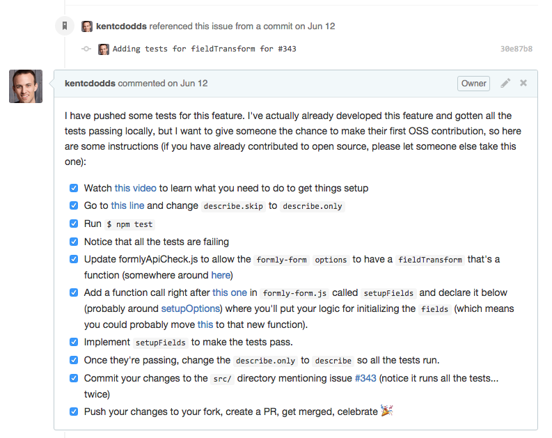

I've started doing something recently that's been really rewarding. I'm the
maintainer of [angular-formly](https://github.com/formly-js/angular-formly) a
fairly popular library for forms with [AngularJS](https://angularjs.org). I've
committed a lot of code and the library has
[33 contributors](https://github.com/formly-js/angular-formly/graphs/contributors)
right now. For at least five of these contributors, it was their first time
contributing to an open source library.

I've tried really hard to make it easy to contribute to angular-formly. I've
done all of the common things an open source project maintainer does and some
less common things...

- Set up the (often ignored)
  [CONTRIBUTING.md](https://github.com/formly-js/angular-formly/blob/master/CONTRIBUTING.md)
- Try hard to organize the code and comment where necessary
- Add an
  [up-for-grabs](https://github.com/formly-js/angular-formly/issues?utf8=%E2%9C%93&q=label%3Aup-for-grabs+)
  label (and angular-formly is now on
  [up-for-grabs.net](http://up-for-grabs.net/#))
- Add a githook (using [ghooks](http://npm.im/ghooks)) that runs the tests and
  checks coding standards with [eslint](http://eslint.org) so people don't have
  the frustration of going back and forth on the PR.
- Use [npm scripts](https://docs.npmjs.com/misc/scripts) so people don't have to
  understand or globally install any build tools

I've even recorded
[screencasts](https://youtu.be/QOchwBm9W-g&index=5&list=PLV5CVI1eNcJi7lVVIuNyRhEuck1Z007BH)
to demonstrate how to get things setup. But what I didn't realize was that there
was still something missing...

---

A few months back, angular-formly got a
[pull request](https://github.com/formly-js/angular-formly/pull/211) from
[Koen Weyn](https://github.com/koenweyn) who wanted to fix some IE8
compatibility issues with the project. He submitted a good PR
([pull request](https://help.github.com/articles/using-pull-requests)), we
iterated on it a little bit, and it got merged. He mentioned to me that it was
his first ever GitHub pull request. That was a neat experience. It was cool to
be a part of someone’s first ever open source code contribution.

It wasn’t until a few months later that I had an idea. While developing
[a new feature](https://github.com/formly-js/angular-formly/issues/343) doing
TDD
([Test Driven Development](https://wikipedia.org/wiki/Test-driven_development))
all the way (and loving it), I finished the tests and was about ready to start
on the implementation. Then I had a thought: “Why don’t I let someone else work
on this? I know exactly what I’d do. I could do some hand-holding and help
someone contribute to open source for the first time.”

Small tangent… I’m a happy father of two. When teaching or playing with my kids,
sometimes I have to ask my daughter to give her brother a chance to answer a
question. Many people are eager to please and help out. So when I throw out a
soft-ball to my son, if I don’t ask my daughter to let her little brother
answer, she’ll spout out the answer and he’ll have a harder time
learning/feeling the satisfaction of answering. I think that sometimes we adults
can behave the same way.

So I decided to commit the tests, but skipped (so the build wouldn’t fail)
(using `describe.skip` from [Mocha](http://mochajs.org)), then I pushed them up
and added
[this comment](https://github.com/formly-js/angular-formly/issues/343#issuecomment-111495740)
to the issue:

Make it as is easy as possible. Say exactly where the code needs to go and
recommend a good approach.

_The hard part of getting into open source for the first time isn’t the
implementation of a feature, but figuring out how to actually contribute code._

So I explain exactly what to do in the issue, and then I blasted it out on
[Twitter](https://twitter.com/kentcdodds/status/609354862074052608),
[Gitter](https://gitter.im/formly-js/angular-formly), and
[Slack](http://angularbuddies.com):

https://twitter.com/kentcdodds/status/609354862074052608

It wasn’t long before I had several people reach out to me on all three mediums
asking if they could take a swing at it. Finally with
[this PR](https://github.com/formly-js/angular-formly/pull/351),
[Stephen Bluck](https://github.com/stevebluck) took his first step into the open
source community.

It felt awesome! So I looked for opportunities to do this some more. I’ve had
the chance to do this
[three](https://github.com/formly-js/angular-formly/issues/358#issuecomment-115251096)
[more](https://github.com/formly-js/angular-formly/issues/398#issuecomment-125195897)
[times](https://github.com/formly-js/angular-formly/issues/410#issuecomment-127227984)
and it’s been rewarding for both me and the contributor each time. The project
now has a
[first-timers-only](https://github.com/formly-js/angular-formly/issues?utf8=%E2%9C%93&q=label%3Afirst-timers-only+)
label for this purpose. Shoutouts go to
[Douglas Mason](https://github.com/douglas-mason),
[Devan Beitel](https://github.com/DevanB), and
[Brian Macheski](https://github.com/bmacheski) for taking up the challenge. For
those of you who haven’t had a chance yet, don’t worry, there’s definitely more
to come…

---

Now, could I have finished it quicker and moved on my way if I’d just done it
myself? Of course. But that’s not what it’s all about as an open source
contributor. It’s fun delivering good software that helps other people, but also
realize that there are tons of people out there who just don’t know where to get
started.

Some of you may be asking yourself, “what if I (and other lib users) don’t want
to wait days for the feature?” From my experience, people are eager to try it
out. At least one PR (sometimes several) is submitted, iterated on, and merged
within a matter of a few hours.

I’ve thought back on
[my first pull request](https://github.com/playframework/playframework/pull/616).
It was nothing spectacular. It was really small. I learned how to use git and
GitHub. It gave me an opportunity to figure out what contributing feels like.
That’s a rewarding feeling. As open source project maintainers, we are empowered
with the ability to help newcomers feel this for the first time and contribute
back. Let’s do it!

---

### A small plea

If you are an open source project maintainer, give this a shot. Add the label
**first-timers-only** to your project so people can find it
[here](https://github.com/search?utf8=%E2%9C%93&q=label%3Afirst-timers-only+is%3Aopen&type=Issues&ref=searchresults).
You might also consider referencing
[makeapullrequest.com](http://makeapullrequest.com). I think that we can be more
friendly to newcomers in the open source community. You never know, you may find
a new main contributor to the project or even a new life-long friend. Either
way, the more people we get into open source the better. And by being open like
this, we’re helping
“[Bring Kindness back to Open Source](http://www.hanselman.com/blog/BringKindnessBackToOpenSource.aspx).”

See you on the [githubs](https://github.com/kentcdodds) and
[twitters](https://twitter.com/kentcdodds)!

---

Watch my Fluent Conf 2016 talk
“[The First Pull Request](http://slides.com/kentcdodds/1st-pr)”

https://youtube.com/watch?v=HjgZQeMrw6c&list=PLV5CVI1eNcJgNqzNwcs4UKrlJdhfDjshf

---

**Read next:**

- [Introducing: How to Contribute to Open Source](/blog/introducing-how-to-contribute-to-open-source)
- [How getting into Open Source has been awesome for me](/blog/how-getting-into-open-source-has-been-awesome-for-me)
- [What open source project should I contribute to?](/blog/what-open-source-project-should-i-contribute-to)
- [How to Write a JavaScript Library](/blog/how-to-write-a-javascript-library)
