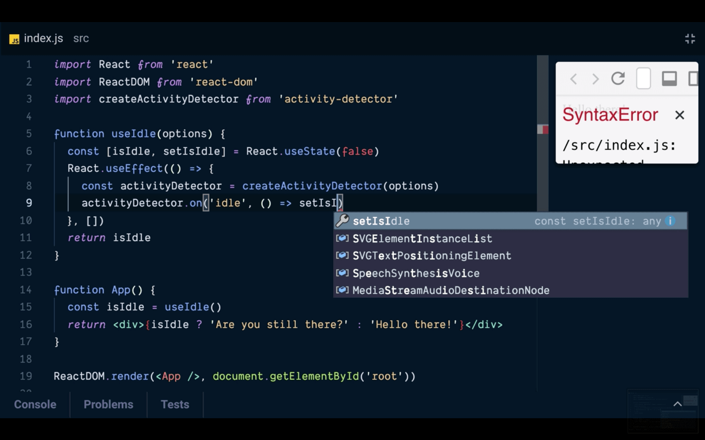

I've been teaching for as long as I can remember. I talk about this a lot in
["Why and How I started public speaking"](/blog/why-and-how-i-started-public-speaking),
but just know that I have a love of teaching, I've done it a lot, and I want to
do more. **This is why I'm excited to announce that I've gone full-time
educator!**

What does this mean? Well, it means that I'll be able to spend my daytime
completely focused on making content that will **help you level up your skills
as a developer**. And it means that I can spend my nighttime with my wife and
kids (not that I wasn't, but when I've worked on big things like
[TestingJavaScript.com](https://testingjavascript.com) my wife didn't see much
of me in the evenings).

So what am I working on? Here are a few things I'm planning:

1. Remote workshops. Lots of remote workshops. Stay tuned for more info on how
   to sign up for those :)
2. More sites like [TestingJavaScript.com](https://testingjavascript.com). Stuff
   for React, JavaScript, HTML, CSS, and more more more!
3. Quality improvements to [DevTips with Kent](https://kcd.im/devtips)
   livestreams!
4. Some time to write and publish my fantasy novels:
   [Shurlan](https://kcd.im/shurlan) ⚪
5. More [egghead.io](https://kcd.im/egghead) and
   [Frontend Masters](https://kcd.im/fem) courses!
6. Improved curation of the mountain of content I've put together over the
   years, making it easier for you to pull value out of the stuff I'm creating.
7. Quality improvements to this newsletter, my website, and blog. Also making it
   easier to get value from that stuff.
8. There's more... But I'm going to surprise you 😜

## Conclusion

I had amazing experiences and co-workers at PayPal. I built some things that I'm
really proud of while there. If you're looking for a place to work, I highly
recommend you [give PayPal a close look](http://paypal.jobs).

I can't wait to show you what I have in store for you. Just to get things going,
I made this egghead.io lesson today! Give it a watch 💯

[**Detect user activity with a custom useIdle React Hook**](https://egghead.io/lessons/react-detect-user-activity-with-a-custom-useidle-react-hook?pl=react-hooks-and-suspense-650307f2)

Good luck, and stay tuned!
