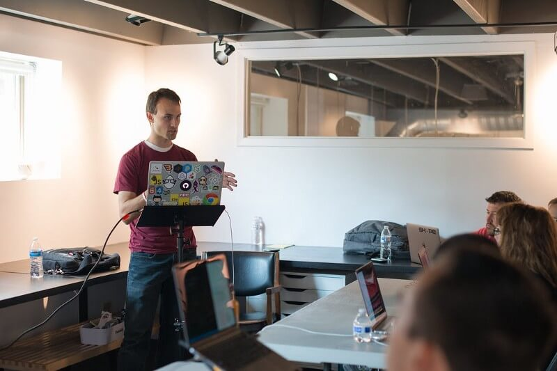
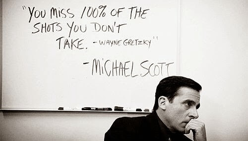

This last week I had three people complaining to me (in individual interactions)
that they create cool things, but what they create is not noticed because they
don't have a following on Twitter or otherwise. In at least one of the cases
there was a fair amount of bitterness. An attitude of: "If you create something
it becomes popular by virtue of you being so popular. If I create something, it
goes unnoticed even if it's better than what you created."

While this may be true, the attitude bothers me. I'd be classified in the
"popular" crowed, so maybe that's why it bothers me, but it also bothers me
because it feels like
["pride from the bottom looking up"](https://www.lds.org/general-conference/1989/04/beware-of-pride)
or could also come from
[a fixed mindset](https://mindsetonline.com/whatisit/about). I wasn't born with
a twitter following (though I was born into privilege which makes a non-trivial
impact, and I'll address that later). I worked for this by creating things and
doing things to get noticed even before I had the following. This is true of
most people with a wide reach. In today's newsletter, I'd like to share with you
some things that I've seen be an effective way to get your work noticed and
widen your reach.

There's not one thing I've done to get noticed and widen my reach. And there's
also not a sequence. It's been a mix of several things (including hard work,
luck, timing, and kindness of others) that have helped me to do this. Depending
on what you're trying to get noticed for, there are different things you can do,
so I'll focus on a few and hopefully that'll touch on what you're doing...

### [Open source](https://github.com/react-vis)

### [geniejs 🧞‍](https://github.com/react-vis/genie)

My first personal open source project that I wanted to get noticed was
[geniejs](https://github.com/react-vis/genie).
[The first commit](https://github.com/react-vis/genie/commit/18db942457d8e7855a3afbb7345e9f8aa5c5a8ce)
was back in 2013. I can't remember exactly how many followers I had, but at the
time
[I was tweeting](https://twitter.com/search?l=&q=from%3Areact-vis%20since%3A2013-08-01%20until%3A2013-08-31&src=typd)
using [Friends+ me](https://friendsplus.me) (because I thought Google+ was the
bomb) and of all my tweets that month, only one got a single favorite. Needless
to say, I wasn't well known or popular.

And honestly, my project didn't get super popular at the time either. However,
that didn't stop me from working on getting it noticed. I presented it at my
work's hack night around that time (it's actually
[how I got my first fulltime job at Domo](https://github.com/react-vis/ama/issues/1)),
I built [a sweet in-browser workshop](http://react-vis.github.io/genie/workshop)
and used it in
[my first meetup talk](https://www.meetup.com/UtahJS-Orem-Meetup/events/156148202),
I then lucked out and got a conference (MidwestJS 2014) to accept me to give
that talk there (I only was able to speak because another speaker canceled).

Here are some takeaways from this experience: It never got very popular or
widely used (it's still not, despite my level of reach, though
[it is used by codesandbox!](https://github.com/CompuIves/codesandbox-client/blob/76815f14c90e85c95c604624466fe2d50c995204/packages/app/src/app/pages/Sandbox/QuickActions/index.js)).
Despite this it gave me opportunities to improve my skills, show my skills, get
a job, and speak at a meetup and conference. This was primarily a combination of
luck, timing, assistance (my friend
[Merrick Christensen](https://twitter.com/iammerrick) should be thanked for
helping me turn this into a job opportunity), courage (to propose my library as
the subject for a talk at a meetup and conference), and hard work/persistence (I
documented the library very well and built a great learning experience).

### [angular-formly](https://github.com/formly-js/angular-formly)

About a year after I started work on geniejs (when I still did not have much by
way of a twitter following, etc.), I was moonlighting at a small startup that
had a pretty basic CRUD app with a TON of forms. I looked around at the
AngularJS form libraries, found one I really liked and before long
[I made my first pull request to angular-formly](https://github.com/formly-js/angular-formly/pull/17).
At the time, it wasn't a terribly popular project itself, but I needed it and it
satisfied most of my use cases.

In the weeks that followed I made more and more pull requests and before too
long, the project maintainer (who was no longer using the project) asked me if I
wanted to take the project over as the maintainer. I accepted and began the work
of improving the project and building a community.

Honestly, at the time I wasn't really thinking that's what I was doing. A lot of
my concern was the excitement of hearing that people were using something that I
built and a desire for my library to be the best in its class. Definitely not
the most pure motivations, but my results were positive and within a few months,
[downloads quadrupled](https://npm-stat.com/charts.html?package=angular-formly&from=2015-01-01&to=2018-09-01)
and to my knowledge, angular-formly is still the number one most downloaded
AngularJS forms library.

So what did I do to build such popularity of the project so quickly? Well, one
thing I did (which I don't recommend) was I sorta sold my soul to the project. I
allowed myself to get carried away in answering issues as if they were paid
support requests. I prided myself on responding to issues in seconds and having
a fix pushed out in minutes. This was a lot of fun, but it did put strain on my
important relationships and my mental health, which is why I don't recommend it.

I've found that you can build a strong and positive community without
sacrificing your well-being and relationships. That's a subject for another blog
post. Just know that working on building a community by
[creating fantastic documentation](https://twitter.com/react-vis/status/582620905433489408)(including
[several free egghead.io lessons](http://docs.angular-formly.com/docs/learn-angular-formly)),
[encouraging contribution](/blog/first-timers-only), and
[recognizing and trusting contributors](https://github.com/all-contributors/all-contributors)
is an important part of getting adoption and recognition for your open source
work.

Other things that I did which were significant help were similar to what I did
with geniejs: I spoke at meetups and conferences (my talk at MidwestJS 2015 was
about angular-formly, and I gave the same talk at the first ng-nl conference). I
worked on making the documentation and learning materials fantastic. I ensured
the project satisfied the use cases it needed to while attempting to avoid
overcomplexity (so it was something people would _want_ to use). I also reached
out to _relevant_ newsletters to invite them to check it out and reference it in
their newsletter. Oh, and I tweeted about it
[a lot](https://twitter.com/search?q=from%3Areact-vis%20formly&src=typd).

It took a lot of work, but my work was recognized and appreciated and the
success there was a major talking point in my interview with my future boss's
boss at PayPal which probably helped me get hired.

**Something I did NOT do** is spam dozens of "influencers" out of the blue on
twitter asking them to use and promote a library which for them was probably
irrelevant because they probably didn't need or have a use case for anyway. I
have dozens of people per week asking me to review the things they've built or
written. This really only bothers me when it's clear that I'm one of tens of
others to whom they've sent the same message, but it's also ineffective because
often these "influencers" either don't have the time to review them or the
project may not have any relevance to them.

I also did _not_ attempt to throw shade at alternatives or downplay the value of
their abstractions. Being unkind to the hard work of other people is a very poor
way to promote your project and has no good place in the world.

### [Speaking](/talks) & [Teaching](/workshops)

I recently published a blog post called
[Why and How I started public speaking](/blog/why-and-how-i-started-public-speaking).
I'm just going to link you to that story rather than re-iterate the whole thing
here. But I do want to tell how I got started with creating content for
[egghead.io](http://egghead.io) as that made a big influence on widening my
reach.

Back in June 2014, I spoke at
[AngularJS Utah meetup](https://www.meetup.com/AngularJS-Utah/events/173788512)
about something I had been learning about in a school project
([you can watch the talk here!](https://youtu.be/vIGZxeQUUFU?t=1m51s)). Not long
later, [John Lindquist](https://twitter.com/johnlindquist) (co-founder and
original instructor on [egghead.io](http://egghead.io)) watched the recording
and emailed me inviting me to turn the workshop into a course.

This lead into an incredible positive relationship. Being an instructor on a
platform like [egghead.io](http://egghead.io) gives you automatic authority in
the minds of many people. It did take some time and consistency with creating
content on [egghead.io](http://egghead.io), but after some time, the following
started to grow (as did my royalties which have been sufficient enough to pay my
monthly home mortgage here in Utah for a couple years now).

**Here's the takeaway:** If my talk had not been recorded, John would not have
seen the value I created that night at the meetup and I could have missed or
delayed my [egghead.io](http://egghead.io) opportunity. You are constantly
creating value. A conversation with a co-worker, a meetup talk, a realization
after hours of working on a hard to solve bug. **The trick is to take those
value creating experiences and make them public.**This is where my
[DevTips with Kent](http://kcd.im/devtips) and my
[Tech Chats](http://kcd.im/tech-chats) come from. Both of those activities widen
my reach.

Just over a year after I started with [egghead.io](http://egghead.io) (in
September 2015), after I had established myself a bit with egghead, I was
listening to episode 178 of [JavaScript Jabber](https://devchat.tv/js-jabber):
[Tech Education and The Business of Running Front End Masters with Marc Grabanski](https://devchat.tv/js-jabber/178-jsj-tech-education-and-the-business-of-running-front-end-masters-with-marc-grabanski).
I had met Marc at my first MidwestJS where we were both speakers and thought he
was a pretty cool dude. I knew of Frontend Masters and had a great deal of
respect for Marc and his company. So I reached out to him:

> _Hey dude,  
> I'm listening to your JSJabber episode and I've been wanting to do a FEM
> workshop for a long time. I've been trying to think about what I could
> contribute and something that I'm really into is open source. I have a growing
> list of open source libraries_ [_on npm_](https://www.npmjs.com/~react-vis) >
> _and_ [_GitHub_](https://github.com/react-vis) _and I'm the owner and
> maintainer of_ >
> [_angular-formly_](https://github.com/formly-js/angular-formly) > _which has
> grown in popularity._

> _I also have an_ >
> [_egghead.io series_](https://egghead.io/series/how-to-write-an-open-source-javascript-library) >
> _on the subject. But, as you know, a workshop format would make it pretty
> useful._

> _I think that we could get more people into open source if they just knew how
> to get started. I believe you're interested in open source as well with your
> jQuery UI Datepicker experience. I think you could be pretty jazzed about this
> workshop.  
> What do I need to do to make this happen?_

> _Thanks!  
> Kent_

To which Marc responded:

> _Sounds awesome! When were you thinking?_

And so began my relationship with Frontend Masters. I now have
[six courses (almost 7) on Frontend Masters](https://frontendmasters.com/teachers/react-vis).
**The takeaway here** is courage. I'm mostly sharing my success stories in this
blog post, but you gotta know that there were plenty of rejections as well. But
it's ok! Have the courage to ask.

### Podcasting

I have to mention my podcasts as a form of widening my reach and getting
noticed. Back in November 2014, Todd Motto and I kicked off our bi-weekly Google
Hangouts on Air called ["Angular Air"](https://angularair.com) with
["Angular Air Episode 0: The Angular Team on 1.3 & 2.0"](https://youtu.be/LG9VkCDbte0).
We didn't plan on making it a podcast. We just wanted to chat every other week
between ourselves and maybe a guest or two about AngularJS. We figured it'd be a
good way to talk to cool people and help the community.

This first episode was so well received that I quickly took the audio from the
YouTube video and created [a podcast](http://audio.angularair.com) which quickly
started getting thousands of downloads per week. Todd was pretty busy, and I
wanted to go weekly, so I took it over and started getting more and more guests.

What I quickly discovered is that you can get really cool people to freely give
you an hour of their time when you can promise that the value they're creating
by talking with you will have an increased impact on thousands of developers all
over the world.

When I made the transition from AngularJS to React at PayPal, I handed off
Angular Air to [Jeff Whelpley](https://twitter.com/jeffwhelpley) and started
[JavaScript Air](https://javascriptair.com) with a panel of developers that'd
knock your socks off and
[a first episode](https://javascriptair.com/episodes/2015-12-09) with the
creator of JavaScript himself, [Brendan Eich](https://twitter.com/brendaneich).
I was able to get these folks because they're just awesome people and I had
proven myself to them with my experience as a podcaster with Angular Air and I
could promise them that their time investment would have a great positive impact
on the thousands of developers who would listen to the show. And when you are
able to associate yourself with people like this, their followers will notice
you as well and many become your followers. **I think that of all things, my
podcasts had the biggest impact on my reach while I was running them.**

The show did prove to take more time than I had, so I did eventually
[Sunset JavaScript Air](/blog/sunsetting-javascript-air). But maybe one day I'll
start it back up again. It was awesome.

> _I'll just add here really quick that I'm also way more likely to be able to
> give you an hour of my time if I know that the value we create will be spread
> to impact more people. I'm always happy to join you on a podcast._ >
> [_Here's a list of podcasts I've been a guest on in the past_](/appearances)_._

### [Newslettering](http://kcd.im/news) & [Blogging](/blog)

This newsletter email is being sent as the last email to complete a full year of
weekly newsletters! Without fail, I've sent out an email every week for an
entire year! Two weeks after I send you this newsletter, I publish it to my blog
where it gets several hundred or thousand more views/reads. That amounts to over
50 value-adding blog posts! I'm pretty amazed that I've been able to keep it up
and I have no plans to stop.

At this moment I have over 7,000 subscribers to my newsletter. But I didn't
start with that. Granted, when I started my newsletter I already had a pretty
strong twitter following, but it's consistency which has gotten me the
subscribers I have. I still have >50% open rate (which I'm told is very good).
You subscribers have arrived and stayed at this weekly newsletter because of the
value that I am creating and delivering to your inbox consistently every week.
Hopefully some of you were slightly disappointed when this particular issue came
12 hours later than normal 😅

I've learned that consistency is important with a blog. With the exception of
this newsletter (which has taken many many hours), my newsletters take about an
hour of my time to produce. I can write these during my work hours because
several of you subscribers are PayPal employees and my boss thinks it's cool
that I'm helping educate PayPal every week as well as the community at large.

### [Tweeting](https://twitter.com/react-vis)

Most of my reach is found on twitter. Twitter is a funny and unique place that
we all love to hate (and most of us secretly love). I've found the best way to
be effective on twitter is by following people who (re)tweet
valuable/interesting/relevant stuff, and by (re)tweeting stuff I find
valuable/interesting/relevant. I have no shame in retweeting or promoting
something that's valuable even if it also happens to be promoting myself or if
the tweeter says something nice about me. I use twitter as a platform to share
ideas, ask questions, and promote things that I think are important/people will
find useful.

As you might imagine, I have dozens (hundreds?) of DMs sitting in my twitter DM
requests that I've never found the time to respond to. If you're sitting in
there waiting I'm so sorry. Finding time to respond to every DM is impossible,
which leads me to my next point...

### [Ask Me Anything](https://github.com/react-vis/ama)

In July 2015, I noticed [Sindre Sorhus](https://twitter.com/sindresorhus)
created a new repo called [ama](https://github.com/sindresorhus/ama). It's
basically a GitHub repo where people can ask him anything that they like to (he
doesn't make any guarantees that he'll answer anything though). I thought this
was a great solution to a problem I was beginning to have: Answering the same
questions repeatedly.

So the next day I forked his repo and started my own. I now have over 450
questions answered and regularly direct people there to get their questions
answered or ask new questions. This is another way that I'm able to increase the
impact of the value that I create. By making my answers public, searchable, and
referenceable, I'm able to answer way more questions than I could otherwise
[have time for](http://kcd.im/no-time) and help way more people as well. I do
still have a little trouble answering everything very quickly, but I generally
do get to everything eventually in one form or another.

### The Unquestionable Influence of Privilege

We all need to acknowledge something very important: Privilege. If you've not
heard Kyle Simpson talk about
[#PrivilegeAwareness](https://twitter.com/search?q=%23privilegeawareness&src=typd),
give the first part of [this talk](https://youtu.be/wJEX2FgNYLg&t=46s) a quick
watch. I have similar privileges that Kyle mentions. Incidentally, a few hours
after Kyle gave his talk,
[I gave a talk](https://youtu.be/-qPh6I2hfjw&list=PLV5CVI1eNcJgNqzNwcs4UKrlJdhfDjshf&t=2m33s)
at the same conference where I talk about my privilege as an important thing to
acknowledge.

Yes, I worked really hard to get noticed and gain the reach that I have. But I
would be remiss to not acknowledge the fact that while I was working so hard, I
didn't also have to work against prejudices due to the color of my skin or
gender. I grew up with access to technology and a safe and well-off family that
gave me opportunities to excel and succeed.

I think it's also important for each of us to be aware of our privilege so we
can work on solving societal problems and actively battle (un)conscious bias as
well as have empathy for those who are in less privileged positions than
ourselves. To ["lend our privilege"](https://youtu.be/8Nvg-MMtN_A) (that's a
link to a fantastic talk by [Anjuan Simmons](https://twitter.com/anjuan) which
you should watch right now) in an effort to make the world a better place.

### Conclusion

I sincerely hope this was helpful. I wasn't born with a wide reach. And I
haven't resented the reach that I have as I have been developing it. I've worked
hard to produce useful content for people who in turn follow me because they
want more of that value which we all create and I capture and disseminate. You
can do this too. Don't despair. Keep working at it. Be happy with where you are
and the direction you're going. You can do it! Good luck!

**Learn more about career development from me**:

- [Zero to 60 in Software Development: How to Jumpstart Your Career — Forward 4 Web Summit](https://youtu.be/-qPh6I2hfjw&list=PLV5CVI1eNcJgNqzNwcs4UKrlJdhfDjshf)

**Things to not miss**:

- [Testing React with React Vis and Jack Franklin](https://youtu.be/z4DNlVlOfjU&list=PLV5CVI1eNcJi8sor_aQ2AzOeQ3On3suOr) — A
  [tech chat](https://github.com/react-vis/ama/issues/125) with myself and
  [Jack Franklin](https://twitter.com/jack_franklin) talking about testing
  React. We cover a lot of subjects that you may find interesting!
- [React Fire 🔥🔥🔥](https://github.com/facebook/react/issues/13525) — An
  initiative to modernize react-dom
- [Using the React DevTools Profiler to Diagnose React App Performance Issues](https://www.netlify.com/blog/2018/08/29/using-the-react-devtools-profiler-to-diagnose-react-app-performance-issues)-
  A great blog post by [Shawn Wang](https://twitter.com/swyx) about an awesome
  new feature in the React DevTools!
- [ui.reach.tech](https://ui.reach.tech) — An awesome collection of highly
  accessible React components by my friend
  [Ryan Florence](https://twitter.com/ryanflorence) (he's also giving
  [Advanced React trainings](https://reach.tech/workshops) all over the US
  starting in October).
