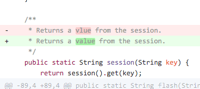
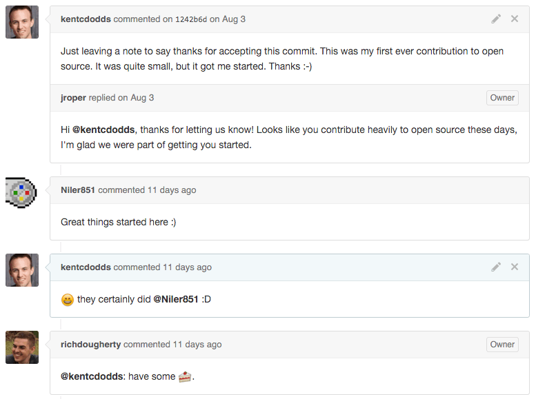

_This blogpost is by request from_ [_HackingEDU_](http://hackingedu.co)_, the
World's Largest Education Hackathon_ 👍

My first contribution to open source was extremely small:

Seriously, that was it. A comment typo that I found while debugging. The PR was
merged a few hours after I made it back in December of 2012 in my brand new days
as a programmer. I recently reminisced over the PR and made a thank you comment.
Which was later followed up by a total stranger and resulted in me getting some
digital cake!

How cool is that!? 🍰

But [Niler851](https://github.com/Niler851) was totally right. As far as I'm
concerned, great things started with this pull request.

> I got over one of the hardest hurdles in open source: The first contribution.

There's so much you need to learn about to contribute to open source, and it can
be daunting, but it's seriously rewarding and there are several reasons why it's
been so great for me.

## Learning Experiences

I have learned so many valuable skills from my time using and contributing to
open source projects. Whether it's a pull request to another project or creating
my own it's been an amazing learning experience. I've learned how
[many](http://webpack.github.io) [different](http://gruntjs.com)
[build](http://gulpjs.com) [systems](https://www.gnu.org/software/make)
[work](https://docs.npmjs.com/misc/scripts), different methods/styles of
structuring [code](/blog/newspaper-code-structure) and
[files](https://gist.github.com/ryanflorence/daafb1e3cb8ad740b346) to enhance
readability/maintainability, JavaScript APIs I didn't know existed, etc. etc.
etc.

> It's amazing what happens when you regularly read code written by many
> different people when many different people read your own code.
> Learning happens.

Having your own projects also gives you a really easy experiment playground
where I've learned and experimented with several
[Continuous Integration](https://medium.com/continuous-delivery/continuous-delivery-3a4a55baa58a)
services and [automation](https://github.com/commitizen/cz-cli)
[tools](https://github.com/semantic-release/semantic-release). It's been a lot
of fun and helped keep my skills sharp.

## Job opportunities

I can't count the number of emails I've received from recruiters to my GitHub
email address alias. And by developing some street credibility on GitHub, people
start paying attention and are interested in what you're working on and if you'd
like to work on their problems full time.

Some people you may have heard of who got their jobs this way:
[Brian Ford](https://twitter.com/briantford),
[Dan Abramov](https://twitter.com/dan_abramov), and
[Sebastian McKenzie](https://twitter.com/sebmck). But you don't have to make it
big in open source to get noticed.
[Matt Apperson](https://twitter.com/mattapperson),
[Rahat Khanna](https://twitter.com/mappmechanic), and
[Bram Borggreve](https://twitter.com/beeman_nl) and
[others](https://twitter.com/kentcdodds/status/671565082858418180) each spent
time making contributions to open source and have their jobs to thanks for it.
Certainly getting a job was not _the_ reason these developers got into open
source in the first place. But it's good for business in any case.

It's notable that when
[I asked](https://twitter.com/kentcdodds/status/671565082858418180) people if
they had gotten their job for open source contributions, several mentioned they
got their job from other community contributions like blog posts
([Vjeux](https://twitter.com/Vjeux) and
[johnlindquist](https://twitter.com/johnlindquist)) or speaking at conferences
([Olivier Combe](https://twitter.com/OCombe)). While not code contributions,
these are also valuable contributions to the open source community and I
recommend you do this as well.

## Friends

One of the most rewarding experiences I get out of using and collaborating on
open source comes from the relationships that I build with other developers
facing many of the same problems I am. I have so much fun working with these
amazing people.

Lots of conversations that start on GitHub turn into friendships that extend to
Twitter (a whole other blog post). It gets really fun when you meet these
awesome people in real life. Friends make open source fun and rewarding.

## Helping Others

One of the most rewarding things when working in open source is when someone
says something like: "This is amazing!" "Thank you so much!" "It's saved me so
much time!" or "I wish that I'd found this earlier!" It's awesome to think that
the 5 hours I've spent on my project has saved 500 developers days or weeks
worth of development time. That's cool. **Call to action:** If a project has
saved you some time, go ahead and file an issue to simply tell them thanks. 🎁

## Conclusion

If you haven't contributed to open source before, I recommend you give it a
whirl. It's fun, it's rewarding, and it's good for your career. If you're
looking for a good project to contribute to, remember that:

> You contribute best to something you use regularly.

— [Open Source Stamina](/blog/open-source-stamina)

For my first contribution, I made a single (tiny) contribution to the Play
framework and never submitted another PR there again. It was a great first PR
and I recommend that kind of experience to anyone. But if you're looking to make
a lasting impression on a project, think of what tools, libraries, and
frameworks you use regularly and find ways you can contribute to those things.

See you on [Twitter](https://twitter.com/kentcdodds) and
[GitHub](https://github.com/kentcdodds)!

**Other Resources:**

- [24 Pull Requests](http://24pullrequests.com/contributing)
- [How to Write an Open Source JavaScript Library - Course by @kentcdodds](https://egghead.io/series/how-to-write-an-open-source-javascript-library)
- [First Timers Only](https://medium.com/p/78281ea47455)
- [GitHub for Developers](https://training.github.com/classes/developers)
