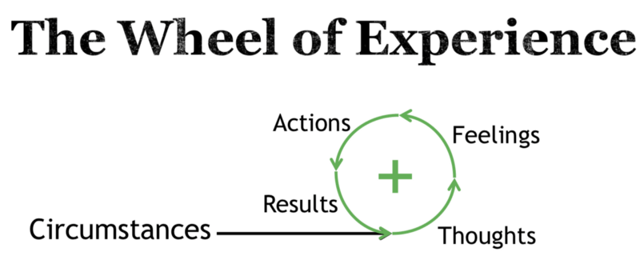
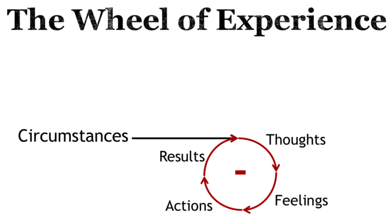
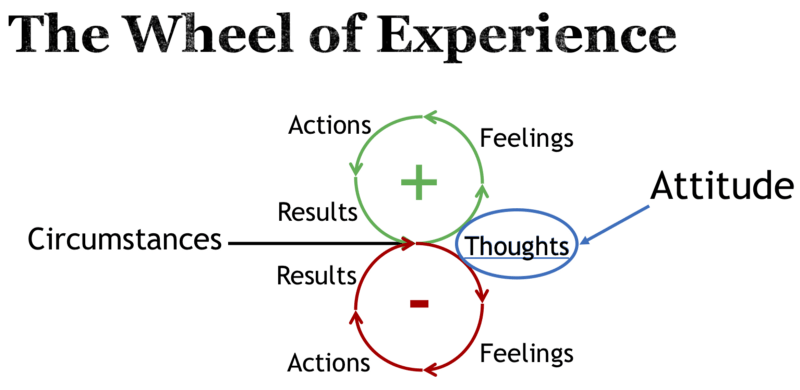
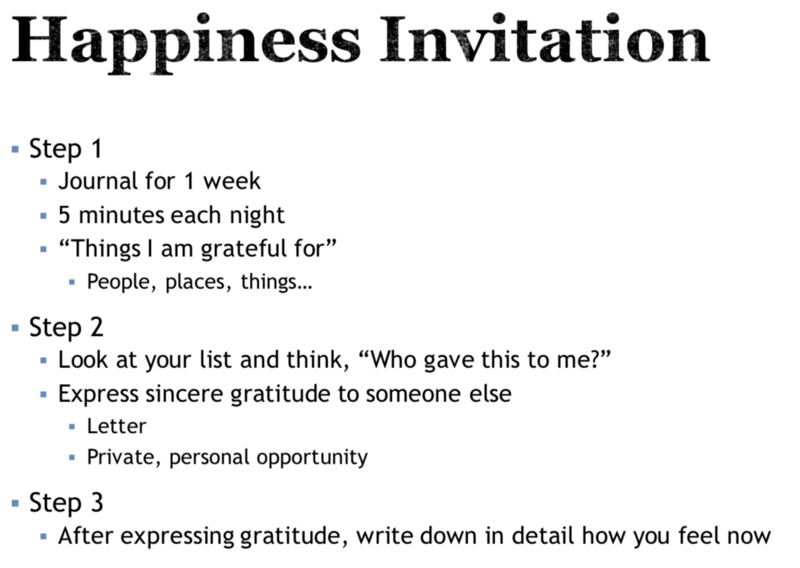

This week in the United States we celebrate
[Thanksgiving Day](https://en.wikipedia.org/wiki/Thanksgiving). In the US, the
celebration was started by Pilgrims who came to America in the 1620s on
[the Mayflower](https://en.wikipedia.org/wiki/Mayflower). They had a pretty
rough time getting their settlement started and had help from the Native
Americans. Together they celebrated and gave thanks to God for a good harvest
with a feast and that yearly tradition became the Thanksgiving holiday we
celebrate in the US today.

Each year, Thanksgiving gets more and more overshadowed with the commercialism
of Christmas. I want to take this opportunity to share with you some of the
things I'm grateful for and also explain why I think that gratitude can help you
be a better software engineer and a better person.

When I was off
[riding horses](https://twitter.com/react-vis/status/1043644565041819648) at a
family reunion last summer, my older brother gave a presentation about attitude
and gratitude.

He presented this graphic:

<figcaption>The Wheel of Experience: Positive</figcaption>

Given any circumstance (which we often can't control), whether those
circumstances are positive or negative, we can control what we think of those
circumstances, and that impacts the outcome. Positive thoughts lead to positive
feelings, actions, and results.

Then he presented this alternative graphic:

<figcaption>The Wheel of Experience: Negative</figcaption>

Here we have the same circumstances but respond with negative thoughts which
lead to negative feelings, followed by negative actions and then negative
results.

What's the big difference between these two experiences? Here we have them
together:

<figcaption>The Wheel of Experience: Both — Attitude</figcaption>

The turning point for both of these experiences is our thoughts. Our attitude
can help guide our thoughts automatically in a positive direction so we more
often wind up with positive feelings, actions, and results.

Let's try to make this more concrete. Imagine that your product manager comes to
you and says you have to stop experimenting with GraphQL because a new
requirement came in and it's critical to the business that everyone work on it.
That's a circumstance you can't control, but your attitude and what you think
about that circumstance can influence the result.

Let's take the negative route first. You think: "I'll bet that manager is just
making this up. They don't want us to take anymore time to learn GraphQL because
they never wanted to invest in it anyway." 😠 This clearly will make you feel
resentful and upset at the product manager and the work they've given you to do.
Because of these negative feelings, your behavior toward your manager and
co-workers is cold and bitter, and you make short-cuts on the work you've been
given because you don't want to do it anyway and you think it's just something
your manager made up because they're petty. 😡 The result is a poorly thought
out solution that's not tested, ends up causing more problems, is code nobody
wants to touch, and it's a spiral down from there. 🌀

Now with the positive attitude, things change. You think: "Dang, I really wanted
to experiment with GraphQL and my branch will probably fall out of date, but
that's ok, I'll probably be able to get it back up to date when I'm done with
this." 😃 You get to work on the assignment you've been given, hopeful that you
can finish it and get back to your GraphQL work, but also with the positive
attitude you approach all your work because you care about software craft and
want to make sure you don't have to deal with this when it's shipped. 🚢 The
result is a well crafted solution that's well tested and reviewed, you don't
have any problems when shipping to production so nobody needs to touch the code
anyway, you get back to your GraphQL work and turns out it's a smashing success
and you're promoted! 🥇 Good job! 👏

This is a contrived example, but hopefully you can see this as something that
could actually happen and you can see examples of times things have worked out
this way for you in the past (both negative and positive).

It's important to realize that "positive results" does not mean you'll
necessarily get the promotion like we have in this story, that's another thing
that's not entirely in your control. But one thing that is always in your
control are the attitude and thoughts you have given any circumstances.

After my brother explained this (though he didn't share that story, I made that
up on my own 😉), he showed us a clip from this video (I recommend you watch it
before continuing, but please... do come back 😅):

<figcaption>The Gratitude Experiment</figcaption>

So science 👩‍🔬🔬📊⚗️👨‍🔬 tells us that gratitude makes us happier! The video gives
a challenge, and this is the slide my brother showed us for his "Happiness
Invitation"

Step 1

- Journal for 1 week
- 5 minutes each night
- "Things I am grateful for" (People, places, things...)

Step 2

- Look at your list and think "Who gave this to me?"
- Express sincere gratitude to someone else (Letter; Private, personal
  opportunity)

Step 3

- After expressing gratitude, write down in detail how you feel now

### Conclusion

One thing that I like about the video and this challenge is that it gives a path
for developing a better attitude. I think often our thoughts are automatic and
unless we're really trying, our brain with start thinking for us. This is where
**mindfulness** kicks in. Being mindful of yourself and how you're feeling can
actually lead you to retraining your brain to think positively automatically. It
may be hard to change your thought process today, but given enough time and
effort, you can retrain your brain to do what will really bring you happiness.

I hope you join me this Thanksgiving in the happiness invitation. Tweet with the
hashtag
[**#HappinessInvitation**](https://twitter.com/hashtag/HappinessInvitation)
every time you do one of the steps (write in your journal, express gratitude,
and reflect) and let's hold each other accountable. Then next week we'll see how
we're all feeling and hopefully we can land that promotion we're looking for
😉🥇

Good luck!

**Things to not miss**:

- [lerna-wizard](https://github.com/szarouski/lerna-wizard): I've been using
  lerna and this helped me learn what I can do with the commands. Thanks
  [Sergey Zarouski](https://twitter.com/webuniverseio)!
- [useKonami](https://github.com/alexanderson1993/react-konami-hook): A custom
  hook by [R. Alex Anderson](https://twitter.com/ralex1993) for supporting
  Konami code to your app 😍
- [Render Prop by Any Other Name](https://youtu.be/pjDOJdMM2eg&list=PLV5CVI1eNcJgNqzNwcs4UKrlJdhfDjshf) — This
  is a talk I gave at [FrameworkSummit](https://twitter.com/FrameworkSummit) in
  October with [Divya Sasidharan](https://twitter.com/ShortDiv) (Vue) and
  [Isaac Mann](https://twitter.com/MannIsaac) (Angular) that compares similar
  patterns across the frameworks. (There were other great talks there too, see
  them on
  [the Framework Summit YouTube channel](https://youtube.com/channel/UCUTZdTjqY9ypGfpYWvSHC2w))
- [React's New Defaults — Concurrent React and React Hooks](https://youtu.be/vhWaMPQhMLQ) — An
  interesting talk about the future of React by
  [Shawn Wang](https://twitter.com/swyx).
- [GDG Salt Lake DevFest 2018: Why React Hooks](https://youtu.be/zWsZcBiwgVE&list=PLV5CVI1eNcJgNqzNwcs4UKrlJdhfDjshf) — A
  talk by me about why React Hooks are a thing and why I'm super excited to get
  them. [Demo repo](https://github.com/react-vis/gdg-devfest-2018-react).
