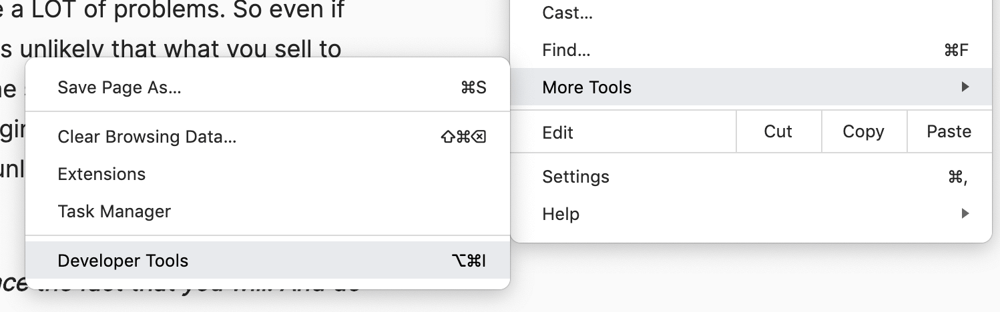
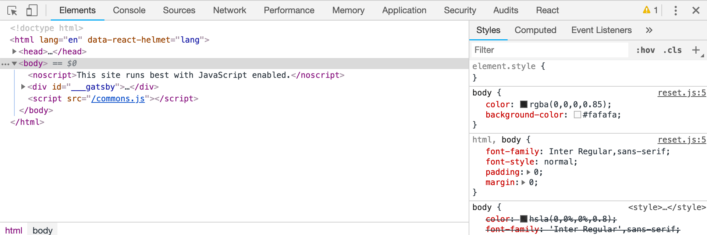
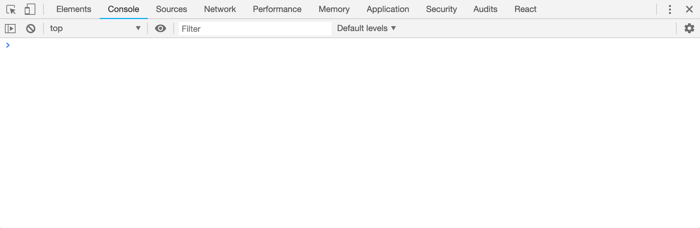
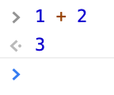
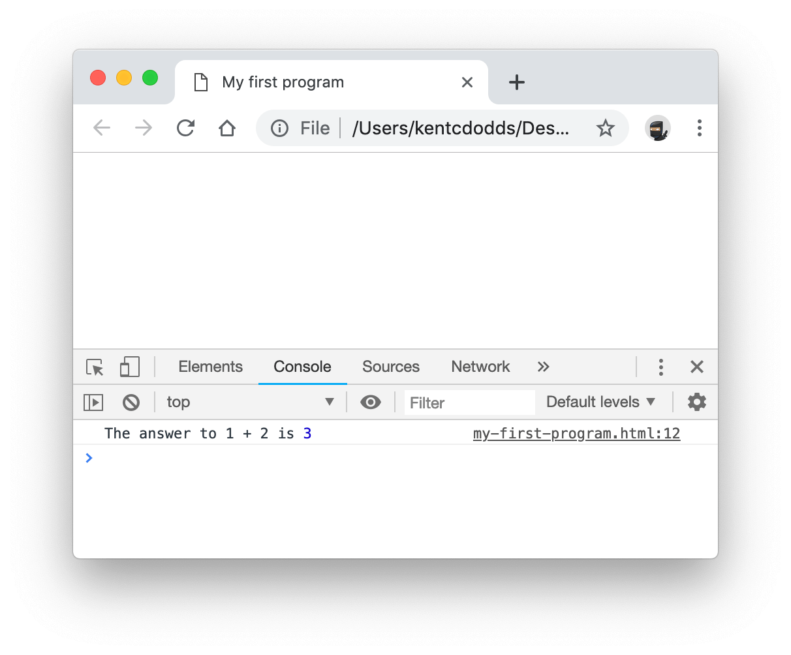

Programming computers is amazing. There are so many things you can accomplish
with technology these days and being able to control what computers, phones, and
[IoT devices](https://en.wikipedia.org/wiki/Internet_of_things) do enables you
to accomplish so much more.

There's no shortage of ideas of the things that we can accomplish with
technology. What's super cool about knowing how to program is the knowledge that
given enough time you can create your idea with technology yourself. Whether
that's [a simple todo app](/blog/building-production-apps-100-in-the-browser)
with your specific requirements or the next Instagram, when you know how to
program, the possibilities are seemingly endless.

Now, let's not get ahead of ourselves. There's a reason that big tech companies
employ hundreds or even thousands of software programmers and it's because
building cool things like this is not easy. That said, there's so much good that
you can do with software, it's definitely worthwhile learning.

## So, where do I start?

There is so much that you can do with programming these days that where you go
kinda depends on what you want to do with your coding skills. But regardless of
where you want to go with programming, there are some fundamental things you can
learn at the beginning to get your feet wet.

Whatever you end up doing to get started, I want to give you a suggestion:

> **Don't focus on learning to code. Focus on solving a problem that interests
> you.**

## Learning Backwards

I call this **"learning backwards."** By that I mean you start with what you
want to create, and learn the things you need to learn to accomplish your goals.
Doing things this way makes things much less abstract as you're learning a
subject that is all about abstraction.

However, doing this backward learning might be tough for you for a few reasons:

1. You have so many ideas and you're not sure where to start.
2. Your ideas are so ambitious it's overwhelming.
3. You have no ideas at all. Everything's been done before.

## Your first idea

Here are some tips for combatting these issues. Just choose one idea and focus
on that one. The first program you write is going to have a LOT of problems. So
even if you do end up building a company out of this idea, it's unlikely that
what you sell to customers will resemble your first iteration even in the
slightest. So avoid thinking that the first thing you build is going to be a
life changing creation (I mean, learning programming could be life changing for
you, but it's unlikely to exist in it's initial form forever).

> **Don't be afraid of making mistakes; instead embrace the fact that you will.
> And do so with your eyes wide open.**

Also, don't stress over this first idea. It doesn't have to be a world shaking
idea. Here, let me give you a quick and easy way to come up with an idea. Think
of one of your hobbies. What's one repetitive task you find yourself doing
regularly with that hobby? Build a simple program that helps you do that
repetitive task so it takes less time.

Here's an example from my own life: I like playing board/card games and we have
lots of games like this, so we sometimes struggle deciding what to play. So I
could build a program that can help us decide which one to play by categorizing
our games and helps us decide by asking questions and then suggesting a few
options based on our answers.

## Now learn what you need to learn to build it

Here's where things start to get a bit hard. Now that you have an idea of a
simple program that you want to build, you have a lot to learn. There are many
ways you can go about getting the information you need. In particular there are
many free resources available to learn the basics of programming.

### Foundational programming concepts

One resource I suggest is [Scratch](https://scratch.mit.edu) which is a
surprisingly powerful programming-like platform that doesn't require writing any
code at all. It's a great place to start learning about foundational programming
concepts like variables, loops, conditional statements, and events. You will
likely not even know that you're learning these things as you build stories and
games with the platform, but they will come to you and what you learn will help
you as you move onto the next phase of learning and getting your first idea
built.

### Writing a simple program

Now you need to make a decision: what programming language do I use? Might I
suggest JavaScript. Not only because I've bet the farm on JavaScript myself, but
also because of all programming languages it strikes the best balance of
approachability, ubiquity, and capability. JavaScript is by far the most
commonly used programming language in the world
([Stack Overflow Survey 2018](https://insights.stackoverflow.com/survey/2018/#technology)).
There are a lot of resources for the JavaScript language which can help you as
you start on the long journey of learning to code.

Having chosen JavaScript as your programming language I'll give you your first
opportunity to write some code now. You're probably reading this in an internet
browser like Chrome, Safari, Microsoft Edge, etc. Each of these run JavaScript
and are capable of running your JavaScript code! Go ahead and Google this: "How
to open the Developer Console in `<your browser>`"

Here's what it looks like in Google Chrome on Mac:



Clicking on that "Developer Tools" menu option opens up the Chrome Developer
Tools:



Now, what you want to bring up is the "Developer Console" which here is labeled
"Console." If you click on that, it'll bring this up next:



And this is your first window into programming in JavaScript! That area there is
where you can start typing out some code. Here, try typing `1 + 2` and hit
"enter"



There you go! You just wrote your first line of JavaScript. Of course, there's a
lot more to it than that, but that's a great place to start writing some simple
code.

One last thing before we move on (because this isn't really a tutorial), if you
want to save your work, you can do so by creating what's called an "HTML" file
that uses a `<script>` tag in it. Go ahead and create a new file using a text
editor (like Notepad for Windows or TextEdit for macOS). Copy and paste this
into that file:

```html
<html>
  <head>
    <title>My first program</title>
  </head>
  <body>
    <script>
      function add(a, b) {
        return a + b
      }
      const result = add(1, 2)
      const message = 'The answer to 1 + 2 is'
      console.log(message, result)
    </script>
  </body>
</html>
```

> Note: make sure that you save it as a Plain Text file. To do this in TextEdit
> click "Make Plain Text" under the "Format" menu before saving it.

Go ahead and save that file as `my-first-program.html` onto your desktop. Then
open it up in your web browser and open the developer console on that page and
you should have something like this:



Now you can play around in that file, make changes to it, and reload your page
and your program will run every time you do it. This is a great place to start
playing around with coding in JavaScript.

> I recommend that you install a real programming text editor like
> [VSCode](https://code.visualstudio.com). It will really improve your
> experience writing JavaScript programs.

### Learning the JavaScript language

After you've become comfortable writing simple JavaScript code, it's time to
start learning the JavaScript language. There are a lot of resources for this
and you need to find something that matches your learning style. I recommend
googling around a little bit. You'll probably find some useful tutorials on
YouTube and there are lots of good books about JavaScript. One book that I can
suggest to you is the
[You Don't Know JS](https://github.com/getify/You-Dont-Know-JS) book series.
It's pretty deep, but it'll give you a fantastic foundational understanding of
the language.

There's no shortcut to experience in coding I'm afraid. So the more time you
spend actually writing code, the better you'll get at it. Keep at it! You can
totally do this.

## Now build your idea

During this whole time, you should hopefully not have forgotten about the
original problem you wanted to solve. Once you've written a few simple programs,
try to solve your problem with what you've learned. What you build doesn't have
to look amazing, or work 100% of the time. You can work your way up to the
perfection you're hoping for. Build as simple of a version of what you're
looking for as possible.

**The process of success/failure is where you'll do the bulk of your learning,**
so don't feel bad if you're really struggling to learn this stuff. That's where
the real learning happens.

## Conclusion

I hope this is helpful to you. I'm working on creating more resources for people
in your position myself, so I suggest you sign up for my newsletter here:
[kcd.im/news](https://kcd.im/news). Another tip for you is that in the software
industry, twitter is a pretty big platform where coders connect and communicate.
If you're not on twitter yet, jump on board and I have a suggestion for your
first follow: [@kentcdodds](https://twitter.com/kentcdodds) 😉

Good luck to you!

P.S. If you'd like to see more beginner material and tutorials from me, please
[ask me about it on twitter](https://twitter.com/intent/tweet?url=https%3A%2F%2Fkentcdodds.com%2Fblog%2Fhow-to-get-started-with-programming&text=Hey,%20@kentcdodds,%20I%27d%20love%20it%20if%20you%20could%20create%20more%20beginner%20programmer%20content!)
