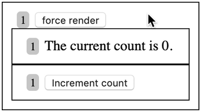

> NOTE: I want to add that the times it's important to optimize your context
> value is when a certain combination of the following conditions are met:

1. Your context value changes frequently
2. Your context has many consumers
3. You are bothering to use `React.memo` (because things are legit slow)
4. You've actually measured things and you know it's slow and needs to be
   optimized

If that explains your situation, then read on (and don't miss the alternative
solution which is honestly probably better anyway). In fact, the alternative is
definitely better and I've reworked the blog post to remove my original
recommendation and just show the alternative. If you want to see my original,
[read the original stuff here](https://github.com/react-vis/react-vis.com/blob/319db97260078ea4c263e75166f05e2cea21ccd1/content/blog/how-to-optimize-your-context-value/index.md).

> No seriously, if you're going to do this stuff just because you _think_ your
> code _might_ be slow, then don't bother. I'm not joking. React is really fast
> and adding complexity in the name of performance when performance is good
> enough is just wasteful of your "complexity budget"

The simplest solution to optimizing your context value involves using
`useReducer` for your state management and putting the `state` in one context
provider and the `dispatch` in another. Here's that:

https://codesandbox.io/s/ynn88nx9x?view=editor

Not only do you not need to `useMemo` in this case, but you actually can avoid
re-rendering the components that just use the updater context:

This is the same as with my original `useMemo` solution, except because the
`<Counter />` component's context isn't getting updated, we avoid the re-render
of that component entirely which is cool.

I personally feel like this is more complicated of an API than is necessary for
most situations, so I wouldn't bother optimizing most of my contexts. But if you
really have all the problems mentioned above, then consider doing this as a
simple way to side-step the issue.

Also, don't miss
[How to use React Context effectively](/blog/how-to-use-react-context-effectively).
