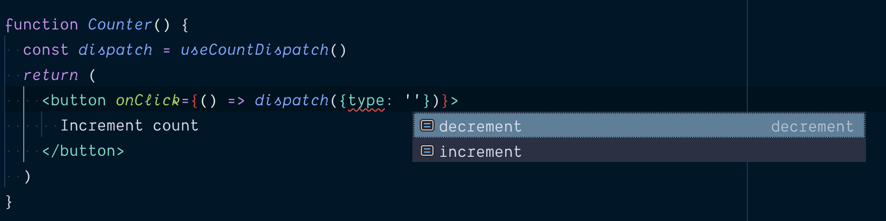
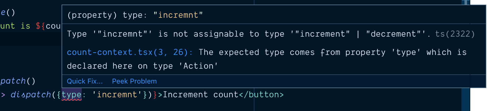

In
[Application State Management with React](/blog/application-state-management-with-react),
I talk about how using a mix of local state and React Context can help you
manage state well in any React application. I showed some examples and I want to
call out a few things about those examples and how you can create React context
consumers effectively so you avoid some problems and improve the developer
experience and maintainability of the context objects you create for your
application and/or libraries.

> Note, please do read
> [Application State Management with React](/blog/application-state-management-with-react)
> and follow the advice that you shouldn't be reaching for context to solve
> every state sharing problem that crosses your desk. But when you do need to
> reach for context, hopefully this blog post will help you know how to do so
> effectively. Also, remember that context does NOT have to be global to the
> whole app, but can be applied to one part of your tree and you can (and
> probably should) have multiple logically separated contexts in your app.

First, let's create a file at `src/count-context.js` and we'll create our
context there:

```jsx
// src/count-context.js
import React from 'react'

const CountStateContext = React.createContext()
const CountDispatchContext = React.createContext()
```

First off, I don't have an initial value for the `CountStateContext`. If I
wanted an initial value, I would call `React.createContext({count: 0})`. But I
don't include a default value and that's intentional. The `defaultValue` is only
useful in a situation like this:

```jsx {2}
function CountDisplay() {
  const {count} = React.useContext(CountStateContext)
  return <div>{count}</div>
}

ReactDOM.render(<CountDisplay />, document.getElementById('⚛️'))
```

Because we don't have a default value for our `CountStateContext`, we'll get an
error on the highlighted line where we're destructing the return value of
`useContext`. This is because our default value is `undefined` and you cannot
destructure `undefined`.

None of us likes runtime errors, so your knee-jerk reaction may be to add a
default value to avoid the runtime error. However, what use would the context be
if it didn't have an actual value? If it's just using the default value that's
been provided, then it can't really do much good. 99% of the time that you're
going to be creating and using context in your application, you want your
context consumers (those using `useContext`) to be rendered within a provider
which can provide a useful value.

> Note, there are situations where default values are useful, but most of the
> time they're not necessary or useful.

[The React docs](https://reactjs.org/docs/context.html#reactcreatecontext)
suggest that providing a default value "can be helpful in testing components in
isolation without wrapping them." While it's true that it allows you to do this,
I disagree that it's better than wrapping your components with the necessary
context. Remember that every time you do something in your test that you don't
do in your application, you reduce the amount of confidence that test can give
you. [There are reasons to do this](/blog/the-merits-of-mocking), but that's not
one of them.

> Note: If you're using Flow or TypeScript, not providing a default value can be
> really annoying for people who are using `React.useContext`, but I'll show you
> how to avoid that problem altogether below. Keep reading!

**What's this `CountDispatchContext` thing all about?** I've been playing around
with context for a while, and talking with friends at Facebook who have been
playing around with it for longer and I can tell you that the simplest way to
avoid problems with context (especially when you start calling `dispatch` in
effects) is to split up the state and dispatch in context. Stay with me here!

> If you want to dive into this a bit more, then read
> [How to optimize your context value](/blog/how-to-optimize-your-context-value)

## The Custom Provider Component

Ok, let's continue. For this context module to be useful _at all_ we need to use
the Provider and expose a component that provides a value. Our component will be
used like this:

```jsx {3,6}
function App() {
  return (
    <CountProvider>
      <CountDisplay />
      <Counter />
    </CountProvider>
  )
}

ReactDOM.render(<App />, document.getElementById('⚛️'))
```

So let's make a component that can be used like that:

```jsx
// src/count-context.js
import React from 'react'

const CountStateContext = React.createContext()
const CountDispatchContext = React.createContext()

function countReducer(state, action) {
  switch (action.type) {
    case 'increment': {
      return {count: state.count + 1}
    }
    case 'decrement': {
      return {count: state.count - 1}
    }
    default: {
      throw new Error(`Unhandled action type: ${action.type}`)
    }
  }
}

function CountProvider({children}) {
  const [state, dispatch] = React.useReducer(countReducer, {count: 0})
  return (
    <CountStateContext.Provider value={state}>
      <CountDispatchContext.Provider value={dispatch}>
        {children}
      </CountDispatchContext.Provider>
    </CountStateContext.Provider>
  )
}

export {CountProvider}
```

> NOTE: this is a contrived example that I'm intentionally over-engineering to
> show you what a more real-world scenario would be like. **This does not mean
> it has to be this complicated every time!** Feel free to use `useState` if
> that suites your scenario. In addition, some providers are going to be short
> and simple like this, and others are going to be MUCH more involved with many
> hooks.

## The Custom Consumer Hook

Most of the APIs for context usages I've seen in the wild look something like
this:

```jsx
import React from 'react'
import {SomethingContext} from 'some-context-package'

function YourComponent() {
  const something = React.useContext(SomethingContext)
}
```

But I think that's a missed opportunity at providing a better user experience.
Instead, I think it should be like this:

```jsx
import React from 'react'
import {useSomething} from 'some-context-package'

function YourComponent() {
  const something = useSomething()
}
```

This has the benefit of you being able to do a few things which I'll show you in
the implementation now:

```jsx {32-38,40-46,48}
// src/count-context.js
import React from 'react'

const CountStateContext = React.createContext()
const CountDispatchContext = React.createContext()

function countReducer(state, action) {
  switch (action.type) {
    case 'increment': {
      return {count: state.count + 1}
    }
    case 'decrement': {
      return {count: state.count - 1}
    }
    default: {
      throw new Error(`Unhandled action type: ${action.type}`)
    }
  }
}

function CountProvider({children}) {
  const [state, dispatch] = React.useReducer(countReducer, {count: 0})
  return (
    <CountStateContext.Provider value={state}>
      <CountDispatchContext.Provider value={dispatch}>
        {children}
      </CountDispatchContext.Provider>
    </CountStateContext.Provider>
  )
}

function useCountState() {
  const context = React.useContext(CountStateContext)
  if (context === undefined) {
    throw new Error('useCountState must be used within a CountProvider')
  }
  return context
}

function useCountDispatch() {
  const context = React.useContext(CountDispatchContext)
  if (context === undefined) {
    throw new Error('useCountDispatch must be used within a CountProvider')
  }
  return context
}

export {CountProvider, useCountState, useCountDispatch}
```

First, the `useCountState` and `useCountDispatch` custom hooks use
`React.useContext` to get the provided context value from the nearest
`CountProvider`. However, if there is no value, then we throw a helpful error
message indicating that the hook is not being called within a function component
that is rendered within a `CountProvider`. This is most certainly a mistake, so
providing the error message is valuable. _**#FailFast**_

## The Custom Consumer Component

If you're able to use hooks at all, then skip this section. However if you need
to support React `<` 16.8.0, or you think the Context needs to be consumed by
class components, then here's how you could do something similar with the
render-prop based API for context consumers:

```jsx
function CountConsumer({children}) {
  return (
    <CountContext.Consumer>
      {context => {
        if (context === undefined) {
          throw new Error('CountConsumer must be used within a CountProvider')
        }
        return children(context)
      }}
    </CountContext.Consumer>
  )
}
```

This is what I used to do before we had hooks and it worked well. I would not
recommend bothering with this if you can use hooks though. Hooks are much
better.

## TypeScript / Flow

I promised I'd show you how to avoid issues with skipping the `defaultValue`
when using TypeScript or Flow. Guess what! By doing what I'm suggesting, you
avoid the problem by default! It's actually not a problem at all. Check it out:

```typescript {9-12,40-44,48-52}
// src/count-context.tsx
import * as React from 'react'

type Action = {type: 'increment'} | {type: 'decrement'}
type Dispatch = (action: Action) => void
type State = {count: number}
type CountProviderProps = {children: React.ReactNode}

const CountStateContext = React.createContext<State | undefined>(undefined)
const CountDispatchContext = React.createContext<Dispatch | undefined>(
  undefined,
)

function countReducer(state: State, action: Action) {
  switch (action.type) {
    case 'increment': {
      return {count: state.count + 1}
    }
    case 'decrement': {
      return {count: state.count - 1}
    }
    default: {
      throw new Error(`Unhandled action type: ${action.type}`)
    }
  }
}

function CountProvider({children}: CountProviderProps) {
  const [state, dispatch] = React.useReducer(countReducer, {count: 0})

  return (
    <CountStateContext.Provider value={state}>
      <CountDispatchContext.Provider value={dispatch}>
        {children}
      </CountDispatchContext.Provider>
    </CountStateContext.Provider>
  )
}

function useCountState() {
  const context = React.useContext(CountStateContext)
  if (context === undefined) {
    throw new Error('useCountState must be used within a CountProvider')
  }
  return context
}

function useCountDispatch() {
  const context = React.useContext(CountDispatchContext)
  if (context === undefined) {
    throw new Error('useCountDispatch must be used within a CountProvider')
  }
  return context
}

export {CountProvider, useCountState, useCountDispatch}
```

With that, anyone can use `useCountState` or `useCountDispatch` without having
to do any undefined-checks, because we're doing it for them!

[Here's a working codesandbox](https://codesandbox.io/s/bitter-night-i5mhj)

## What about dispatch `type` typos?

At this point, you reduxers are yelling: "Hey, where are the action creators?!"
If you want to implement action creators that is fine by me, but I never liked
action creators. I have always felt like they were an unnecessary abstraction.
Also, if you are using TypeScript or Flow and have your actions well typed, then
you should not need them. You can get autocomplete and inline type errors!





I really like passing `dispatch` this way and as a side benefit, `dispatch` is
stable for the lifetime of the component that created it, so you don't need to
worry about passing it to `useEffect` dependencies lists (it makes no difference
whether it is included or not).

If you are not typing your JavaScript (you probably should consider it if you
have not), then the error we throw for missed action types is a failsafe. Also,
read on to the next section because this can help you too.

## What about async actions?

This is a great question. What happens if you have a situation where you need to
make some asynchronous request and you need to dispatch multiple things over the
course of that request? Sure you could do it at the calling component, but
manually wiring all of that together for every component that needs to do
something like that would be pretty annoying.

What I suggest is you make a helper function within your context module which
accepts `dispatch` along with any other data you need, and make that helper be
responsible for dealing with all of that. Here's an example from
[my Advanced React Patterns workshop](/workshops/advanced-react-patterns):

```javascript
// user-context.js
async function updateUser(dispatch, user, updates) {
  dispatch({type: 'start update', updates})
  try {
    const updatedUser = await userClient.updateUser(user, updates)
    dispatch({type: 'finish update', updatedUser})
  } catch (error) {
    dispatch({type: 'fail update', error})
  }
}

export {UserProvider, useUserDispatch, useUserState, updateUser}
```

Then you can use that like this:

```javascript
// user-profile.js

import {useUserState, useUserDispatch, updateUser} from './user-context'

function UserSettings() {
  const {user, status, error} = useUserState()
  const userDispatch = useUserDispatch()

  function handleSubmit(event) {
    event.preventDefault()
    updateUser(userDispatch, user, formState)
  }

  // more code...
}
```

I'm really happy with this pattern and if you'd like me to teach this at your
company [let me know](/contact) (or
[add yourself to the waitlist](/workshops/advanced-react-patterns) for the next
time I host the workshop)!

## The state and dispatch separation is annoying

Some people find this annoying/overly verbose:

```javascript
const state = useCountState()
const dispatch = useCountDispatch()
```

They say "can't we just do this?":

```javascript
const [state, dispatch] = useCount()
```

Sure you can:

```javascript
function useCount() {
  return [useCountState(), useCountDispatch()]
}
```

## Conclusion

So here's the final version of the code:

```jsx
// src/count-context.js
import React from 'react'

const CountStateContext = React.createContext()
const CountDispatchContext = React.createContext()

function countReducer(state, action) {
  switch (action.type) {
    case 'increment': {
      return {count: state.count + 1}
    }
    case 'decrement': {
      return {count: state.count - 1}
    }
    default: {
      throw new Error(`Unhandled action type: ${action.type}`)
    }
  }
}

function CountProvider({children}) {
  const [state, dispatch] = React.useReducer(countReducer, {count: 0})
  return (
    <CountStateContext.Provider value={state}>
      <CountDispatchContext.Provider value={dispatch}>
        {children}
      </CountDispatchContext.Provider>
    </CountStateContext.Provider>
  )
}

function useCountState() {
  const context = React.useContext(CountStateContext)
  if (context === undefined) {
    throw new Error('useCountState must be used within a CountProvider')
  }
  return context
}

function useCountDispatch() {
  const context = React.useContext(CountDispatchContext)
  if (context === undefined) {
    throw new Error('useCountDispatch must be used within a CountProvider')
  }
  return context
}

export {CountProvider, useCountState, useCountDispatch}
```

[Here's a working codesandbox](https://codesandbox.io/s/react-codesandbox-je6cc).

Note that I'm _NOT_ exporting `CountContext`. This is intentional. I expose only
one way to provide the context value and only one way to consume it. This allows
me to ensure that people are using the context value the way it should be and it
allows me to provide useful utilities for my consumers.

I hope this is useful to you! Remember:

1. You shouldn't be reaching for context to solve every state sharing problem
   that crosses your desk.
2. Context does NOT have to be global to the whole app, but can be applied to
   one part of your tree
3. You can (and probably should) have multiple logically separated contexts in
   your app.

Good luck!
