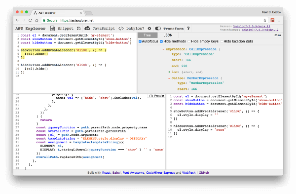

**_My_**
[**_Frontend Masters course "Code Transformation and Linting with ASTs"_**](https://frontendmasters.com/courses/linting-asts)
**_has been released 🎉 🎊 (go there to see a quick intro to the course)! I
thought you all might be interested to know why you should take the 3 hours and
42 minutes to learn how to write custom Babel and ESLint plugins._**

Building applications is hard, and it just gets harder as a team and codebase
grows. Luckily, we have tools like [ESLint](http://eslint.org) and
[Babel](https://babeljs.io) to help us manage these growing codebases to prevent
bugs and migrate code so we can focus on the domain-specific problems of our
applications.

Both ESLint and Babel have a strong community of plugins (today, there are 857
packages matching
["ESLint plugin"](https://www.npmjs.com/search?q=eslint%20plugin&page=1&ranking=optimal)
and 1781 matching
["Babel Plugin"](https://www.npmjs.com/search?q=babel%20plugin)). You can
leverage these plugins to improve your developer experience and increase the
quality of your codebase.

As amazing as the communities are for both Babel and ESLint, the problems you're
facing are often different from the problems the rest of the world faces, so
there's often not an existing plugin to handle your specific use case. In
addition, sometimes you need to refactor a big codebase and a custom babel
plugin can help do so much better at this than a find/replace regex.

> _You can write custom ESLint and Babel plugins to handle your own needs._

### When to write a custom ESLint plugin

The next time you're fixing a bug, you're going to want to make sure it doesn't
come back. Instead of starting out with
[test driven development](https://egghead.io/lessons/javascript-use-test-driven-development)
to do that, first ask yourself: "Could this bug have been prevented using a type
system (like [Flow](https://flow.org))?" If not, then ask "Could this bug have
been prevented using a
[custom ESLint plugin](http://eslint.org/docs/developer-guide/working-with-rules)?"
The nice thing about these two tools is that you can run them on your code
_statically_.

> With ESLint you **don't have to run any of your code** to confidently
> determine whether there's a problem.

In addition to this, once you've added an ESLint plugin, you've not only
prevented the problem from entering that particular area of your codebase,
**you've also prevented it from showing up anywhere else as well.** That's a
real win! (And that's a benefit you do not have with testing).

Here are some examples of custom rules my team at PayPal uses to prevent us from
shipping bugs we've experienced in the past:

- Ensure we always use our localization library rather than inlining content.
- Enforce the correct React controlled component behavior and make sure there's
  an `onChange` handler if a `value` is specified.
- Ensure `<button>`s always have a `type` attribute.
- Ensure that our `<Link>` components and `<a>` tags always have the proper
  `data` attributes for analytics.
- Ensure you're only importing files within the the right app or the shared
  folder (we have multiple apps in a single repo).

We have more, but there's just a few of them. The cool part is that these bugs
haven't come up again because we took the time to
[learn and write a custom ESLint plugin](http://kcd.im/fm-asts).

Note: if you can't prevent a bug with Flow or ESLint, then it's probably some
sort of business logic problem, and you can prevent that from coming back with
tests ([learn how to test JavaScript projects here](http://kcd.im/fm-testing)).

### When to write a custom Babel plugin

The next time you think: "That API is way too tedious" or "We can't do that,
because performance would suffer big time." then you should consider writing a
custom babel plugin.

[Babel plugins](https://babeljs.io/docs/plugins) allow you to manipulate code.
This can be done as part of your build (to accomplish some built-time
optimization) or as a one-time operation (called a "codemod" which you can think
of as a way-more-powerful-than-regex find and replace).

One of the things I love about babel:

> Babel allows us to enhance both the user experience and the developer
> experience at the same time.

Here are some examples of how babel plugins have done that:

1.  Shipping your entire application when just pulling up the login screen is
    wasteful, so the community has adopted
    "[code-splitting](https://webpack.js.org/guides/code-splitting)" as a means
    to avoid this.
    [react-loadable](https://github.com/thejameskyle/react-loadable) allows you
    to lazy-load React components. If you want more complicated features (like
    server-side support or improved client-side loading), it requires a fairly
    verbose API, however, the associated
    [babel-plugin-import-inspector](https://github.com/thejameskyle/react-loadable/blob/3a9d9cf34abff075f3ec7919732f95dc6d9453a4/README.md#babel-plugin-import-inspector)
    takes care of that for you automatically.
2.  [Lodash](https://lodash.com) is a fairly ubiquitous utility library for
    JavaScript, but it's also quite large. One neat trick is that if you
    "cherry-pick" the methods you actually use (like:
    `import get from 'lodash/get'`), the code for those will be the only ones
    that end up in your final bundle.
    [babel-plugin-lodash](https://github.com/lodash/babel-plugin-lodash) allows
    you to use the entire library as you normally would
    (`import _ from 'lodash'`) and it will automatically cherry-pick methods for
    you.
3.  While building the [glamorous.rocks](https://rc.glamorous.rocks) website
    (soon to be released), I realized that we were loading all localization
    strings regardless of what language you were requesting! So I wrote
    [a custom babel plugin](https://github.com/uber/react-vis/glamorous-website/blob/7ab245a4f99af9f217fd9b7d63f59dae1814f08e/other/babel-plugin-l10n-loader.js)
    to load the right localization based on a `LOCALE` environment variable.
    This enabled us to create a
    [static export of the server rendered site](https://github.com/zeit/next.js/blob/dba24dac9db97dfce07fbdb1725f5ed1f9a40811/readme.md#static-html-export)
    for each locale we support and start using markdown for our localization
    strings on the server (whereas we'd been using markdown in strings in
    JavaScript modules before, a total mess). We were able to get rid of a
    confusing "Higher Order Component" for localization and just start importing
    markdown files _on the server._ At the end of it all, the site is way faster
    and it's much more pleasant to work with
    ([contributions to glamorous.rocks are welcome](https://github.com/uber/react-vis/glamorous-website/issues)).

There are way more, but hopefully that gives you an idea of what's possible when
you know how to write custom Babel plugins.

Oh yeah, and you know those amazing codemods that frameworks and tools push out
with major releases that somehow magically ✨ update your code to the new APIs
(like this [codemod from react](https://github.com/reactjs/react-codemod) or
[this one from webpack](https://github.com/webpack/webpack-cli/blob/master/lib/migrate.js))?
You can write things like that as a babel plugin and run those using
[babel-codemod](https://github.com/square/babel-codemod) (checkout
[this short demo of babel-codemod](https://youtu.be/Vj9MOXbC43A&index=1&list=PLV5CVI1eNcJipUVm6RDsOQti_MzHImUMD)).
([Learn more about codemods from this talk](https://youtu.be/d0pOgY8__JM) by
[Christoph](https://twitter.com/cpojer)).

> I don't care how good you are at regex, you can do way better with a custom
> babel plugin.

### But what on earth is an AST? I'm not a rocket scientist 🚀!

Babel and ESLint both operate on what's called an Abstract Syntax Tree (commonly
abbreviated to AST). It's effectively how the computer sees your code. Babel has
[a JavaScript parser called "babylon"](https://github.com/babel/babylon) which
turns your string of code into an AST (it's literally just a JavaScript object),
then Babel hands pieces of this to your babel plugin for you to operate on it.
In the case of Babel it allows you to make transformations, in the case of
ESLint it allows you to inspect it for patterns you want to discourage.

I do not have a computer science degree. I started learning about ASTs just a
year ago.

> The experience of working with ASTs has helped me to understand JavaScript
> better.

### Give it a try

**I promise you, this is way less scary than it seems 😱.** You can learn this
stuff. I'll walk you through it. And the course has a bunch of great exercises
to help you get going. Learning how to write custom ESLint and Babel plugins can
improve your life as a software developer and make your applications better 👍

[**Learn Code Transformation and Linting with Abstract Syntax Trees (ASTs)**](http://kcd.im/fm-asts)

### Please share

This is a topic that people often are scared or confused by. If this blog post
has helped you understand things a little better, please share it so more people
see that learning how to write custom Babel and ESLint plugins can be an
invaluable skill. You can simply retweet this:

https://twitter.com/react-vis/status/886945519909711872

---

P.S. There are several other (free) resources to help you learn ASTs:

- [babel-plugin-handbook](https://github.com/thejameskyle/babel-handbook/blob/master/translations/en/plugin-handbook.md)
- [asts-workshop](https://github.com/uber/react-vis/asts-workshop) (the repo
  used for the Frontend Masters course)
- [Writing custom Babel and ESLint plugins with ASTs](https://youtu.be/VBscbcm2Mok&index=1&list=PLV5CVI1eNcJgNqzNwcs4UKrlJdhfDjshf&t=192s)
- [A couple lessons on ASTs on egghead.io](http://kcd.im/egghead-asts)

P.S.P.S. I thought I’d mention two babel plugins I’ve written recently that I’m
pretty excited about
([I’m](https://twitter.com/threepointone/status/885884698093899777)
[not](https://twitter.com/mitchellhamiltn/status/886441807420182528)
[alone](https://twitter.com/rauchg/status/886449097770541057)
[either](https://twitter.com/souporserious/status/886803870743121920)). I think
you should really take a look at these. I wrote the first working version of
each of them in about a half hour:

- [babel-plugin-preval](https://github.com/uber/react-vis/babel-plugin-preval):
  Pre-evaluate code at build-time
- [babel-macros](https://github.com/uber/react-vis/babel-macros): Enables
  zero-config, importable babel plugins

And in [the course](http://kcd.im/fm-asts) I teach you everything you need to
know to be able to write plugins like these.
