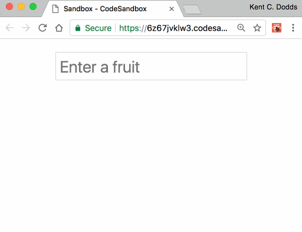
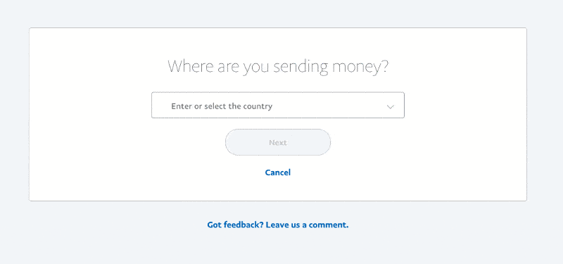
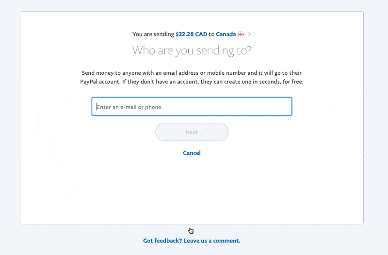
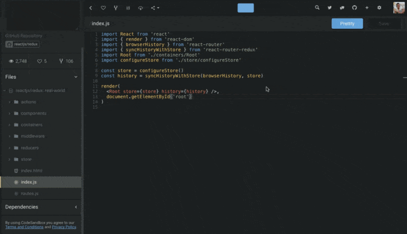

[_downshift 🏎_](https://github.com/downshift-js/downshift) _is the primitive you
need to build simple, flexible, WAI-ARIA compliant React
autocomplete/typeahead/dropdown/select/combobox/etc (AKA "item selection")
(p)react ⚛️ components. From PayPal 💙_

One common component on the web is autocomplete:


I've personally implemented 5 unique autocomplete abstractions in the last 4
years 😱 It's not an easy component to get right. And while you're busy doing
all that work, don't forget to **make it accessible**! That's also a pretty big
job.

Luckily, we have quite a few solutions for implementing an item selection like
autocomplete. Specifically for React, there's
[react-select](https://github.com/JedWatson/react-select),
[react-autosuggest](https://github.com/moroshko/react-autosuggest),
[react-autocomplete](https://github.com/reactjs/react-autocomplete), and
[more](https://www.npmjs.com/search?q=react%20autocomplete). And now there's
another one on the scene. It's called
[downshift](https://github.com/downshift-js/downshift), its emoji is the race
car 🏎, and it's taking a different approach.

## The state of item selection

The existing solutions for item selection inputs
(autocomplete/typeahead/dropdown/select/combobox/etc) components in React will
render the input and menu for you. Some of them allow you to specify what you'd
like rendered, but will render in a predetermined location (or one that is
configurable). Some of them also expose a list of class names that you can
reference for styling the rendered component so you can make it fit your brand.

Unfortunately, this results in a wider API surface area and a more complicated
implementation under the covers. And even with all of the flexibility provided,
it can still be a real chore to make these things render what you want them to
when, where, and how you want them to render.

These issues and limitations are largely due to the fact that these libraries
are doing the rendering
([React.createElement](https://facebook.github.io/react/docs/react-api.html#createelement))
for you.

## How downshift 🏎 is different

There are two design decisions that provide distinguishing characteristics about
`downshift` that sets it apart from existing solutions:

1.  The "Render Prop" pattern.
2.  The "Controlled Props" pattern.

Let's talk about how each of these works to bring you an incredible amount of
value and flexibility.

## render callback

_There's actually not one instance of React.createElement (or JSX) anywhere in
the_ [`downshift`](https://github.com/downshift-js/downshift/tree/master/src)
[_source code_](https://github.com/downshift-js/downshift/tree/master/src)_._
Instead,
[`downshift`](https://github.com/downshift-js/downshift/blob/a449a3b115e4253c7547b404e1059422ae9bf165/src/downshift.js#L710)
[uses a render callback](https://github.com/downshift-js/downshift/blob/a449a3b115e4253c7547b404e1059422ae9bf165/src/downshift.js#L710)
(following
[the render prop pattern](https://cdb.reacttraining.com/use-a-render-prop-50de598f11ce)).
This allows you to render whatever you want inside `<Downshift />` . It also
puts you in total control of when, where, and how you render the selectable
items in the menu.

This means that `downshift` doesn't need to expose nearly as many props as other
solutions because there's no rendering to configure.

> It turns out that rendering nothing increases simplicity, decreases bundle
> size, and enhances flexibility.

## **So what does it look like?**

Here's a bare-bones autocomplete component with `downshift`:

```js
import React from 'react'
import {render} from 'react-dom'
import Downshift from 'downshift'

const items = [
  {value: 'apple'},
  {value: 'pear'},
  {value: 'orange'},
  {value: 'grape'},
  {value: 'banana'},
]

render(
  <Downshift
    onChange={selection => alert(`You selected ${selection.value}`)}
    itemToString={item => (item ? item.value : '')}
  >
    {({
      getInputProps,
      getItemProps,
      getLabelProps,
      getMenuProps,
      isOpen,
      inputValue,
      highlightedIndex,
      selectedItem,
    }) => (
      <div>
        <label {...getLabelProps()}>Enter a fruit</label>
        <input {...getInputProps()} />
        <ul {...getMenuProps()}>
          {isOpen
            ? items
                .filter(item => !inputValue || item.value.includes(inputValue))
                .map((item, index) => (
                  <li
                    {...getItemProps({
                      key: item.value,
                      index,
                      item,
                      style: {
                        backgroundColor:
                          highlightedIndex === index ? 'lightgray' : 'white',
                        fontWeight: selectedItem === item ? 'bold' : 'normal',
                      },
                    })}
                  >
                    {item.value}
                  </li>
                ))
            : null}
        </ul>
      </div>
    )}
  </Downshift>,
  document.getElementById('root'),
)
```



https://codesandbox.io/s/6z67jvklw3

This is a pretty minimal example, and if you were to build similar minimal
examples with other autocomplete libraries you could certainly do it in fewer
lines of code. But what you'll notice here is that we're only passing `onChange`
and `render` props to `<Downshift />`. The `render` prop is a function which is
invoked with some helper methods and state for us to build our component out of.
`**downshift**` **is responsible for managing the user interaction, state, and
most of accessibility for us, and we're responsible for rendering things based
on that state.**

> Your autocomplete component is literally a function of the state of
> `downshift`

## **prop getters**

Another thing you'll notice about the example above is the `render` function is
passed more than just state. You're also given `getInputProps` and
`getItemProps`. These are "prop getters" (inspired by
[Jared Forsyth](https://twitter.com/jaredforsyth)) and _they are the key to
allowing you to render whatever you like._ So long as you forward all the props
to the appropriate element you're rendering (if you're rendering it at all),
then `downshift` will do all the work of wiring things together.

Also, because `downshift` isn't rendering your menu or your items, `downshift`
doesn't need to provide any APIs for how you filter or load them. You can load
them asynchronously
([example using Apollo and graph.cool](https://codesandbox.io/s/m5zrvqj85p) and
[this example using Algolia Instantsearch](https://codesandbox.io/s/kvn0lpp83))
and you can control how you filter things (see this
[example that integrates geniejs](https://codesandbox.io/s/jRLKrxwgl)
[watch me build geniejs integration here](https://youtu.be/gjqB-YAxjWg&index=4&list=PLV5CVI1eNcJh5CTgArGVwANebCrAh2OUE&t=4s)).
This means that you don't need to learn or work around an API and can do it
however works best for your use case.

This API also means that you don't have to render an input at all. So you can
use `downshift` to implement a dropdown without any trouble too.
[Here's an example implementing a multi-select dropdown with](https://codesandbox.io/s/W6gyJ30kn)
[`downshift`](https://codesandbox.io/s/W6gyJ30kn).

There are other prop getters available (some are there just to make
accessibility easier). See
[the](https://github.com/downshift-js/downshift/blob/8563d4bae2af19fdc7242c66b551d46396234cf9/README.md#prop-getters)
[`downshift`](https://github.com/downshift-js/downshift/blob/8563d4bae2af19fdc7242c66b551d46396234cf9/README.md#prop-getters)
[docs](https://github.com/downshift-js/downshift/blob/8563d4bae2af19fdc7242c66b551d46396234cf9/README.md#prop-getters)
for more info.

## controlled props

The other design decision `downshift` has made is the use of controlled props.

If you've used React for a while, you've probably bumped into the concept of
controlled and uncontrolled components. The most common of these is the
`<input />` component which allows you to specify a `value` prop if you want to
control what the input value is. If you specify that prop, then you're
responsible for keeping it up to date (often this requires an `onChange` handler
to keep things in sync with when the user updates things).

`downshift` has this exact same concept for all pieces of state that it tracks:
`isOpen`, `selectedItem`, `inputValue`, and `highlightedIndex`. This information
is something that you have access to in your `render` function, as well as an
`onStateChange` callback. But sometimes (just like with `<input />`) you need to
be able to have complete control over it. So if you provide any of these as a
prop to the `downshift` component (for example `<Downshift isOpen={true} />`),
it becomes "controlled" and `downshift` will reference the value of your prop
rather than track it internally with state.

[Here's an example that controls the `isOpen` state](https://codesandbox.io/s/0mrl1819qw):

https://codesandbox.io/s/0mrl1819qw

This allows you to have complete control over the state of your component.
[Ryan Florence](https://twitter.com/ryanflorence) teaches about
[controllable components (like](https://courses.reacttraining.com/courses/advanced-react/lectures/3172720)
[`downshift`](https://courses.reacttraining.com/courses/advanced-react/lectures/3172720)[) in this fantastic lesson](https://courses.reacttraining.com/courses/advanced-react/lectures/3172720)
(I highly recommend it). And you can
[watch me build the first iteration of the implementation here](https://youtu.be/iy0znrRA2h8&index=13&list=PLV5CVI1eNcJh5CTgArGVwANebCrAh2OUE&t=1s).

## Accessibility

Accessibility (#a11y) is a really important feature, and quite frankly, it's not
easy to get right for an item selection component like autocomplete. While
developing it, I referenced several autocomplete components and
[Marcy Sutton](https://twitter.com/marcysutton) was kind enough to give one of
our examples
[an accessibility audit](https://github.com/downshift-js/downshift/issues/79)
(Thank you Marcy!). Pull up [an example](https://3kxm9wk791.codesandbox.io) with
[VoiceOver](https://www.apple.com/accessibility/mac/vision) and I think you'll
be impressed! We've worked hard to make sure that it's accessible
([watch me work on it here](https://youtu.be/p9QqTGQ5TZ0&list=PLV5CVI1eNcJh5CTgArGVwANebCrAh2OUE&index=12)),
and based on my survey of the existing solutions, `downshift` is the most
accessible component of its kind.

## Size

`downshift` is quite a bit smaller than other similar solutions.
[The UMD build rolls in at 14.34kb](https://unpkg.com/downshift@1.0.0-rc.11/dist)
(uncompressed). Because `downshift` gives you full control over rendering,
there's much less code required. In addition, it was easy to make work out of
the box with [preact](https://preactjs.com) ⚛️ (a teeny tiny version of react.
No need to add preact-compat). I was able to create
[an experiment using preact-habitat](https://github.com/react-vis/autocomplete-widget)
that gives
[**a completely frameworkless implementation of autocomplete**](https://dist-woxxqrsspd.now.sh)
**in less than 26kb (uncompressed)**. That size _includes_ `downshift` +
`preact` + `preact-habitat`. You have my permission to jump for joy 😉. Shout
out to [Jason Miller](https://twitter.com/_developit) and
[Zouhir](https://twitter.com/_zouhir) for [`preact`](https://preactjs.com) and
[`preact-habitat`](https://github.com/zouhir/preact-habitat)!

## Where is it?

I built `downshift` for
[this country selector experience on PayPal](https://www.paypal.com/myaccount/transfer/fx/fees):



We also use the same component in the recipient selector:



_You can
[watch me build part of these PayPal experiences here](https://youtu.be/rB62gSER9fg&index=14&list=PLV5CVI1eNcJh5CTgArGVwANebCrAh2OUE&t=456s)._

We actually have several other item selection experiences in our app that have
slightly different use cases and necessitated us having multiple implementations
of an autocomplete component in the same app! So that's why I build downshift:
so we could have a single implementation that was flexible enough to cover all
the use cases. The experience in PayPal should ship next week.

There are other teams within PayPal who are integrating downshift with their
applications right now as well.

I
[started working on downshift](https://youtu.be/2kzD1IjDy5s&list=PLV5CVI1eNcJh5CTgArGVwANebCrAh2OUE&index=11)
about a month ago, the first beta was published (as
[react-autocompletely](https://github.com/downshift-js/downshift/issues/10)) the
next day. It's slowly been gaining popularity (it already has 900 🌟 and 7k
downloads/month) even before the official 1.0.0 release! So it's definitely
being used in several places, but the first production deployment that I'm aware
of is in [codesandbox](https://codesandbox.io) from
[Ives van Hoorne](https://twitter.com/CompuIves)
([gif from his tweet](https://twitter.com/CompuIves/status/897970526832013315)):



Fun fact: both of these solutions are also using
[match-sorter](https://github.com/react-vis/match-sorter), which is a user
friendly best-match sorting library. I highly recommend it!

## What's next

`downshift` is a pretty minimal component by design. It does take a little bit
more work to get things that you get out of the box from other solutions. But
I'm convinced that you can build all of those features on top of `downshift`. So
I'm hoping that the community can help build `downshift`-powered versions of
some of these features and get those published to npm.
[Here's a great place to get started](http://kcd.im/ds-example)!

## Conclusion

I need to give a big shoutout to
[Ryan Florence](https://twitter.com/ryanflorence). His lesson on
["Compound Components"](https://courses.reacttraining.com/courses/advanced-react/lectures/3060560)
got me started on this. `downshift` doesn't actually use compound components
anymore, but the first incarnation did! So thanks to Ryan! And _you can watch me
develop most of `downshift` on
[this YouTube playlist](https://youtube.com/playlist?list=PLV5CVI1eNcJh5CTgArGVwANebCrAh2OUE)
(starting with
[this first video](https://youtu.be/2kzD1IjDy5s&t=2468s&index=16&list=PLV5CVI1eNcJh5CTgArGVwANebCrAh2OUE))
📺._

And again, a big shoutout to [Jared Forsyth](https://twitter.com/jaredforsyth)
for inspiring the prop getters one day when we just bumped into each other at
the airport ✈️ That made a big difference in the direction of the API as well.

Special shoutout to [Travis Arnold](https://twitter.com/souporserious),
[Julien Goux](https://twitter.com/_jgx_),
[the_Simian](https://twitter.com/5imian), and
[all the contributors](https://github.com/downshift-js/downshift/blob/master/README.md#contributors)
([so far](https://github.com/downshift-js/downshift/issues)) for their help with
forming the `downshift` API into what it is now.

Please give `downshift`
[a star 🌟](https://github.com/downshift-js/downshift/stargazers),
[a watch 👀](https://github.com/downshift-js/downshift/watchers), and
[a try 😎](http://kcd.im/ds-example).
