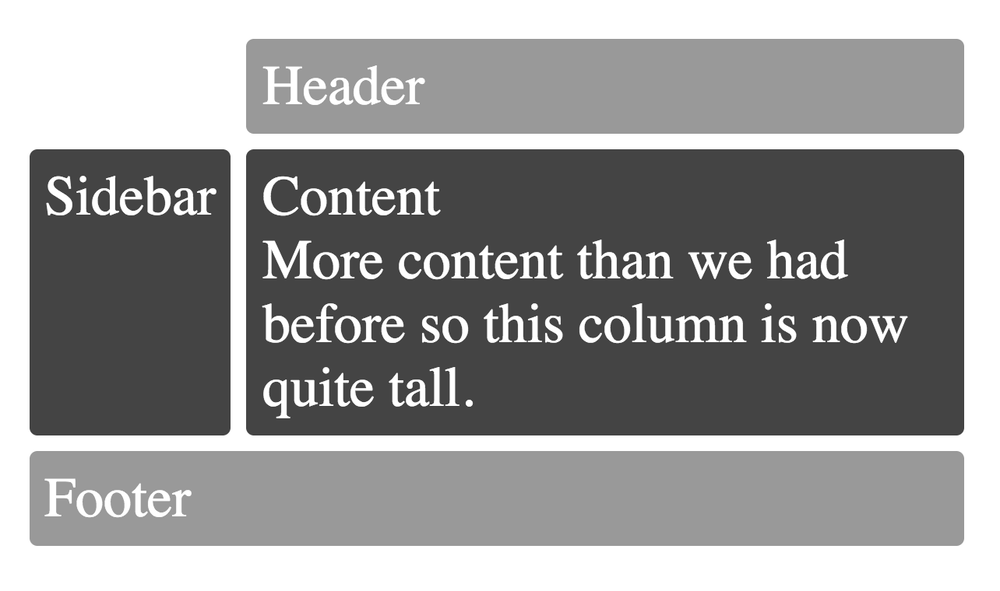

I was building something for my product at PayPal (blog post maybe forthcoming)
and got tired of writing components like this:

```jsx
const styles = glamor.css({
  fontSize: 20,
  textAlign: 'center',
})
function MyStyledDiv({className = '', ...rest}) {
  return <div className={`${styles} ${className}`} {...rest} />
}
```

So I decided to try out
[styled-components](https://github.com/styled-components/styled-components)
because the hype-train was strong 🚂. I REALLY liked it:

https://twitter.com/kentcdodds/status/840329548885557250

It allowed me to write that same component like this:

```js
const MyStyledDiv = styled.div`
  font-size: 20px;
  text-align: center;
`
```

> Making composable components that carry their styling with them was just
> super awesome.

Unfortunately, I hit a wall when I realized that there isn't currently a
solution for right-to-left conversion (like
[CSSJanus](https://github.com/cssjanus/cssjanus) or
[rtl-css-js](https://github.com/kentcdodds/rtl-css-js)) and that's a hard
requirement for what I'm building. I also had some issues with the size of
styled-components at the time (note that you can transpile away a lot of the
size if you're willing to give up
[_some_ dynamic capabilities](https://github.com/kentcdodds/glamorous/issues/4),
which I was unwilling to do).

So after evaluating a bunch of other solutions and trying to enhance existing
solutions to be what I wanted them to be, I decided to create my own.

### Enter [glamorous](https://github.com/paypal/glamorous) 💄!

[**paypal/glamorous**](https://github.com/paypal/glamorous)

`glamorous` is React component styling solved with an elegant
([inspired](https://github.com/kentcdodds/glamorous#inspiration)) API, small
footprint (<5kb gzipped), and great performance (via
[`glamor`](https://github.com/threepointone/glamor)). It has a very similar API
to styled-components and uses similar tools under the hood
([glamor](https://github.com/threepointone/glamor)). The benefits being:

https://twitter.com/kentcdodds/status/842881773180731392

Let's get a quick look at what a glamorous component looks like:

```jsx
// Create a <Title> react component that renders an <h1> which is
// centered, palevioletred and sized at 1.5em
const Title = glamorous.h1({
  fontSize: '1.5em',
  textAlign: 'center',
  color: 'palevioletred',
})

// Create a <Wrapper> react component that renders a <section> with
// some padding and a papayawhip background
const Wrapper = glamorous.section({
  padding: '4em',
  background: 'papayawhip',
})

function App() {
  return (
    <Wrapper>
      <Title>Hello World, this is my first glamorous component!</Title>
    </Wrapper>
  )
}
```

_(thanks to styled-components for the example inspiration)._

The beauty of glamorous is that all of the cool things you can do with
[glamor](https://github.com/threepointone/glamor), you can do with glamorous.
Here are a few examples:

[**pseudoclasses**](https://github.com/threepointone/glamor/blob/5e7d988211330b8e2fca5bb8da78e35051444efd/docs/howto.md#pseudoclasses)

```js
const MyLink = glamorous.a({
  ':hover': {
    color: 'red',
  },
})
```

[**child-selectors**](https://github.com/threepointone/glamor/blob/5e7d988211330b8e2fca5bb8da78e35051444efd/docs/howto.md#child-selectors)
(the escape hatch you should rarely use, but is nice to have)

```jsx
const MyDiv = glamorous.div({
  display: 'block',
  '& .bold': {fontWeight: 'bold'},
  '& .one': {color: 'blue'},
  ':hover .two': {color: 'red'},
})

const ui = (
  <MyDiv>
    <div className="one bold">is blue-bold!</div>
    <div className="two">hover red!</div>
  </MyDiv>
)
```

[**media queries**](https://github.com/threepointone/glamor/blob/5e7d988211330b8e2fca5bb8da78e35051444efd/docs/howto.md#media-queries)

```js
const MyResponsiveDiv = glamorous.div({
  width: '100%',
  padding: 20,
  '[@media](http://twitter.com/media "Twitter profile for @media")(min-width: 400px)': {
    width: '85%',
    padding: 0,
  },
})
```

[**animations**](https://github.com/threepointone/glamor/blob/5e7d988211330b8e2fca5bb8da78e35051444efd/docs/howto.md#animations)

```js
import {css} from 'glamor' // or require or whatever...

const bounce = css.keyframes({
  '0%': {transform: 'scale(1)', opacity: 0.3},
  '55%': {transform: 'scale(1.2)', opacity: 1},
  '100%': {transform: 'scale(1)', opacity: 0.3},
})

const MyBouncyDiv = glamorous.div({
  animation: `${bounce} 1s infinite`,
  width: 50,
  height: 50,
  backgroundColor: 'red',
})
```

**theming**

With the new `ThemeProvider` (recently added by
[Alessandro Arnodo](https://twitter.com/vesparny)), glamorous also supports
theming:

```jsx
const Title = glamorous.h1(
  {
    fontSize: '10px',
  },
  (props, theme) => ({
    color: theme.main.color,
  }),
)

// use <ThemeProvider> to pass theme down the tree
const ui1 = (
  <ThemeProvider theme={theme}>
    <Title>Hello!</Title>
  </ThemeProvider>
)

// it is possible to nest themes
// inner themes will be merged with outers
const ui2 = (
  <ThemeProvider theme={theme}>
    <div>
      <Title>Hello!</Title>
      <ThemeProvider theme={secondaryTheme}>
        {/\* this will be blue */}
        <Title>Hello from here!</Title>
      </ThemeProvider>
    </div>
  </ThemeProvider>
)
```

And if you need global styles, you can just
[use glamor](https://github.com/threepointone/glamor/blob/5e7d988211330b8e2fca5bb8da78e35051444efd/docs/howto.md#global-css-rule)
to do that (you can do this with styled-components as well). And there many
other cool things you can do with glamor (including
[Server Side Rendering](https://github.com/kentcdodds/glamorous#server-side-rendering-ssr))!

Another great feature of `glamorous` is it will merge glamor class names
together automatically for you. Learn more about that
[here](https://github.com/kentcdodds/glamorous/blob/2c5cba47ed83a744b8dec1ac8f85b560eae818b7/README.md#classname).

---

In addition to the styled-components inspired API, `glamorous` exposes a
[jsxstyle](https://github.com/smyte/jsxstyle) inspired API. Sometimes, you don’t
want to give something a name because naming things is hard. Especially with
this stuff, you wind up with names like `Container` and `Wrapper` and who knows
which is which!? So, if you find that something doesn’t really need a name, then
don’t give it one!

```jsx
const {Div, A} = glamorous

function App() {
  return (
    <Div textAlign="center" color="red">
      <A
        href="[https://brave.com/](https://brave.com)"
        textDecoration="none"
        color="darkorange"
        textShadow="1px 1px 2px orange"
      >
        Browse faster and safer with Brave.
      </A>
      <div>It's fast, fun, and safe!</div>
    </Div>
  )
}
```

(fun tip: this works too: `<glamorous.Div>JSX!!</glamorous.Div>`)

---

Oh, and just for fun, all this excitement around CSS Grid got you salivating?
It’s trivially supported by glamorous:

```jsx
// Example inspired by
// [http://gridbyexample.com/examples/example12/](http://gridbyexample.com/examples/example12)
const MyGrid = glamorous.div({
  margin: 'auto',
  backgroundColor: '#fff',
  color: '#444',
  // You can use [@supports](http://twitter.com/supports "Twitter profile for @supports") with glamor!
  // So you can use [@supports](http://twitter.com/supports "Twitter profile for @supports") with glamorous as well!
  '[@supports](http://twitter.com/supports "Twitter profile for @supports") (display: grid)': {
    display: 'grid',
    gridGap: 10,
    gridTemplateAreas: `  
      "....... header header"  
      "sidebar content content"  
      "footer  footer  footer"  
    `,
  },
})

const Box = glamorous.div({
  backgroundColor: '#444',
  color: '#fff',
  borderRadius: 5,
  padding: 10,
  fontSize: '150%',
})

const HeaderFooter = glamorous(Box)({
  backgroundColor: '#999',
})

function App() {
  return (
    <MyGrid>
      <HeaderFooter css={{gridArea: 'header'}}>Header</HeaderFooter>
      <Box css={{gridArea: 'sidebar'}}>Sidebar</Box>
      <Box css={{gridArea: 'content'}}>
        Content
        <br />
        More content than we had before so this column is now quite tall.
      </Box>
      <HeaderFooter css={{gridArea: 'footer'}}>Footer</HeaderFooter>
    </MyGrid>
  )
}
```

And [you get](https://codesandbox.io/s/2k8yll8qj):



Example inspired by
[http://gridbyexample.com/examples/example12/](http://gridbyexample.com/examples/example12)

I hope you enjoy [glamorous](https://github.com/paypal/glamorous) 💄
[🌟](https://github.com/paypal/glamorous/stargazers)
[👀](https://github.com/paypal/glamorous/watchers)!

See you around on twitter: [@glamorousCSS](https://twitter.com/glamorousCSS) and
[@kentcdods](https://twitter.com/kentcdodds)

With ❤️ from PayPal ([we’re hiring](https://jobsearch.paypal-corp.com/search)!)
