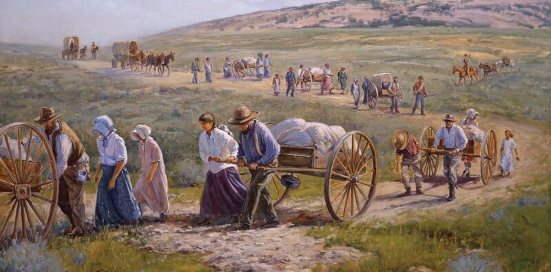

This week's episode of [JavaScript Air](https://javascriptair.com) is canceled.
I will be out of town and I didn't plan far enough in advance to have someone
fill in for me. I've had this thing planned for several months and I only just
realized last week that I leave before the normal show time. This also means
that my normal
[#eggheadADay](https://twitter.com/search?q=from%3Akentcdodds%20%23eggheadADay&src=typd)
will miss a few days and I'll not be responding to emails, GitHub notifications,
or [AMA questions](https://github.com/kentcdodds/ama).

So, **TL;DR: I'll be unavailable from June 1 - 4** (Wed - Sat). If you're
interested in why, read on:

#### Where I'm going, and why JS Air is canceled this week

I'll be down in Southern Utah, trekking across miles and miles of desert with a
few dozen teenagers dressed in 19th century pioneer clothing for four days.
Sound like fun? We'll see! I think it will be an amazing experience.

I'm a youth leader for 16 - 18 year old young men in my church (the technical
term is "Priest Quorum Advisor"). [My church](https://mormon.org) has a rich
pioneer history, so many of the congregations will go on what's called a
[Pioneer Trek](https://www.lds.org/youth/activities/stake-and-multistake-activities/camps-and-youth-conferences/treks?lang=eng)
for a few days. It gives them an opportunity to experience firsthand the faith
and determination of the pioneers. It gives them a taste of what it was like for
pioneers to cross the country with nothing but a handcart holding all of their
worldly possessions they could fit and cary.

I never went on a pioneer trek when I was growing up, so I'm excited to
experience this myself. While I'm out there I will have just as much access to
modern technology as the early pioneers had: _none_.

#### So, why cancel the JS Air episode?

I have yet to miss a broadcast of JavaScript Air. There were a handful of times
that I couldn't make it to an [Angular Air](http://angularair.com) broadcast.
With those times I generally had one of the panelists fill in. This took a bit
of planning and a little training (you'd be surprised how much work it takes to
put on one of these shows).

This pioneer trek was scheduled months ago. But for some reason I thought we
were leaving on Thursday morning and fully expected to be able to make it to the
broadcast. It wasn't until last week that I realized we're leaving Wednesday
morning which means that I'll not be available for the show.

I didn't want to miss [the webpack show](https://jsair.io/webpack), so I
rescheduled that for next week. There wasn't enough time for me to find guests
and schedule another show _and_ ask a panelist to host a show for the first
time. So I've decided to cancel this week's show.

My apologies! Maybe you can take the time you would have watched/listened to the
show to learn more about your own heritage (or
[mine](https://history.lds.org/overlandtravels) if you're interested) :-)

**Edit: I decided to rerun a previous episode this week. If you heard it before
you'll still learn something, I promise. It's one of my personal favorites and
the most popular show:** [**jsair.io/2016-06-01**](http://jsair.io/2016-06-01)

See you next week!

_P.S. Often in a trek like this one, participants walk in honor of someone
specific. I will be representing_
[_Arza Erastus Hinckley_](http://wiki.hanksplace.net/index.php/Arza_Erastus_Hinckley)
_who was among the heroes of the time who went out to help rescue suffering
pioneers._
