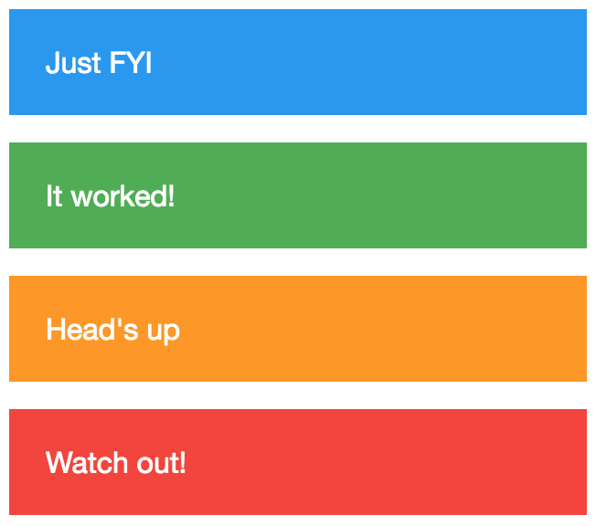

This is a phrase I first heard from
[David Khourshid](https://twitter.com/DavidKPiano) in his talk at React Rally
2017 [Infinitely Better UIs with Finite Automata](https://youtu.be/VU1NKX6Qkxc):
"Make impossible states impossible" (super great talk by the way, and
[xstate](https://github.com/davidkpiano/xstate) is awesome, and David is too).
Googling around it looks like it's a pretty popular phrase in the
[Elm](http://elm-lang.org) community, though I'm not sure who said it first.

To illustrate what this means, let's checkout at
[a very simple example](https://codesandbox.io/s/j71ljpvvww):

```jsx
<Alert>Just FYI</Alert>
<Alert success>It worked!</Alert>
<Alert warning>Head's up</Alert>
<Alert danger>Watch out!</Alert>
```



You may have used or written a component that has this kind of API. It's nice
and clean (in case you're unfamiliar, in JSX, a non-assigned prop like that is
the same as assigning it to the value "true", so `success` is the same as
`success={true}`).

Here's where this kind of API falls over. What should I render with this?

```jsx
<Alert success warning>
  It worked!
</Alert>
```

Should it blend the colors? Should I choose one? Which do I choose? Or should we
just yell at the developer trying to do this because they obviously don't know
what they're doing? (tip: that last one is _NOT_ what you should do).

The idea of making impossible states impossible basically means that situations
and questions like these should never come up. It means that you design APIs
that make a clear distinction between the possible states of a component. This
makes the component easier to maintain and to use.

So what do we do with our simple example? Whelp, all these different props
represent is the _type_ of alert that should be rendered. So what if instead of
simply accepting the prop itself, we accept a `type` prop?

```jsx
<AlertBetter>Just FYI</AlertBetter>
<AlertBetter type="success">It worked!</AlertBetter>
<AlertBetter type="warning">Head's up</AlertBetter>
<AlertBetter type="danger">Watch out!</AlertBetter>
```

Now it's impossible to have more states than one because there are only three
valid values for the `type` prop (well, four if you count `undefined`)! It's
easier to maintain, easier to explain/understand, and harder to mess up.
Everyone wins!

### Conclusion

There are various ways to do this effectively and converting a boolean value to
[an enum](https://en.wikipedia.org/wiki/Enumerated_type) is only one such
mechanism. It can and does get more complicated, but the concept can seriously
simplify your component's and application's state. This is why I recommend you
give [David's](https://twitter.com/DavidKPiano) talk a watch
([here it is again](https://youtu.be/VU1NKX6Qkxc)). And give
[xstate](https://github.com/davidkpiano/xstate) a solid look as well. There's
some good ideas in that! Good luck!

P.S. After publishing this, several people noted that this phrase was the title
of [a talk](https://youtu.be/IcgmSRJHu_8) from
[Richard Feldman](https://twitter.com/rtfeldman) at Elm Conf. There's also
[a talk](https://youtu.be/P7dTPoxCg4w) by
[Patrick Stapfer](https://twitter.com/ryyppy) from ReasonML Munich Meetup. You
may also be interested to check out
[a similar blog post](https://github.com/stereobooster/pragmatic-types/blob/master/posts/making-impossible-states-impossible.md)
by [@stereobooster](https://twitter.com/stereobooster).

P.S.P.S. Further revelation about the origin of a similar phrase:

https://twitter.com/yminsky/status/1034947939364425731

**Learn more about React from me**:

- [The Beginner's Guide to React](http://kcd.im/beginner-react)
- [Advanced React Component Patterns](http://kcd.im/advanced-react) (also on
  [Frontend Masters](https://frontendmasters.com/courses/advanced-react-patterns)).
- [Confidently Ship Production React Apps](https://egghead.io/lessons/react-confidently-ship-production-react-apps) — **A
  30 talk on egghead** (30 minutes... weird right?!) about testing React
  components.

**Things to not miss**:

- [Babel 7 Released](http://babeljs.io/blog/2018/08/27/7.0.0) — Congratulations
  to the Babel team for releasing Babel 7! I wrote the portion on
  `babel-plugin-macros`!
- [Simply React](https://youtube.com/watch?list=PLV5CVI1eNcJgNqzNwcs4UKrlJdhfDjshf&v=AiJ8tRRH0f8):
  In my ReactRally talk ⚛️I tell a familiar story about an component that you
  can probably relate to. Then I explain how it could have gone better. I think
  you'll enjoy this!
- [`fastpack`](https://github.com/fastpack/fastpack) - a JavaScript bundler
  (like webpack, but with fewer features at the moment) that is BLAZING FAST
  🔥🔥🔥🔥 (bundles 1000 modules in < 1 second!)
- [Byteconf React](https://byteconf.com) — Byteconf React is a 100% free
  conference with the best JavaScript and React speakers in the world.
  Conferences are great, but flights, hotels, and tickets are expensive, so not
  everyone can go. Byteconf is streamed on Twitch, for free, so anyone and
  everyone can attend. We're building a community of developers around the
  world — see you there?

### Bonus:

Here's a part from my section in the babel 7 blog post that didn't make the
final cut but I thought you'd enjoy:

Here's a very simple example of a custom macro that swaps `line`and `column`
imports with the line or column where it appears in the code:

```js
// line-column.macro
module.exports = createMacro(lineColumnMacro)
function lineColumnMacro({references, babel}) {
  references.line.forEach(referencePath => {
    const num = referencePath.node.loc.start.line
    referencePath.replaceWith(babel.types.numberLiteral(num))
  })
  references.column.forEach(referencePath => {
    const num = referencePath.node.loc.start.column
    referencePath.replaceWith(babel.types.numberLiteral(num))
  })
}
```

And then this code:

```
`import {line, column} from './line-column.macro'
`
``console.log(`we're at ${line}:${column}`)
console.log(`and now we're at ${line}:${column}`)``
```

This will be transpiled into:

```js
console.log(`we're at ${3}:${32}`)
console.log(`and now we're at ${4}:${40}`)
```

And we don't need to change any config to add that custom transform. Writing and
using code transforms is a fair amount easier this way. You can't do everything
that a full babel plugin can do, but we're only just getting started with this
and look forward to what the community will do with this power.

> _Play around with the above macro example_ >
> [_on astexplorer.net_](https://astexplorer.net/#/gist/e586bcbbf2ce35835115a7d808528c90/b64f5f025d98481ebfb93a582334c8562f7337f0)_.
> See if you can make it support an import called_ `_lineColumn_`_that is
> replaced with the sum of line and column. Just for fun!_
