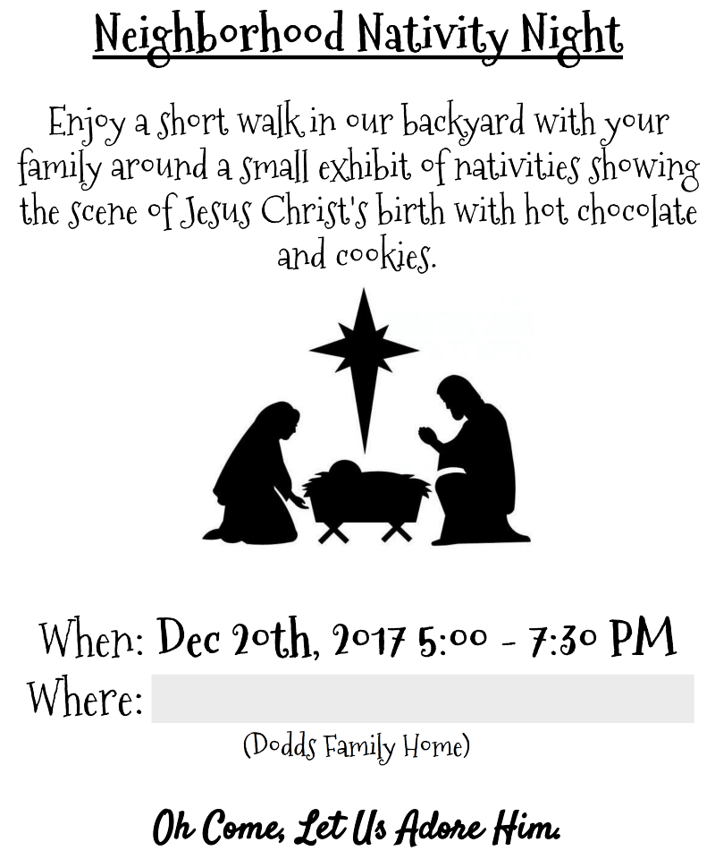

As I write this, it's Christmas Eve. My kids have fallen asleep and I've wrapped
up the last few presents I've made or purchased for them. You might find some of
them interesting:

- Michael (3 months): A letter telling him what I love about him as a baby.
  He'll hopefully appreciate it more later :)
- Adam (2):
  [Hand woven beanie](https://twitter.com/react-vis/status/944812510821023744),
  [GitHub Activity Book](https://github.myshopify.com/products/github-activity-book)
- Nathan (4): [Typing For Kids](https://typing-for-kids.netlify.com)
  ([repo](https://github.com/react-vis/typing-for-kids)),
  [GitHub Activity Book](https://github.myshopify.com/products/github-activity-book)
- Becca (5): [Typing For Kids](https://typing-for-kids.netlify.com)
  ([repo](https://github.com/react-vis/typing-for-kids)),
  [GitHub Activity Book](https://github.myshopify.com/products/github-activity-book)

And for my wife, I made [Repeat Todo](https://repeat-todo.com)
([repo](https://github.com/react-vis/repeat-todo-v2)). A while back I made her
[this version](https://stackedit.io/repeat-todo.surge.sh), but the fact that it
used only local storage for persistence presented a few problems when wanting to
create a list or transfer devices. This new one uses Firebase _and_ works
offline (thanks create-react-app/codesandbox.io!).

In addition to that, I also worked hard to help an idea my wife had become a
reality:

I'm a member of
[The Church of Jesus Christ of Latter-Day Saints](https://lds.org) (aka
[Mormons](https://mormon.org)). We celebrate Christmas to commemorate the birth
of our Savior Jesus Christ.

A few weeks ago, my wife had the idea to have a Nativity display in our backyard
and invite our neighbors to come and see them and enjoy cookies and hot
chocolate. It happened, and
[here's a video of the result](https://twitter.com/react-vis/status/943644317503156224).
It took a lot of work, but it was totally worth it and a wonderful new family
tradition.

Tomorrow morning (Christmas morning), we'll be continuing another family
tradition (started by my wife's family when she was a kid). We'll wake up early
(5:30 AM or so) and drive around to a half dozen hotels/gas stations, and the
hospital to sing them Christmas carols and bring treats. It's a shame some folks
need to work on Christmas day, so we try to bring them a little Christmas cheer.
There are some people who look forward to it every year now.

This month, my Church commemorated the Savior's birth with an initiative they
call [#LightTheWorld](https://www.mormon.org/christmas/25-ways-25-days) ✨ in 25
ways, in 25 days. Following along with it has brought my family more cheer this
holiday season. Check out 👉 [the intro video](https://youtu.be/P_VRN7hcL_8) and
[the videos for each of the 25 days](https://www.mormon.org/christmas/25-ways-25-days)
👈 It'll warm your heart and hopefully inspire you too.

I'd like to invite each of you to look outside of yourself and find
opportunities to serve others and give of yourself. Not just your means, but
also give of your time to those who matter most to you and those who need it. I
think this is one of the best parts of Christmas. Whatever your religious
affiliation (or if you have none at all), I can promise you that doing this will
bring you and those around you more joy.

Merry Christmas 🎅🎄🎁

I'll see you all next week with another newsletter/blog post about JavaScript
(keep an eye on [JavaScript January](https://www.javascriptjanuary.com)).
