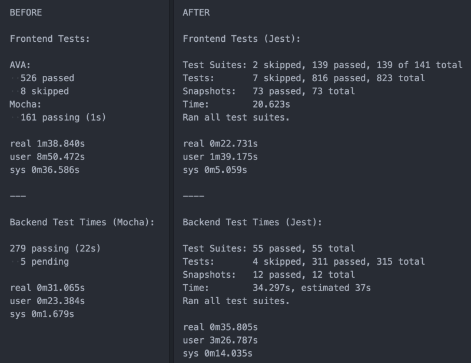

I get really excited about new tech I find interesting. When I first "got" the
testing framework [AVA](https://github.com/avajs/ava), I was soooo excited. I
was on the rooftops of twitter telling people to give AVA a shot. I created
[two](https://youtu.be/FgjxXntElEY) [screencasts](https://youtu.be/jfWK8LMD8mw)
about how to set up and use AVA, and a full blown workshop on how to test React
with AVA:

https://twitter.com/react-vis/status/699636857928179712

I actually had used Jest long before, but had a less than awesome experience:

https://twitter.com/react-vis/status/687756147105730560

So,
[I convinced my team at PayPal](https://twitter.com/react-vis/status/720359271469162496)
and we started using AVA for all our new React tests. I was getting ready to
start migrating our existing UI tests and our server tests when I started to
notice something about AVA that really put a wrench in the whole thing.

It turns out that AVA was created to be fast for lots of async tests. Not for
large test suites of async and sync tests. So for the use cases in my
application, I found this to be true:

https://twitter.com/housecor/status/736530288952541185

https://twitter.com/react-vis/status/749019087167041537

<figcaption>
  On a thread where I'm talking about making a AVA ➡️ Mocha codemod
</figcaption>

It was just too much. As much as I loved all the other amazing and awesome
features the AVA team had worked on (and there are many), performance was so
poor I couldn't enjoy them as much. As the testbase grew to hundreds of tests,
my MacBook Pro was brought to its knees. My fans would spin up like an airplane
ready to take flight 🛩 and it wouldn't respond to me reliably until the tests
were done.

[These performance issues](https://github.com/avajs/ava/labels/performance) led
to my team (myself included) skipping the githooks with `--no-verify` so we
wouldn't have to wait to push our code changes. This led to the build breaking
for really simple things (like linting errors and broken tests) which slowed our
team down a lot.

Another major issue we found was with AVA's testing assertions. They use
[power-assert](http://npm.im/power-assert) which is an amazingly helpful
utility, but would sometimes lead to reeeeally weird things happening (like
[this](https://github.com/avajs/ava/issues/616)). I realize that these are
things that can be fixed, but as AVA is a community project built in the spare
time of contributors (thank [you](https://github.com/avajs) and
[you](https://github.com/power-assert-js) so much!), those things getting fixed
often took time. Along with that, engineers on my team sunk hours upon hours of
work trying to figure out where these issues were and working around them. We
don't have that kind of time.

### Why migrate to Jest instead of Mocha?

So, at this point, we had all our React tests with AVA, previous UI tests
(mostly backbone) with Mocha, and server tests with Mocha. The natural choice
was to move all our stuff to Mocha. But then I got involved in this thread:

https://twitter.com/dan_abramov/status/760255553272705025

Which led to
[this comment](https://github.com/facebook/create-react-app/pull/250#issuecomment-236980910)
from [Trevor D. Miller](https://twitter.com/trevordmiller) which I
[responded to](https://github.com/facebook/create-react-app/pull/250#issuecomment-236985503)
(in which I mention that I'd write this very blog post about me migrating from
AVA to Mocha... I'd already started migrating my React Testing workshop to Mocha
[here](https://github.com/uber/react-vis/react-mocha-workshop). Hah). Then
[Christoph Pojer](https://twitter.com/cpojer) responded with
[this great comment](https://github.com/facebook/create-react-app/pull/250#issuecomment-237098619).
That pretty much won my curiosity back and I decided to give it another go on a
project.

Unfortunately, I didn't have time to look into it right away, even though I
wanted to:

https://twitter.com/react-vis/status/760668819140390913

<figcaption>😅</figcaption>

But a few weeks later I gave it a go:

https://twitter.com/react-vis/status/771455054947549184

I was impressed at how fast it was and even more how easy it was to set up.
Especially since I'd tried Jest before and it was soooo slow. And I was really
encouraged by this tweet from [Mike Nikles](https://twitter.com/mikenikles):

https://twitter.com/mikenikles/status/772234132436885504

I was slowly discovering the truth of this statement:

https://twitter.com/cpojer/status/795729029223616512

So I eventually
[swapped AVA for Jest](https://github.com/uber/react-vis/generator-kcd-oss/commit/23f8875358db204d16e040a14ee44aaa79681691)
for my open source module generator and now all my open source stuff is Jest and
I love it 💚 .

As is the case for me, when I get excited about new tech, I really like to
share! So I created [a bunch of videos](http://kcd.im/egghead-jest) for
egghead.io about it, had a
[tech chat](https://github.com/uber/react-vis/ama/issues/125) with
[Christoph Pojer](https://twitter.com/cpojer)
[on YouTube](https://youtu.be/i31VtyJSM-I&list=PLV5CVI1eNcJi8sor_aQ2AzOeQ3On3suOr&index=20)
about Jest, and rewrote my React Testing Workshop **again** in
[Jest](https://github.com/uber/react-vis/react-jest-workshop).

### The Migration

#### Client Side

My coworker [Jamund Ferguson](https://twitter.com/xjamundx) did most of the work
for migrating our React tests from AVA. We were really helped by
[this codemod](https://github.com/skovhus/jest-codemods) by
[Kenneth Skovhus](https://twitter.com/kenneth_skovhus). This saved us a ton of
time manually updating our tests to work with Jest.

There were still some places we had to work through and we definitely had to
configure Jest in some special ways to handle our scenario. We have both server
and UI code in a single repo and each side gets its own special `.babelrc` which
complicated things slightly and we had some odd behaviors with some browser
globals, but for the most part it was pretty solid. We also had to migrate our
usage of [proxyquire](https://npmjs.com/package/proxyquire) to Jest's (superior)
built-in
[mocking capabilities](http://facebook.github.io/jest/docs/manual-mocks.html).

After getting that merged, a week or two later I migrated the old mocha UI
tests. Luckily Jest actually works with _most_ of mocha's globals so that
migration was relatively simple. Just some slight config changes and
find/replace some stuff. Pretty easy...

#### Server Side

And then there was the ~300 server Mocha tests. Surprisingly, this was an
absolute nightmare to migrate. Most of the problems stemmed from some of our
dependencies doing some interesting and archaic things. But some of these were
legitimate bugs in Jest that were reported and fixed. Finding those bugs took a
really long time.

I ended up trying 5 different approaches to the migration. I really wanted to
limit changing the existing tests to just find/replace for globals and stuff,
but ended up manually changing every single test in unique ways. It took about 2
weeks of effort. In the process I learned a TON about how our dependencies work
including Jest.

I'm not going to share everything that I learned (that would take a really long
time and a lot of background info), but
[here's one really interesting one](https://github.com/facebook/jest/issues/2048)
that tripped me up for a _very_ long time. It involved polyfilling `JSON.parse`.
And [here's another](https://github.com/facebook/jest/issues/281) that caused me
some grief. Oh, and
[requireindex ended up not working at all](https://github.com/facebook/jest/issues/2017)
and we had to remove it from our project. Luckily we weren't using it heavily.

The reason it took so long for me to get the server tests migrated wasn't so
much the amount of effort it took to do the code changes (though that did take
quite a bit of time) but the amount of time it took to dig through our project's
dependencies to figure out which one was the root cause of the issue. Most of
the errors were thrown in bluebird promises which provided pretty much no useful
stacktrace of any kind.

I should also mention that my experience was not at all typical. Most people are
able to migrate to Jest fairly quickly and seamlessly.

https://twitter.com/iamsapegin/status/798096415075528704

https://twitter.com/0xDEAD37/status/798993455040995328

### Was it worth it?

For the client-side stuff, I can say for sure absolutely positively YES:

https://twitter.com/react-vis/status/785571364484755456

https://twitter.com/react-vis/status/786354753122947072

As for the server side. Well, my PR for the server changes was just merged
yesterday, so I can only say I _think_ that it was worth it. Jest provides a ton
of great features, not the least of which is amazing performance as the number
of tests grow. It's exposes a surprisingly powerful API with great and
reasonable defaults. Jest ships with
[easy code coverage instrumentation and reporting](https://egghead.io/lessons/javascript-track-project-code-coverage-with-jest?pl=testing-javascript-with-jest-a36c4074)
right out of the box. It has
[an interactive watch mode](https://egghead.io/lessons/javascript-use-jest-s-interactive-watch-mode?pl=testing-javascript-with-jest-a36c4074)
that I love. It has the best mocking story of anything I've ever seen. It has
[snapshot assertsions](https://egghead.io/lessons/javascript-use-jest-s-snapshot-testing-feature?pl=testing-javascript-with-jest-a36c4074)
which work really well for React components, server responses, and redux state.
And most importantly, I think my co-workers and I will _stop_ running
`git push --no-verify` like we were before which will help our productivity, so
I think that it's definitely worth the migration!

#### Stats

So the stuff people always want to know is: "Is it really faster?" Well...
Here's some clipped output from running the test commands with `time` before and
after (note that the before tests are from over a month ago so there are a few
more tests in the after numbers):

_If you're unfamiliar with the time command see
[this](https://linux.die.net/man/1/time). "real" is the thing we're focusing
on here._

_Note: This is with the cache in all cases. I ran the tests several times in a
row with my machine otherwise idle to get the best numbers I could for all
tests. I also ran these with code coverage because that's what our git hook
runs. Also, you'll notice there are more total tests to run in the "after" case
because "before" is one month ago._

So here are some important stats based on my runs:

**UI Before**: 144ms per test

**UI After:** 28ms per test

**Server Before:** 111ms per test

**Server After:** 116ms per test

One thing that I found with Jest is that the ms/test stat decreases as you add
tests. Turns out it's really good at running tests in parallel. So I expect we'd
see a wider gap with more tests.

### Conclusion

[Jest](https://github.com/facebook/jest) is awesome and I recommend you give it
a solid look. Seriously. Oh, and don't forget to
[give it a star](https://github.com/facebook/jest/stargazers) 🌟!

See you on [twitter](https://twitter.com/react-vis)!

P.S. PayPal is hiring 😃

https://twitter.com/react-vis/status/783330287035887616
