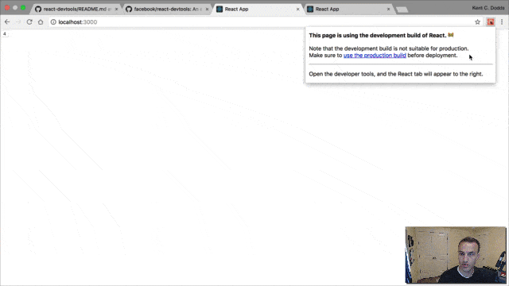

This last week I had someone criticize using React component state because:

> _there are no browser dev tools for inspecting \[component state\]_

Maybe this person just forgot about
[the official React DevTools browser extension](https://github.com/facebook/react-devtools),
maybe they didn't know about it. Whatever the case may be, it made me realize
that some people probably don't know about the browser extension, so I thought
I'd share it with you.

After considering it a bit, I decided that it would be easiest to share this
with you all via a quick (8 minute) video demo of the extension so here you have
it (the gif is a summary preview...)!

[**Use React DevTools**](https://youtu.be/DQjMiKEwl_E)**:**

Good luck!

**Learn more about React from me**:

- [egghead.io (beginners)](http://kcd.im/beginner-react) — My Beginner's Guide
  to React absolutely _free_ on [egghead.io](http://egghead.io).
- [egghead.io (advanced)](http://kcd.im/advanced-react) — My Advanced React
  Component Patterns course available on [egghead.io](http://egghead.io) today!
  This will be updated with the new context API and new patterns very soon!
- [Frontend Masters](https://frontendmasters.com/workshops/advanced-react-patterns) — My
  Advanced React Patterns workshop (updated with the new patterns and context
  API).
- [Workshop.me](https://workshop.me/2018-07-advanced-react?a=kent) — I'm giving
  my Advanced Component Patterns workshop in person in Portland in July!
- [Workshop.me](https://workshop.me/2018-08-react-intro?a=kent) — I'm giving my
  Intro to React workshop in person in Salt Lake City in August!

**Things to not miss**:

- [crapp no-more-npm-install-waiting-for-a-create-react-app](https://twitter.com/ryanflorence/status/781962059974004736) — A
  handy idea from [Ryan Florence](https://twitter.com/ryanflorence).
- [github-contributions.now.sh](https://github-contributions.now.sh) — GitHub
  Contributions Chart Generator. All your contributions in one image! By
  [Sallar Kaboli](https://twitter.com/sallar)
- [bundlephobia](https://bundlephobia.com) — find the cost of adding a npm
  package to your bundle. By [Shubham Kanodia](https://github.com/pastelsky).
