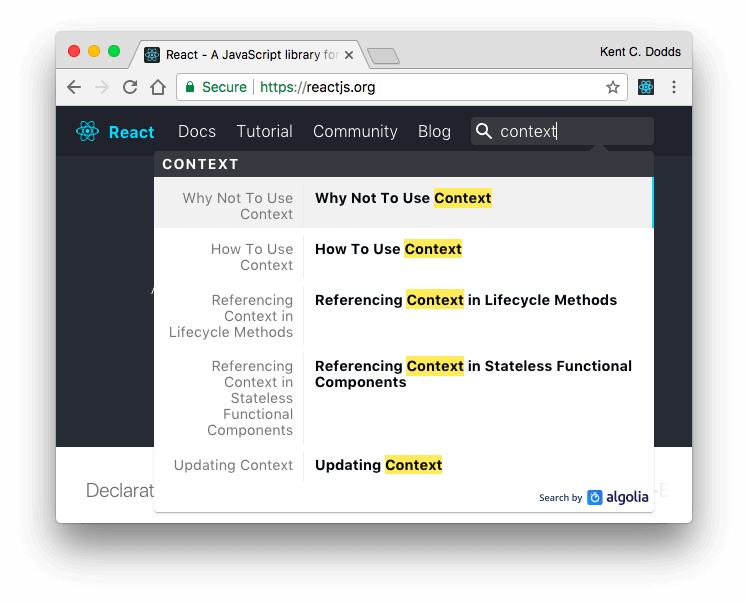

> Curious about what's going to happen to the context API when
> [React hooks](https://reactjs.org/hooks) are stable? Read all about it here:
> [https://react-vis.com/blog/react-hooks-whats-going-to-happen-to-react-context](/blog/react-hooks-whats-going-to-happen-to-react-context)

Have you heard of the context API in React? If you've heard of it, are you like
many others afraid to use it directly because you saw this in the official docs:



The first result of that search is showing
["Why Not To Use Context"](https://reactjs.org/docs/context.html#why-not-to-use-context).
Doesn't inspire a whole lot of confidence in the context API. To make things
even more concerning, that section says:

> _If you want your application to be stable, don't use context. It is an
> experimental API and it is likely to break in future releases of React._

### So why use context?

Have you ever experienced the pain of trying to get state from the top of your
react tree to the bottom? This pain you're feeling is called **"prop drilling"**
and **it's super annoying**. You wind up having to pass props through components
that don't care about the data just so you can send it down to components that
do care. And as you move components around this pain is magnified.

You could actually use a regular JavaScript module to avoid these problems. Just
put the data in a singleton module and poof, it's accessible/importable
anywhere. But then you have trouble with updates (you have to implement an event
emitter to notify subscribers when there are updates), and server side rendering
can be [problematic](https://stackoverflow.com/a/40974748/971592) with
singletons as well.

So this is where state management libraries like [redux](https://redux.js.org)
come into play (specifically
[react-redux](https://github.com/reduxjs/react-redux)). They allow you to get
data from the store easily anywhere in the tree. All you have to do is use this
thing called a `<Provider />` and magically your store data is accessible by any
component that is "connected."

What if I told you that the `<Provider />` is using this experimental context
feature 😱 Indeed it is! The provider component puts the data into context, and
the `connect` Higher Order Component pulls the data out of context. So in
reality, redux isn't allowing your data to be accessible anywhere... context is!

So, why should you use context? Well, you probably already are and loving it!
Even if you're not using context directly, your app is making use of it via
[`react-redux`](https://github.com/reactjs/react-redux/blob/76dd7faa90981dd2f9efa76f3e2f26ecf2c12cf7/src/components/connectAdvanced.js#L136-L143),
[`MobX-react`](https://github.com/mobxjs/mobx-react/blob/dc249910c74c1b2e988a879be07f10aeaea90936/src/Provider.js#L19-L34),
[`react-router`](https://github.com/ReactTraining/react-router/blob/e6f9017c947b3ae49affa24cc320d0a86f765b55/packages/react-router/modules/Router.js#L23-L34),
[`glamorous`](https://github.com/paypal/glamorous/blob/7468bfc76f46783cac841e20973ed119c771f3b7/src/theme-provider.js#L33-L37),
and more!

### Context Reborn

So we love `context`, but remember that warning that "it is likely to break in
future releases of React"? IT'S COMING! And you're going to love it!

Over a month ago, the React team created a new
[RFCs repository](https://github.com/reactjs/rfcs) inspired by
[Yarn's](https://github.com/yarnpkg/rfcs),
[Rust's](https://github.com/rust-lang/rfcs), and
[Ember's](https://github.com/emberjs/rfcs). The first pull request to that
repository is from [Andrew Clark](https://twitter.com/acdlite) (react core team
member) and it's called
["New version of context"](https://github.com/reactjs/rfcs/pull/2). In it,
Andrew outlines what the new version of context will be. There's interesting
discussion in there. A few days later, Andrew opened a PR to React called
["New context API"](https://github.com/facebook/react/pull/11818).

So what does it look like? Whelp, it's about a million times more intuitive than
the old context API. Here's the simplest useful example I can come up with:

https://codesandbox.io/s/n4r0qq898j

Here's an even simpler version so you don't have to open the codesandbox:

```jsx
const ThemeContext = React.createContext('light')
class ThemeProvider extends React.Component {
  state = {theme: 'light'}
  render() {
    return (
      <ThemeContext.Provider value={this.state.theme}>
        {this.props.children}
      </ThemeContext.Provider>
    )
  }
}

class App extends React.Component {
  render() {
    return (
      <ThemeProvider>
        <ThemeContext.Consumer>{val => <div>{val}</div>}</ThemeContext.Consumer>
      </ThemeProvider>
    )
  }
}
```

_You might notice in my example I'm using the render prop Consumer component
(the best!), but if that's not your jam, you could easily implement a Higher
Order Component or something else using the context API (which is why it's the
best)._

The new context API consists of three main parts:

- `React.createContext` which is passed the initial value (and optionally
  [a fancy opt-out function that uses a bitmask](https://twitter.com/acdlite/status/957446433656864768)).
  This returns an object with a `Provider` and a `Consumer`
- The `Provider` component is used higher in the tree and accepts a prop called
  value (which can be anything).
- The `Consumer` component is used anywhere below the provider in the tree and
  accepts a prop called "children" which must be a function that accepts the
  value and must return a react element (JSX).

I'm extremely excited about this API. The React team will remove the warning
about context being an experimental feature because it's now a
["first-class feature"](https://twitter.com/acdlite/status/957445801302618112)
of the framework. This means that people will hopefully be less concerned about
using it to help solve the prop-drilling problem in their apps which hopefully
will help people not feel like they _have_ to reach for redux so early to solve
that pain and they can instead stick with vanilla React for longer (or perhaps,
[Unstated](https://github.com/thejameskyle/unstated) by
[James Kyle](https://medium.com/@thejameskyle) is the solution we've all been
waiting for).

I recently [tweeted](https://twitter.com/react-vis/status/911276059051438082):

https://twitter.com/react-vis/status/911276059051438082

So I think if we avoid prematurely and arbitrarily breaking up render methods,
we'll feel this pain even less. But even when we do feel it, we'll have a solid,
core React API to lean on to help us avoid the problem.

### Practical Context

One question that I've seen a lot about the new context API (or the render prop
pattern in general) is how to compose providers and consumers together. When you
put a bunch of render prop components together in a single render method, things
can get... [nested](https://twitter.com/acdlite/status/955955121979969537):

https://twitter.com/acdlite/status/955955121979969537

So what can we do to avoid this? If it bothers you, then you can solve it the
same way you solve the problem in regular JavaScript: utility
functions/components. Here's an example:

```jsx
const ThemeContext = React.createContext('light')
class ThemeProvider extends React.Component {
  /* code */
}
const ThemeConsumer = ThemeContext.Consumer
const LanguageContext = React.createContext('en')
class LanguageProvider extends React.Component {
  /* code */
}
const LanguageConsumer = LanguageContext.Consumer

function AppProviders({children}) {
  return (
    <LanguageProvider>
      <ThemeProvider>{children}</ThemeProvider>
    </LanguageProvider>
  )
}

function ThemeAndLanguageConsumer({children}) {
  return (
    <LanguageConsumer>
      {language => (
        <ThemeConsumer>{theme => children({language, theme})}</ThemeConsumer>
      )}
    </LanguageConsumer>
  )
}

class App extends React.Component {
  render() {
    return (
      <AppProviders>
        <ThemeAndLanguageConsumer>
          {({theme, language}) => (
            <div>
              {theme} and {language}
            </div>
          )}
        </ThemeAndLanguageConsumer>
      </AppProviders>
    )
  }
}
```

The goal here is to take common use cases and make special functions/components
to make those use cases more ergonomic. Just like you do in regular JavaScript!
Makes sense right? I hope it does anyway 😅

I have another example here that really shows how bad the nesting can get and
how to use a utility called `react-composer` by
[jmeas](https://twitter.com/jmeaspls) to make it great:

https://codesandbox.io/s/92pj14134y

I should mention that I don't expect you to need to nest render props components
a whole lot in practice. Whenever you do, you can create a simple component that
composes them together and use that one instead.

### Conclusion

Like I said, I'm super stoked about this API. It's currently unreleased, but
will be included in the next minor React release. Don't worry, the old context
API will continue to work until the next major release, so everyone should have
time to migrate. And don't forget that the React team has over 50,000 react
components at Facebook they need to consider when making changes like this.
There will quite probably be a codemod released to automatically update most
everyone's code (as there often is).

I'm excited about what this new API has to offer. As
[I noted on twitter recently](https://twitter.com/react-vis/status/956675313966239745)
(in response to [Dan Abramov](https://twitter.com/dan_abramov)'s
[tweet](https://twitter.com/dan_abramov/status/956674265104953344)):

https://twitter.com/react-vis/status/956675313966239745

So much to look forward to! Good luck! 👍

**Things to not miss**:

- [`react-broadcast`](https://github.com/ReactTraining/react-broadcast) is a
  library from [Michael Jackson](https://twitter.com/mjackson) that provides the
  same capabilities as context.
  [The next version](https://github.com/ReactTraining/react-broadcast/tree/next)
  will be a sort of polyfill for `React.createContext` (shoutout to
  [James Kyle](https://medium.com/@thejameskyle) as well for creating
  [`create-react-context`](https://github.com/thejameskyle/create-react-context)).
  I actually use `react-broadcast` in
  [my advanced react course](https://egghead.io/courses/advanced-react-component-patterns)
  which I'll have to update when the new context API is official 😅.
- [`react-fns`](https://github.com/jaredpalmer/react-fns): Browser API's turned
  into declarative React components and HoC's by
  [Jared Palmer](https://twitter.com/jaredpalmer) 👏
- [`react-composer`](https://github.com/jmeas/react-composer): Compose render
  prop components (what I use in the codesandbox above) by
  [jmeas](https://twitter.com/jmeaspls)
- [`react-contextual`](https://github.com/drcmda/react-contextual): Tiny helper
  around Reacts new context API by [Paul Henschel](https://twitter.com/0xca0a)

https://twitter.com/acdlite/status/960288610229473280

[**What's new in React 16.3(.0-alpha)**](https://medium.com/@baphemot/whats-new-in-react-16-3-d2c9b7b6193b)
