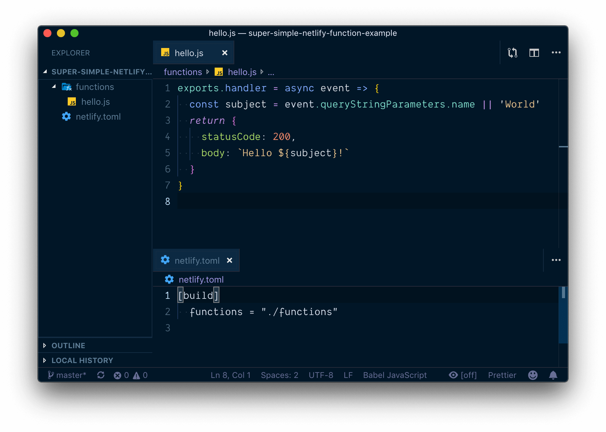
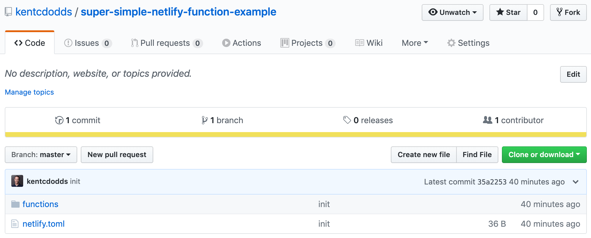
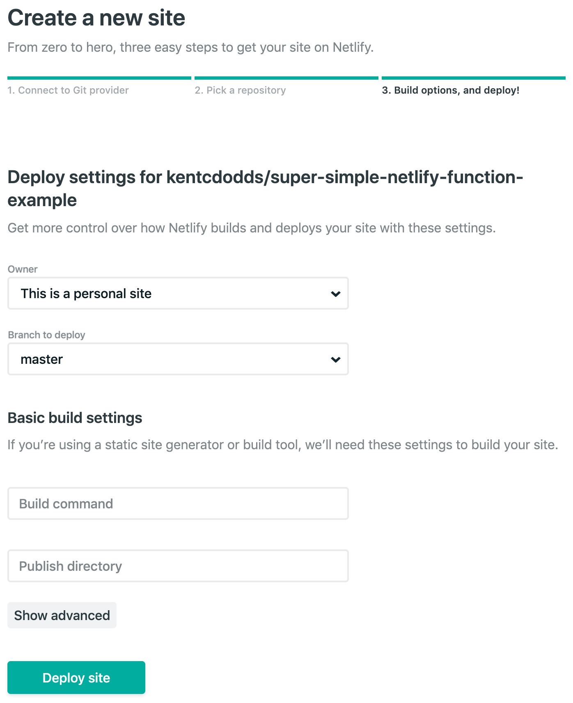
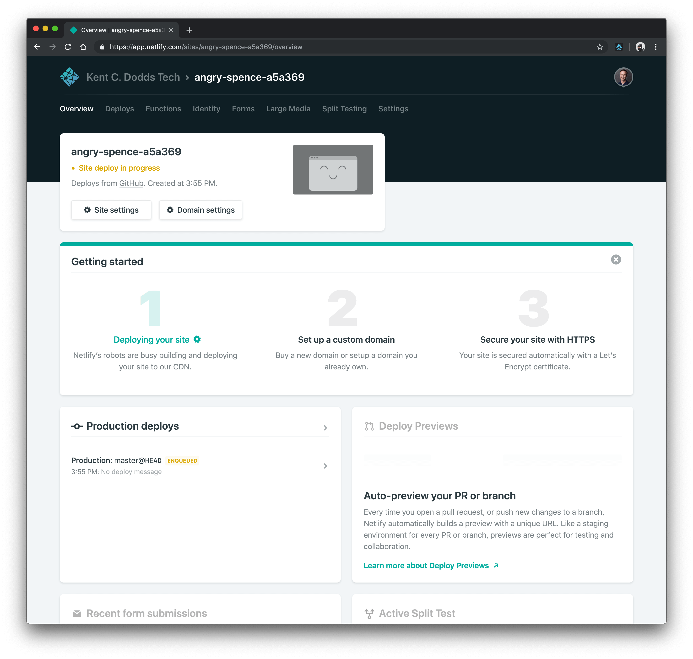
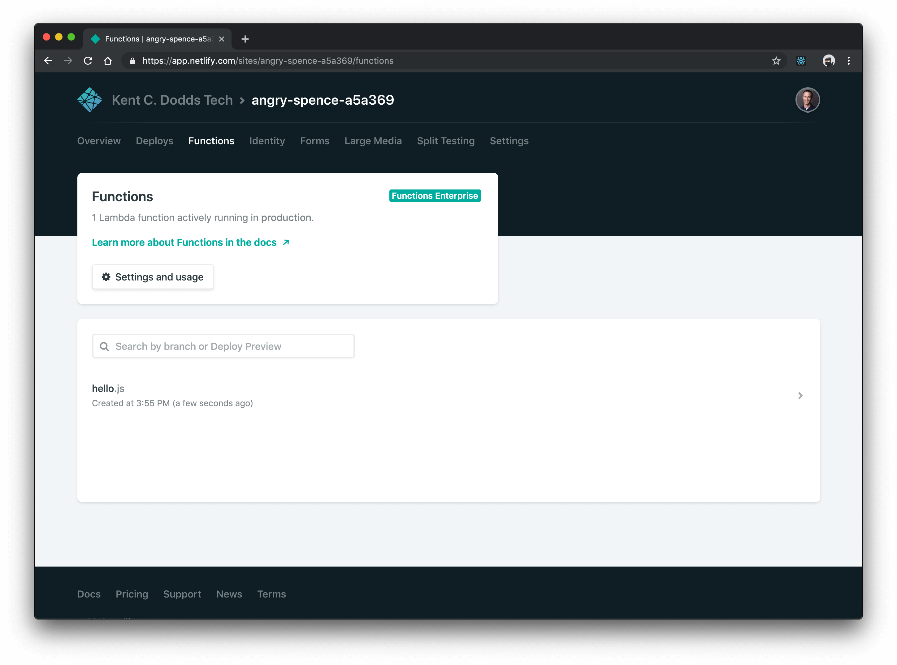
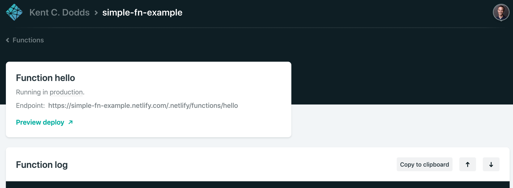
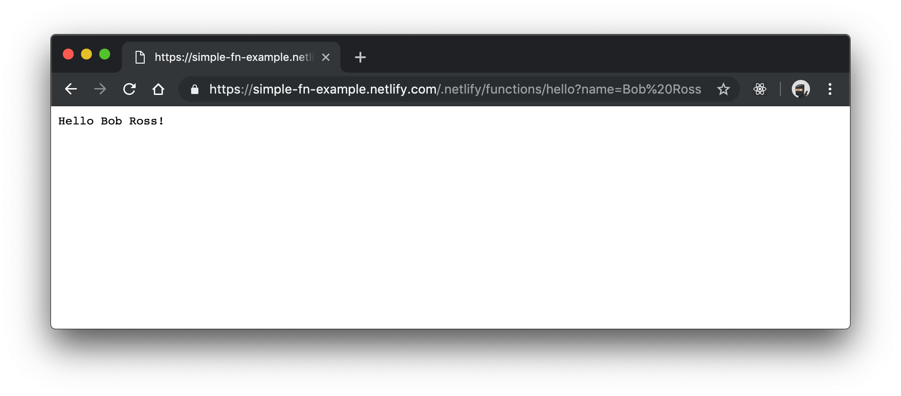

This last little while I've been doing a fair amount of work on
[react-vis.com](https://react-vis.com). One page that I've been working on is
the [contact page](/contact) where you can
[request enterprise training](https://kcd.im/request-a-workshop),
[schedule an hour of my time for consulting](https://kcd.im/consulting), or even
[leave your own testimonial of my work](https://kcd.im/testimonial) (I'd love it
if you did!).

My app is built with [GatsbyJS](https://www.gatsbyjs.org) which has quickly
become one of my favorite pieces of technology. Gatsby is a static site
generator, so it generates a bunch of HTML, CSS, and JavaScript files in a
directory called `public` in my project and it leaves it to me to get those
files on the World Wide Web for you and your loved ones to enjoy.

So how do I get those files up there on the internet? I use
[Netlify](https://www.netlify.com)! I've LOVED Netlify for years. It's bonkers
how quickly I can get a site up and running (with HTTPS) with Netlify and it's
integration with GitHub is unmatched. I love it.

Great, so now I've got static files served ultra-fast on the internet with
Netlify's CDN. But how do I make it so my contact form can actually send emails?
You may not be aware of this, but web browsers are not able to send emails
themselves. To do that you need a server. I don't know about you, but managing
servers and databases are among the top things on the list of stuff I do NOT
enjoy about web development.

You may have heard of "Serverless" or "Lambda Functions" or "Azure Functions"
etc. What's cool about this is you can write your server code without worrying
about managing servers or paying to have them sit around waiting for requests
all day long (which is particularly useful for a contact form like mine).

I remember years ago when those started getting popular, I tried them out a bit
and was reminded why I don't enjoy working with backend/devops stuff. As cool as
these functions were conceptually, I just didn't feel like I was smart enough to
navigate the complexities of the offerings.

Luckily for us, almost exactly one year ago from the time I'm writing this,
Netlify took the complexity of AWS Lambda functions and made it super simple (I
think it's what they do best):

https://twitter.com/netlify/status/976126036491386880

I want to give you a really quick intro to using Netlify to deploy server code
in a way that is mind-blowingly straightforward to me.

## How to use Netlify Lambda Functions

Before you get started, you'll need a [GitHub](https://github.com) account, a
[Netlify](https://netlify.com) account, and a fresh repository. Once you've got
the project locally on your computer, then you can start with the following
steps:

### Step 1: Create a `netlify.toml` file

This file configures some stuff about our repository for netlify. Here's all you
need for this to work:

```toml
[build]
  functions = "./functions"
```

All this is saying is: Hey Netlify, when you build my project, the functions are
located in the "functions" directory.

### Step 2: Create `functions/hello.js`

Now that we've told Netlify where to find our functions files, let's make one:

```javascript
// functions/hello.js
exports.handler = async event => {
  const subject = event.queryStringParameters.name || 'World'
  return {
    statusCode: 200,
    body: `Hello ${subject}!`,
  }
}
```

Netlify uses AWS Lambda under the hood, so you can checkout documentation and
learning materials about creating AWS Lambda functions for what kind of code can
go in there. We'll start with something simple that returns a promise (note it's
an `async` function) which resolves to an object for the response we want for
this function. You can do all kinds of things in that function (like connect
with an SMTP mail server and send an email which is what I do in my contact
form).

### Step 3: Commit and push



Now you can just do: `git add -A`, then `git commit -m 'init'`, and
`git push -u origin master` and you're set! Now let's go over to Netlify.



### Step 4: Setup Netlify

Go to [your netlify sites](https://app.netlify.com) and click "New site from
Git." From there you'll connect your Netlify account to your GitHub account and
it'll show you a list of repositories. Search for the one you want and click on
it.



Go ahead and leave the "Build command" and "Publish directory" fields empty and
ignore the advanced options. Just click "Deploy site."



Now you're on the Overview page of your site. It should only take a few seconds
to deploy your site. You can see info about that on the "Deploys" page. While
you wait, you can edit the Site name to be something more memorable by clicking
"Site settings."

Once the deploy is finished, you can go to the "Functions" page:



There you should see `hello.js`! If you click that it'll show you the function
log. Calls from your function to `console.log` should appear here with a
timestamp as well as a note for whenever your function is invoked:



Checkout the "Endpoint" and it shows your function is available on the World
Wide Web at `https://<your-site-name>.netlify.com/.netlify/functions/hello`.

Really quick I just want to explain something. In `netlify.toml` we told Netlify
that it can find the JavaScript for our functions in the `./functions` directory
(we could've called that whatever we wanted). Netlify takes each JavaScript file
in there and deploys it (as-is) to AWS lambda, then sets up an endpoint for
hitting that function for us under `/.netlify/functions` (this is not
configurable AFAIK).

Cool, so now we can hit that URL and boom, Hello Bob Ross!



Wahoo!

## Next steps

You can find my version of this project
[on GitHub](https://github.com/uber/react-vis/super-simple-netlify-function-example)
and
[on Netlify](https://simple-fn-example.netlify.com/.netlify/functions/hello).

One important thing to note is that Netlify will send only the files for our
functions to AWS and no more. This means that if you try to `require` something
from a local `utils` directory or `node_modules` you're out of luck.

Also, testing this locally is... not easy...

**But wait!** Netlify engineers have built
[`netlify-lambda`](https://www.npmjs.com/package/netlify-lambda) to solve both
of these problems! I've taken the liberty of giving you an example of this same
function that uses `netlify-lambda` here
[on GitHub](https://github.com/uber/react-vis/netlify-function-example).

Here are the main changes:

1. Added a `package.json` to configure npm/yarn to install `netlify-lambda` and
   created `dev` and `build` scripts.
2. Added a `.gitignore` to ignore the `.netlify` directory which is where
   `netlify-lambda` will place our compiled functions.
3. Added a `command` line in our `netlify.toml` file to have the build run the
   command `npm run build` which will trigger `netlify-lambda` to build our
   function into a single file for delivery to AWS Lambda.
4. Updated the `functions` line in our `netlify.toml` file to point to
   `.netlify/functions/` which is where `netlify-lambda` will place our final
   built functions.

Everything else is the same, but now we can actually require different files!

## Conclusion

Any time we need to make a change to our function, we simply make those changes,
commit them to GitHub and Netlify will automatically update that on AWS Lambda.
It's very fast and super empowering.

I love enabling technologies like this. I shouldn't have to build an entire
backend with a database and server farm to allow you to send me
[Enterprise Training Inquiries](https://kcd.im/request-a-workshop), and thanks
to Netlify, I don't have to. It's pretty slick!

Give it a try! I think you'll love it too.

## P.S.

<!-- prettier escapes the $ https://github.com/prettier/prettier/issues/5483 -->
<!-- prettier-ignore -->
My friend [Shawn Wang](https://twitter.com/swyx) works at Netlify and he
mentioned he's working on a few neat things that he'll be announcing at
[jamstackconf](https://twitter.com/jamstackconf) 2019. He gave me a discount
code you can use to get $100 off a ticket if you want to go: `friendsofswyx`.

Also, Shawn mentioned that Netlify does have a Forms service built-in for
contact forms like I have. I originally used that, but it doesn't actually send
emails (you have to integrate with Zapier and it's an ok experience).

Also, while `/.netlify/functions` is not configurable, you can alias it to
anything with a redirect, including serving your entire site from a function
which is pretty legit.
