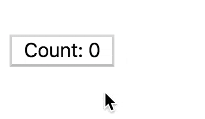
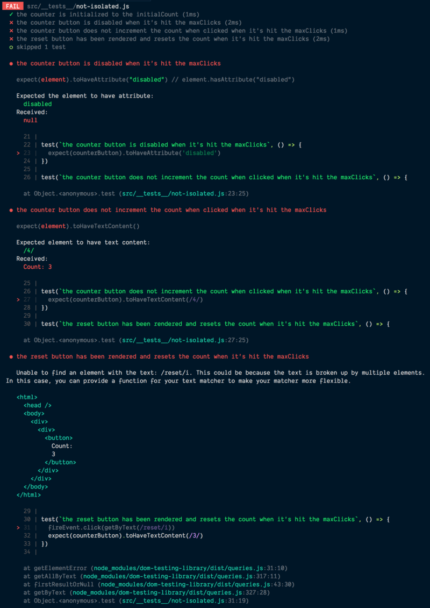

**Read to the end, I've got some cool things in the "things not to miss"
section**

The inspiration for this newsletter comes from seeing React tests that look like
this:

```jsx
const utils = render(<Foo />)

test('test 1', () => {
  // use utils here
})

test('test 2', () => {
  // use utils here too
})
```

So I want to talk about the importance of test isolation and guide you to a
better way to write your tests to improve the reliability of the tests, simplify
the code, and increase the confidence your tests and provide as well.

Let's take this simple component as an example:

```jsx
import React from 'react'

class Counter extends React.Component {
  static defaultProps = {
    initialCount: 0,
    maxClicks: 3,
  }
  initialState = {count: this.props.initialCount}
  state = this.initialState
  handleReset = () => this.setState(this.initialState)
  handleClick = () =>
    this.setState(({count}) =>
      this.clicksAreTooMany(count) ? null : {count: count + 1},
    )
  clicksAreTooMany(count) {
    return count >= this.props.maxClicks
  }
  render() {
    const {count} = this.state
    const tooMany = this.clicksAreTooMany(count)
    return (
      <div>
        <button onClick={this.handleClick} disabled={tooMany}>
          Count: {count}
        </button>
        {tooMany ? <button onClick={this.handleReset}>reset</button> : null}
      </div>
    )
  }
}

export {Counter}
```

Here's a rendered version of the component:



### Our first test suite

Let's start with a test suite like the one that inspired this newsletter:

```jsx
import 'jest-dom/extend-expect' // gives us the toHaveTextContent/toHaveAttribute matchers
import React from 'react'
import {renderIntoDocument, cleanup, fireEvent} from 'react-testing-library'
import {Counter} from '../counter'

const {getByText} = renderIntoDocument(
  <Counter maxClicks={4} initialCount={3} />,
)
const counterButton = getByText(/^count/i)

afterAll(cleanup) // when all tests are finished, unmount the component

test('the counter is initialized to the initialCount', () => {
  expect(counterButton).toHaveTextContent(/3)
})

test('when clicked, the counter increments the click', () => {
  fireEvent.click(counterButton)
  expect(counterButton).toHaveTextContent(/4)
})

test(`the counter button is disabled when it's hit the maxClicks`, () => {
  fireEvent.click(counterButton)
  expect(counterButton).toHaveAttribute('disabled')
})

test(`the counter button does not increment the count when clicked when it's hit the maxClicks`, () => {
  expect(counterButton).toHaveTextContent(/4)
})

test(`the reset button has been rendered and resets the count when it's hit the maxClicks`, () => {
  fireEvent.click(getByText(/reset/i))
  expect(counterButton).toHaveTextContent(/3)
})
```

These tests give us 100% coverage of the component and verify exactly what they
say they'll verify. The problem is that they share mutable state. What is the
mutable state they're sharing? The component! One test clicks the counter button
and the other tests rely on that fact to pass. If we were to delete (or `.skip`)
the test called "when clicked, the counter increments the click" it would break
all the following tests:



This is a problem because it means that we can't reliably refactor these tests,
or run a single test in isolation of the others for debugging purposes because
we don't know which tests are impacting the functionality of others. It can be
really confusing when someone comes in to make changes to one test and other
tests start breaking out of nowhere.

### Better

So let's try something else and see how that changes things:

```jsx
import 'jest-dom/extend-expect'
import React from 'react'
import {renderIntoDocument, cleanup, fireEvent} from 'react-testing-library'
import {Counter} from '../counter'

let getByText, counterButton

beforeEach(() => {
  const utils = renderIntoDocument(<Counter maxClicks={4} initialCount={3} />)
  getByText = utils.getByText
  counterButton = utils.getByText(/^count/i)
})

afterEach(cleanup)

test('the counter is initialized to the initialCount', () => {
  expect(counterButton).toHaveTextContent(/3)
})

test('when clicked, the counter increments the click', () => {
  fireEvent.click(counterButton)
  expect(counterButton).toHaveTextContent(/4)
})

test(`the counter button is disabled when it's hit the maxClicks`, () => {
  fireEvent.click(counterButton)
  expect(counterButton).toHaveAttribute('disabled')
})

test(`the counter button does not increment the count when clicked when it's hit the maxClicks`, () => {
  fireEvent.click(counterButton)
  fireEvent.click(counterButton)
  expect(counterButton).toHaveTextContent(/4)
})

test(`the reset button has been rendered and resets the count when it's hit the maxClicks`, () => {
  fireEvent.click(counterButton)
  fireEvent.click(getByText(/reset/i))
  expect(counterButton).toHaveTextContent(/3)
})
```

With this, each test is completely isolated from the other. We can delete or
skip any test and the rest of the tests continue to pass. The biggest
fundamental difference here is that each test has its own count instance to work
with and it's unmounted after each test (`afterEach(cleanup)`). This
significantly reduces the amount of complexity of our tests with minor changes.

One thing people often say against this approach is that it's slower than the
previous approach. I'm not totally sure how to respond to that... Like, how much
slower? Like a few milliseconds? In that case, so what? A few seconds? Then your
component should probably be optimized because that's just terrible. I know it
adds up over time, but with the added confidence and improved maintainability of
this approach, I'd gladly wait an extra few seconds to render things this way.
In addition, you shouldn't often have to run the entire test base anyway thanks
to great watch mode support like we have in Jest.

### Even better

So I'm actually still not super happy with the tests we have above. I'm not a
huge fan of `beforeEach` and sharing variables between tests.
[I feel like they lead to tests that are harder to understand](https://www.briefs.fm/3-minutes-with-kent/27).
Let's try again:

```jsx
import 'jest-dom/extend-expect'
import React from 'react'
import {renderIntoDocument, cleanup, fireEvent} from 'react-testing-library'
import {Counter} from '../counter'

afterEach(cleanup)

function renderCounter(props) {
  const utils = renderIntoDocument(
    <Counter maxClicks={4} initialCount={3} {...props} />,
  )
  const counterButton = utils.getByText(/^count/i)
  return {...utils, counterButton}
}

test('the counter is initialized to the initialCount', () => {
  const {counterButton} = renderCounter()
  expect(counterButton).toHaveTextContent(/3)
})

test('when clicked, the counter increments the click', () => {
  const {counterButton} = renderCounter()
  fireEvent.click(counterButton)
  expect(counterButton).toHaveTextContent(/4)
})

test(`the counter button is disabled when it's hit the maxClicks`, () => {
  const {counterButton} = renderCounter({
    maxClicks: 4,
    initialCount: 4,
  })
  expect(counterButton).toHaveAttribute('disabled')
})

test(`the counter button does not increment the count when clicked when it's hit the maxClicks`, () => {
  const {counterButton} = renderCounter({
    maxClicks: 4,
    initialCount: 4,
  })
  fireEvent.click(counterButton)
  expect(counterButton).toHaveTextContent(/4)
})

test(`the reset button has been rendered and resets the count when it's hit the maxClicks`, () => {
  const {getByText, counterButton} = renderCounter()
  fireEvent.click(counterButton)
  fireEvent.click(getByText(/reset/i))
  expect(counterButton).toHaveTextContent(/3)
})
```

Here we've increased some boilerplate, but now every test is not only isolated
technically, but also visually. You can look at a test and see exactly what it
does without having to worry about what hooks are happening within the test.
This is a big win in the ability for you to be able to refactor, remove, or add
to the tests.

### Even better better

I like what we have now, but I think we need to take things one step further
before I feel really happy about things. We've split our tests up by
functionality, but what we really want to have confidence in is the use case
that our component satisfies. It allows clicks until the maxClicks is reached,
then requires a reset. That's what we're trying to verify and gain confidence
in. I'm much more interested in use cases when I'm testing than specific
functionality. So what would these tests look like if we concerned ourselves
more with the use case than the individual functionality?

```jsx
import 'jest-dom/extend-expect'
import React from 'react'
import {renderIntoDocument, cleanup, fireEvent} from 'react-testing-library'
import {Counter} from '../counter'

afterEach(cleanup)

test('allows clicks until the maxClicks is reached, then requires a reset', () => {
  const {getByText} = renderIntoDocument(
    <Counter maxClicks={4} initialCount={3} />,
  )
  const counterButton = getByText(/^count/i)

  // the counter is initialized to the initialCount
  expect(counterButton).toHaveTextContent(/3)

  // when clicked, the counter increments the click
  fireEvent.click(counterButton)
  expect(counterButton).toHaveTextContent(/4)

  // the counter button is disabled when it's hit the maxClicks
  expect(counterButton).toHaveAttribute('disabled')
  // the counter button no longer increments the count when clicked.
  fireEvent.click(counterButton)
  expect(counterButton).toHaveTextContent(/4)

  // the reset button has been rendered and is clickable
  fireEvent.click(getByText(/reset/i))

  // the counter is reset to the initialCount
  expect(counterButton).toHaveTextContent(/3)

  // the counter can be clicked and increment the count again
  fireEvent.click(counterButton)
  expect(counterButton).toHaveTextContent(/4)
})
```

I really love this kind of test. It helps me avoid thinking about functionality
and focus more on what I'm trying to accomplish with the component. It serves as
much better documentation of the component than the other tests as well.

In the past, the reason we wouldn't do this (have multiple assertions in a
single test) is because it was hard to tell which part of the test broke. But
now we have much better error output and it's really easy to identify what part
of the test broke. For example:


The code frame is especially helpful. It shows not only the line number, but the
code around the failed assertion which shows our comments and other code to
really help give us context around the error message that not even our previous
tests gave us.

I should mention, this isn't to say that you shouldn't separate test cases for a
component! There are many reasons you'd want to do that and most of the time you
will. Just focus more on use cases than functionality and you'll generally cover
most of the code you care about with that. Then you can have a few extra tests
to handle edge cases.

### Conclusion

I hope this is helpful to you! You can find the code for this example
[here](https://github.com/uber/react-vis/react-test-isolation). Try to keep your
tests isolated from one another and focus on use cases rather than functionality
and you'll have a much better time testing! Good luck!

**Learn more about testing from me**:

- [Frontend Masters](https://frontendmasters.com):
  [Testing Practices and Principles](https://frontendmasters.com/workshops/testing-practices-principles),
  [Testing React Applications](https://frontendmasters.com/courses/testing-react)
- [Confidently Ship Production React Apps](https://egghead.io/lessons/react-confidently-ship-production-react-apps) — Something
  new on [egghead.io](http://egghead.io). It's a recording of one of my talks
  especially for [egghead.io](http://egghead.io). I think you'll really enjoy it
  (and it's 🆓)
- [Write tests. Not too many. Mostly integration.](https://youtu.be/Fha2bVoC8SE&list=PLV5CVI1eNcJgNqzNwcs4UKrlJdhfDjshf) — My
  talk at Assert.js conference
  ([and here's the blog post](http://kcd.im/write-tests))
- [Testing Practices and Principles](https://youtu.be/VQZx1Z3sW0E&list=PLV5CVI1eNcJgNqzNwcs4UKrlJdhfDjshf) — A
  recording of my workshop at Assert.js

**Things to not miss**:

- [Byteconf React Speakers: Round One](https://medium.com/byteconf/byteconf-react-speakers-round-one-ab25af8edf23) — Look!
  It's a free online conference and I'm speaking at it!
- [🏎 downshift 2.0.0 released 🎉](/blog/downshift-2-0-0-released) — Even better
  accessibility, React Native and ReasonReact support, even simpler API,
  improved docs, new examples site, Flow and TypeScript support, and a new
  online community ⚛️
- [keycode.info](http://keycode.info) by
  [Wes Bos](https://twitter.com/wesbos) — shows you the javascript character
  code for the key you type. Handy!
- [Chrome Pixelbook](https://store.google.com/us/product/google_pixelbook) — It's
  what I'm using to write this right now and it's pretty slick!
- [Testing Socket.io-client app using Jest and react-testing-library](https://medium.com/@Daajust/testing-socket-io-client-app-using-jest-and-react-testing-library-9cae93c070a3)
  by my friend [Justice Mba](https://twitter.com/Daajust).
- [Webpack 4 — Mysterious SplitChunks Plugin](https://medium.com/@hemal7735/webpack-4-splitchunks-plugin-d9fbbe091fd0) — My
  fellow PayPal engineer [Hemal Patel](https://twitter.com/TheHemalPatel) wrote
  about how the `splitChunks.chunks` feature works. Pretty interesting!
