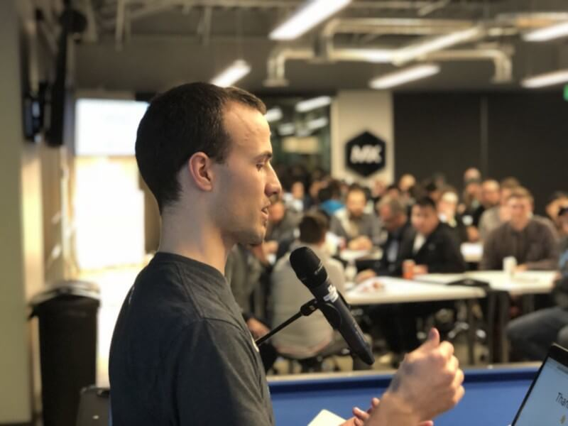
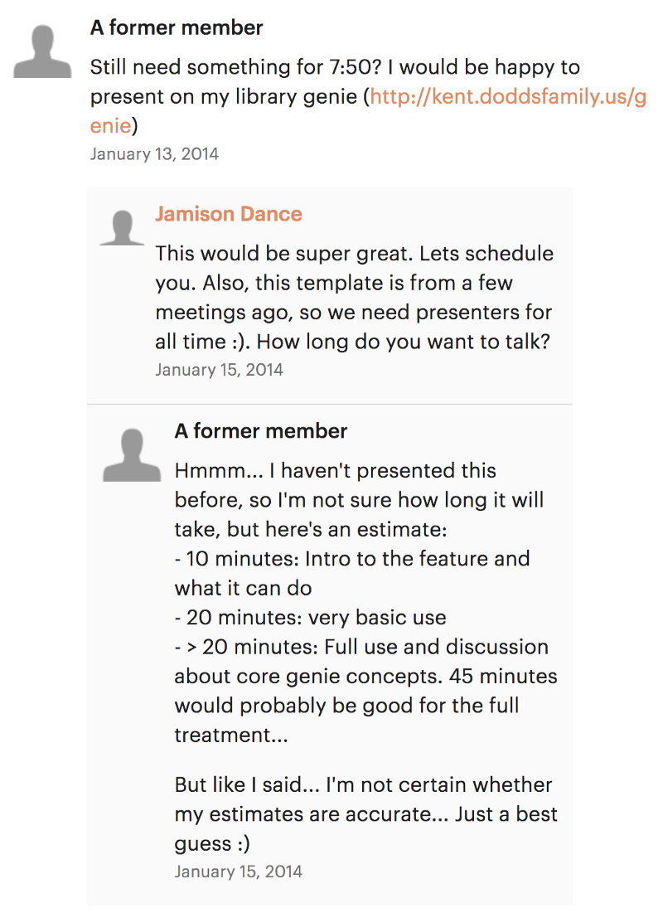

When I was still in school in the Information Systems program at
[BYU](https://www.byu.edu), I discovered and started listening to
[JavaScript Jabber](https://devchat.tv/js-jabber). At the time,
[Jamison Dance](https://twitter.com/jergason) was on the show and also the
organizer of the local JavaScript meetup. I remember him mentioning the meetup
on the show and thought it'd be really cool to attend and learn from others
(which it is!).

So I looked up the
[meetup page](https://www.meetup.com/UtahJS-Orem-Meetup/events/156148202) he
mentioned and noticed that there was an opening for a speaker. I had just gotten
back from the first ng-conf (2014) and thought that whole public speaking thing
looked like a lot of fun. I also had been working on a personal open source
project on the side called [geniejs](https://github.com/kentcdodds/genie) (which
was part of how I eventually got
[my first job](https://github.com/kentcdodds/ama/issues/1)) and thought if they
needed a speaker I could talk about genie! So I offered to fill their slot:

And just like that, the first meetup I attended I was a speaker. Turns out
meetup organizers are often willing to give a speaking slot to anyone who so
much as sneezes in their direction because speakers are surprisingly hard to
come by on a monthly basis 😅

So there's the history of how I got started with public speaking in tech.

#### **So why did I do it?**

I can think of two reasons:

- I thought my library was cool and really wanted people to start using it.
- I thought it would be fun.

I know a lot of people think that public speaking is worse than death. _How on
earth could I think it's fun?_ Well, if you don't mind, let me give you a little
context into my childhood...

Ever since I was a little child, I've been speaking in front of groups of
people. As a child, I spoke in [my Church's](https://www.mormon.org) primary
program (in front of a handful of adult instructors and a few dozen of my peers)
a dozen times or so. When I was a teenager, I had a speech class in school,
started giving short talks in
[my seminary classes](https://www.mormonnewsroom.org/topic/seminary), and gave 5
minute talks in front of my entire church congregation (a
["Ward"](https://www.mormonnewsroom.org/article/ward)consisting of ~200 people).
By the time I moved out of my home at 18, I had probably given 40 talks of
various lengths and on various subjects (though most were religious in nature).
During that time I also gave ~15 minute lessons to my family in
[family home evenings](https://www.lds.org/topics/family-home-evening/purpose),
and led lessons in my church classes as well.

In Junior High and High School, I was also a stage performer. I
[played the piano](https://youtu.be/agdbnzQlMFE) (yes, I'm hitting my head and
forearm on the piano at ~2 minutes),
[sang in choirs](https://youtu.be/F5_QmWwIF3c), and I was in
[my High School's Show Choir "Jive!"](https://youtu.be/5_sRK8UUc3k) (yep, that's
me in the green doing a backflip at ~6:40). After leaving home and spending a
semester at BYU, I left on
[a mission for my church](https://www.mormonnewsroom.org/topic/missionary-program)
and had even more opportunities to speak in front of people (both church
congregations as well as teach lessons to people in their homes).

#### **So why did I think it'd be fun?**

I guess it's because I was privileged to grow up with opportunities that allowed
the fears surrounding public speaking to fall away and all that's left is the
pure joy of sharing experiences and connecting with people in a big way.

I'm mentioning all of this in part for me to walk down memory lane, but also to
illustrate that growing up, I spent a LOT of time in front of people. This will
hopefully give you more context into the why and how I started speaking publicly
at tech meetups and conferences, and hopefully will give you some ideas of what
you can start doing today if that's something you want to do more of as well.

So that's why and how I started public speaking. From there it was pretty
natural to transition to speaking at conferences. I wanted to speak at
conferences because, as I said, I'd just gotten back from my first ever tech
conference (ng-conf) and it was awesome. I wanted to go to more, but my company
wouldn't pay for all the conferences I wanted to attend, so I needed to find
some other way to afford going. So my motivation to speak at conferences was
primarily to be able to attend.

Conference speakers normally have all expenses paid (as they should), so I
started searching around for open conference CFPs (Call For Proposals) (I used
[Lanyrd](https://twitter.com/lanyrd), but I think
[confs.tech](https://confs.tech) is probably better these days. I'm sure there
are more... Google around 😉). I wrote a dozen or so proposals about subjects
that I knew I could write and deliver a fun and informative talk from. I
submitted them to every relevant conference I could. One conference I was
accepted to was Jfokus which is in Stockholm, Sweden (a fact that I realized
only _after_ I'd been accepted 😅). They invited me to give a workshop as well
and that's how I got my first paid workshop gig. (Another story is the fact that
speaking at a meetup was how I got my gig at [egghead.io](http://egghead.io) as
well).

I was able to attend a ton of conferences. Too many actually. As awesome as it
was, it started to negatively impact my family and work. So I've pulled back
considerably, and now I have to be a lot more picky about which conferences I'll
submit to.

### Conclusion

So why do I speak at meetups and conferences now?

- The joy of sharing knowledge and connecting with an audience
- The ability to travel and see new places
- Become a recognized name in the industry to (hopefully) help secure my
  family's financial stability
- Promote the practices and technologies that I enjoy in an effort to increase
  the community around them
- To [solidify what I'm learning](/blog/solidifying-what-you-learn)

How did I get into public speaking?

- **I spent a TON of time in front of people.** Early in childhood, these (large
  and small) opportunities came upon me thanks to others in my life. Now I
  actively search for these opportunities (both large and small).
- **I wasn't afraid of rejection.** Just ask, and keep asking. Early on, I had
  about a %5 acceptance rate for my conference proposals (though probably a 95%
  acceptance rate for my meetup "proposals" 😅).

I really hope this is helpful to you. I definitely still get nervous before
speaking, just like I was always nervous before performing in stage or speaking
in church as a kid. That never goes away. But the more practice you get, the
more able you will be to take that nervous energy and turn it into positive
energy to get the audience engaged which will help you connect with them better.
Keep practicing! Good luck :D

**Learn more about "self improvement" from me**:

- [Zero to 60 in Software Development: How to Jumpstart Your Career](https://youtu.be/-qPh6I2hfjw&list=PLV5CVI1eNcJgNqzNwcs4UKrlJdhfDjshf) — A
  talk I gave a few years ago that's related and has some similar stories to
  this post.

> _Folks have been telling me I should make a course about (the good side of)
> personal brand marketing / self-promotion. Let me know if you'd be interested
> in this._

**Things to not miss**:

- [How and Why to Speak at Tech Conferences](https://hackernoon.com/how-and-why-to-speak-at-tech-conferences-1d50a3f548e0)
  by [Nick Heiner](https://twitter.com/nickheiner) — A great blog post that goes
  deeper on this subject.
- [Test and Code Episode 45: David Heinemeier Hansson — Software Development and Testing, TDD, and exploratory QA](http://testandcode.com/45)-
  A refreshingly practical view of testing software from the creator of Ruby on
  Rails.
- [DevTips](http://kcd.im/devtips) — If you're not reviewing these on a regular
  basis, I suggest you do. I put out some pretty cool things on this playlist.
  You could make it easy on yourself and
  [subscribe to my youtube channel](http://kcd.im/youtube)
