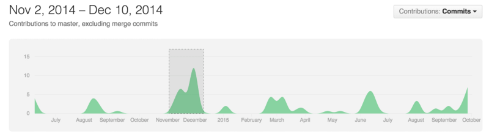
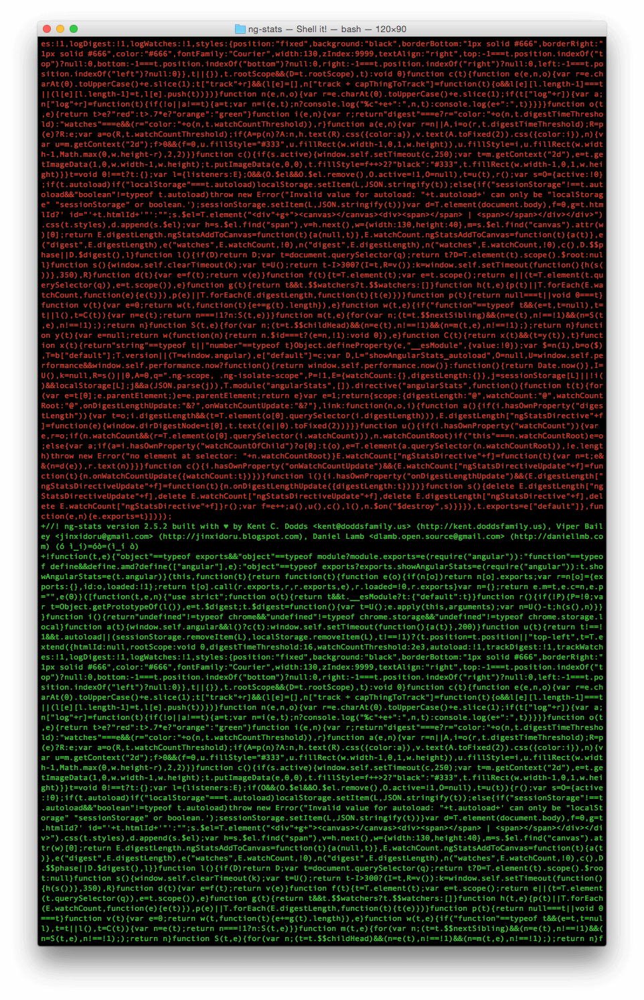

This is an age old
[question and debate](http://stackoverflow.com/q/893913/971592). There are pros
and cons to both sides of the argument. In this post, I’ll explain my experience
committing generated (built) files to master for my libraries and why/how I
don’t do that anymore.

### First, generated files?

In the context of a library, the generated files would be what the user of your
library includes on their page with something like a script tag. So the
concatenated, compiled, and minified version of your library files. For small
libraries this may not be needed, but for multiple-file libraries that need to
run in the browser of today which doesn’t support ES6 modules yet, you’re going
to want to distribute a single file. This is what I mean when I say “generated
files.”

### So, why do it?

You might be tempted to commit built files to source for a few reasons:

1.  Bower needs them there
    ([stop using bower](http://gofore.com/ohjelmistokehitys/stop-using-bower))
2.  Makes it easier for people just downloading the files (not using npm or
    bower)
3.  Enables use of [rawgit](http://rawgit.com) for examples in tools like
    [jsbin](http://jsbin.com) or [plunker](http://plnkr.co)

For a long time, these are the reasons that I committed my generated files for
my libraries to my git repository. Everything worked out great! But I did have a
few problems.

### Problems…

These are some of the things that I just dealt with because I hadn’t thought of
a way to get those benefits without these issues. Until now.

#### Exploding git changes

Looks like a huge boost of features right? Nope! that bump is when a build was
added to ng-stats (there were a few other significant changes as well). The
subsequent bumps are whenever a new version was released (and hence the build
re-run and re-committed). This make’s it difficult to get a good read of the
activity of a project.

#### Terrible Git Diffs

When developing the library, you have to make sure that you only commit the
built files when doing a release (and not with other file changes), otherwise
your git diffs are going to be a huge mess and it’ll be hard to identify when
and what changes entered in the codebase.

But even having this separation is frustrating at best because diffing two
commits that are separated by a build will result in an impossible git diff as
well. 😫

#### Contributions to dist

If you’re writing an open source library, chances are you want to make it easy
to contribute to and
[welcoming to new contributors](http://www.erikaheidi.com/blog/is-your-open-source-project-welcoming-to-new-contributors).
I have often received
[pull](https://github.com/kentcdodds/ng-stats/pull/20)[requests](https://github.com/kentcdodds/ng-stats/pull/33)
that make changes to the generated files rather than the source files (or commit
a run of the build script). Their contributions would be overwritten next time
the build is run! Others will submit
[a](https://github.com/kentcdodds/ng-stats/pull/38)
[PR](https://github.com/kentcdodds/ng-stats/pull/44) that includes the updated
dist (which ruins the diff for that commit as mentioned earlier).

For these kinds of contributions, I always have to (kindly) ask the contributor
to resubmit the PR with a force push so that commit doesn’t get into my history.
This is not a very good experience for contributors 😿

If you want people to contribute to your library, you want to make it as
straightforward as possible. In my experience, this is more easily accomplished
when not committing the generated files.

### My Solution

> NOTE: This is no longer how I do things.
> [I just rely on unpkg](/blog/unpkg-an-open-source-cdn-for-npm)

So, how do we get the things we like about committing the generated files
without these drawbacks? It’s simple, only push the generated files to a special
branch for releases. I call this branch **“latest”** and I’ve automated this
with the package
[**publish-latest**](https://www.npmjs.com/package/publish-latest).

Basically, you run your build, then run publish-latest which runs
[this script](https://github.com/kentcdodds/publish-latest/blob/master/scripts/publish-latest.sh)which
will commit your built files and push them to your latest branch automatically.
You can totally do this locally, but it actually works best when done with
[semantic-release](https://github.com/semantic-release/semantic-release) and
[TravisCI](https://travis-ci.org) (or some other CI service).

#### How do we still get the benefits?

1.  Bower -> tag the commit that publish-release makes (semantic-release does
    this for you)
2.  Downloading -> Look at the latest branch
3.  rawgit -> Point to the latest branch

#### How does this solve the problems?

1.  Exploding git changes -> Just ignore latest, focus on master (that’s what
    github’s contributing graph does as well).
2.  Terrible git diffs -> You never need a git diff on the latest branch. It’s
    just as generated (useless to git) as the code.
3.  Contributions to dist -> Most people won’t checkout the latest branch to
    contribute. I’ve never had that problem.

For an example of this actually working, you can see
[several](https://github.com/formly-js/angular-formly/tree/latest)
[of my](https://github.com/kentcdodds/cross-env/tree/latest)
[projects](https://github.com/kentcdodds/api-check/tree/latest)and
[other’s](https://github.com/Swimlane/angular-model-factory/tree/latest) that
have already been moved over to this (including
[publish-latest](https://github.com/kentcdodds/publish-latest/tree/latest)
itself).

### Conclusion

There are a lot of tools to help you with the development of your open source
libraries. If you’re interested, I have a series on egghead.io that takes you
from the very beginning to building out a great library. I recommend you give it
a look:
[How to Write an Open Source JavaScript Library](https://egghead.io/lessons/javascript-how-to-write-a-javascript-library-automating-releases-with-semantic-release).

#### _FAQ_

- Does this work with CDNJS? It appears to work just fine with
  [angular-formly](https://cdnjs.com/libraries/angular-formly)
- What about storing the latest branch in an entirely different repository? This
  is actually not a bad idea, and with the **_url_** flag of publish-latest, you
  can totally do this.
