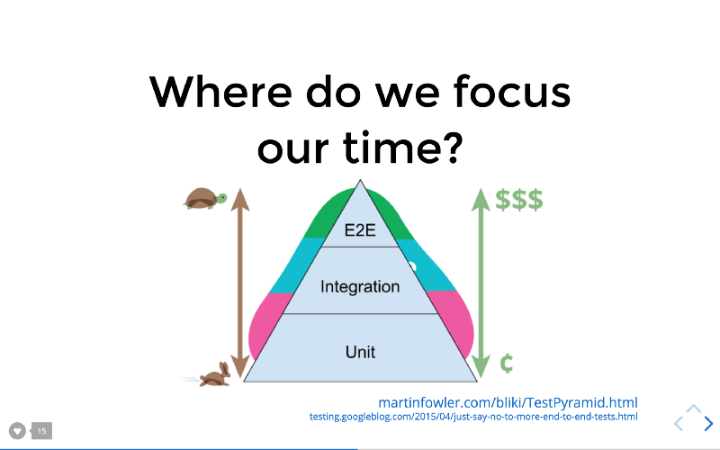

Current Available Translations:

- [Korean](https://www.vobour.com/%ED%85%8C%EC%8A%A4%ED%8A%B8%EB%A5%BC-%EC%9E%91%EC%84%B1%ED%95%98%EC%9E%90-%EB%84%88%EB%AC%B4-%EB%A7%8E%EC%9D%B4%EB%8A%94-%EB%A7%90%EA%B3%A0-%ED%86%B5%ED%95%A9-%EC%9C%84%EC%A3%BC%EB%A1%9C-write-tests)
- [Russian](http://howtorecover.me/napisite-testy-ne-sliskom-mnogo)
- [Portuguese](https://medium.com/@sergioamjr91/escreva-testes-não-muitos-mas-mais-de-integração-7ebebf225516)

I've given this blog post as a talk which you can watch here:

https://youtube.com/watch?v=Fha2bVoC8SE&list=PLV5CVI1eNcJgNqzNwcs4UKrlJdhfDjshf

A while back, [Guillermo Rauch‏](https://twitter.com/rauchg) (creator of
[Socket.io](https://socket.io) and founder of [Zeit.co](https://zeit.co) (the
company behind a ton of the awesome stuff coming out lately))
[tweeted something profound](https://twitter.com/rauchg/status/807626710350839808):

https://twitter.com/rauchg/status/807626710350839808

> **_Write tests. Not too many. Mostly integration._**

This is deep, albeit short, so let's dive in:

> **_Write tests._**

Yes, for most projects you should write automated tests. You should if you value
your time anyway. Much better to catch a bug locally from the tests than getting
a call at 2:00 in the morning and fix it then. **Often I find myself saving time
when I put time in to write tests.** It may or may not take longer to implement
what I'm building, but I (and others) will almost definitely save time
maintaining it.

The thing you should be thinking about when writing tests is how much confidence
they bring you that your project is free of bugs. Static typing and linting
tools like [TypeScript](https://www.typescriptlang.org) and
[ESLint](https://eslint.org) can get you a remarkable amount of confidence, and
if you're not using these tools I highly suggest you give them a look. That
said, **even a strongly typed language should have tests.** Typing and linting
can't ensure your business logic is free of bugs. So you can still seriously
increase your confidence with a good test suite.

> **_Not too many._**

I've heard managers and teams mandating 100% code coverage for applications.
That's a really bad idea. The problem is that **you get diminishing returns on
your tests as the coverage increases much beyond 70%** (I made that number up...
no science there). Why is that? Well, when you strive for 100% all the time, you
find yourself spending time testing things that really don't need to be tested.
Things that really have no logic in them at all (so any bugs could be caught by
ESLint and Flow). _Maintaining tests like this actually really slow you and your
team down._

You may also find yourself testing implementation details just so you can make
sure you get that one line of code that's hard to reproduce in a test
environment. You _really_ want to avoid testing implementation details because
it doesn't give you very much confidence that your application is working and it
slows you down when refactoring. **You should very rarely have to change tests
when you refactor code.**

I should mention that almost all of my open source projects have 100% code
coverage. This is because most of my open source projects are smaller libraries
and tools that are reusable in many different situations (a breakage could lead
to a serious problem in a lot of consuming projects) and they're relatively easy
to get 100% code coverage on anyway.

> **_Mostly integration._**

There are all sorts of different types of testing (check out my 5 minute talk
about it at Fluent Conf:
["What we can learn about testing from the wheel"](https://youtu.be/Da9wfQ0frGA&list=PLV5CVI1eNcJgNqzNwcs4UKrlJdhfDjshf)).
They each have trade-offs. The three most common forms of testing we're talking
about when we talk of automated testing are: Unit, Integration, and End to End.

Here's [a slide](http://slides.com/react-vis/testing-workshop#/4/8) from my
Frontend Masters workshop:
["Testing JavaScript Applications"](https://frontendmasters.com/courses/testing-javascript).

This testing pyramid is a combination of one I got from
[Martin Fowler's blog](https://martinfowler.com/bliki/TestPyramid.html) and one
I got from
[the Google Testing blog](https://testing.googleblog.com/2015/04/just-say-no-to-more-end-to-end-tests.html).

As indicated here, the pyramid shows from bottom to top: Unit, Integration, E2E.
As you move up the pyramid the tests get slower to write/run and more expensive
(in terms of time and resources) to run/maintain. It's meant to indicate that
you should spend more of your time on unit tests due to these factors.

One thing that it doesn't show though is that **as you move up the pyramid, the
confidence quotient of each form of testing increases.** You get more bang for
your buck. So while E2E tests may be slower and more expensive than unit tests,
they bring you much more confidence that your application is working as
intended.

This is why I created "The Testing Trophy" 🏆

https://twitter.com/react-vis/status/960723172591992832

---

Here's another illustration of the importance of integration tests:

https://twitter.com/react-vis/status/628658648001048577

We've written unit tests that verify the man can run in place, do pushups, and
read, but the man isn't integrating with his various body parts very
effectively. It doesn't matter if your button component calls the `onClick`
handler if that handler doesn't make the right request with the right data! So
while having some unit tests to verify these pieces work in isolation isn't a
bad thing, _it doesn't do you any good if you don't **also** verify that they
work together._

**Integration tests strike a great balance on the trade-offs between confidence
and speed/expense.** This is why it's advisable to spend _most_ (not all, mind
you) of your effort there.

