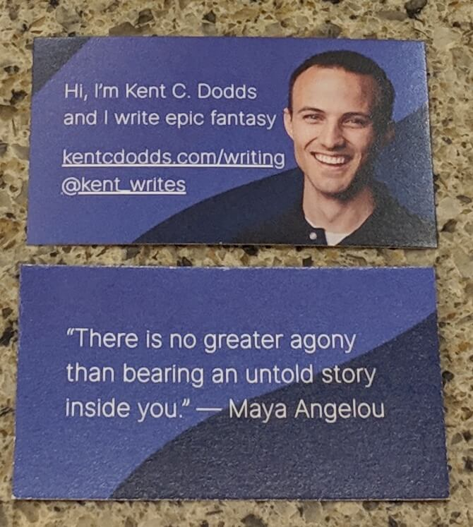

Biggest feeling right now: Excitement. Tomorrow I'm attending the workshop day
of [LTUE](https://ltue.net). LTUE is short for "Life, the Universe and
Everything" and is a refernce to
[a novel of the same name](https://www.amazon.com/Universe-Everything-Hitchhikers-Guide-Galaxy/dp/0345391829/ref=pd_sbs_14_3?_encoding=UTF8&pd_rd_i=0345391829&pd_rd_r=94d0d53c-2f4a-11e9-a873-cb4fd7a22e28&pd_rd_w=b3MiU&pd_rd_wg=HNusk&pf_rd_p=588939de-d3f8-42f1-a3d8-d556eae5797d&pf_rd_r=H24Z8FTM8AFD29CAC35W&psc=1&refRID=H24Z8FTM8AFD29CAC35W)
by [Douglas Adams](https://en.wikipedia.org/wiki/Douglas_Adams)
([see also](https://www.google.com/search?q=what+is+the+answer+to+life+the+universe+and+everything)).

I've really gotten into this whole writing thing and now I'm spending real money
on improving my skills as a writer. I really feel like it's a skill that I _can_
and _want_ to develop. Just like in my journey with coding, I want to be the
best that I possibly can be.

So tomorrow I'm going to the workshop day. I'll be workshopping with
[David Farland](https://twitter.com/davidfarland).

https://twitter.com/kent_writes/status/1095488815601352704

I've heard really great things about his workshops from people in
[LDS Beta Readers](https://www.facebook.com/groups/475461645922698) on facebook,
so I'm eager to see what it's like. The workshop is titled "Master Plotting with
David Farland." Here's the description of the workshop:

> In David Farland's Amazon #1 best-selling writing book MILLION DOLLAR
> OUTLINES, Dave teaches how to outline a major novel, one that has the capacity
> to become a bestseller in its genre. In this course, Dave will be teaching
> advanced techniques to overcoming some of the challenges to plotting. His
> techniques will incorporate those found in Million Dollar Outlines (which will
> be provided to each student electronically before the class), and the workshop
> will also bring in other techniques, including the Snowflake method, the
> Hollywood Method, the 3, 2, 1 method, and others. The goal here is to show you
> how to plot even the most complex novels with greater ease and effort. This
> workshop will be from 9 am to 5 pm on Wednesday February 13th at the Provo
> Marriott Hotel and Conference Center.

I've adopted the
[Story Grid 15 Most Important Scenes](https://storygrid.com/15-most-important-scenes)
as my primary method for outlining my novel and I've been really happy with it.
I'm excited to see what I can learn from David in this workshop.

The following three days are conference days. I've found it's interesting that
this conference is _very_ "panel-heavy." Conferences that I attend and speak at
in the software community are much more focused on talks by one speaker
(sometimes two or three), so this is going to be an interesting change for me.

I'm eager to try to meet as many people as possible. I
[read this blogpost](https://mormonmommywriters.blogspot.com/2013/10/writing-conference-dos-and-donts-and.html)
from a fellow writer who wrote about her experience at this conference for her
first time last year and learned a few really helpful things. I've been to many
conferences in my life, but the writing community is new for me so I want to
make sure that I do things correctly. One thing that I learned from that blog
post is that business cards are pretty important in the writing community so I
got 500 of these printed:

I think they turned out great and I'm excited to hand them out to folks that I
meet and make connections with people at the conference. I'm especially eager to
meet some of the people I've been learning from all these months as I've started
writing. Definitely some people in the LDS Beta Readers community on facebook,
but I'm mostly excited about meeting people who host the
[Writing Excuses](https://writingexcuses.com) podcast:

https://twitter.com/kent_writes/status/1094256956657721345

So we'll see how things go! I'll definitely be taking notes and plan to share
the things that I learn as I go. Wish me luck!

_This is multi-part of a series of posts about LTUE 2019:_

- [Read Part 0 (that's this post)](./first-conference-part-0)
- [Read Part 1](./first-conference-part-1)
- [Read Part 2](./first-conference-part-2)
- [Read Part 3](./first-conference-part-3)
- [Read Part 4](./first-conference-part-4)
