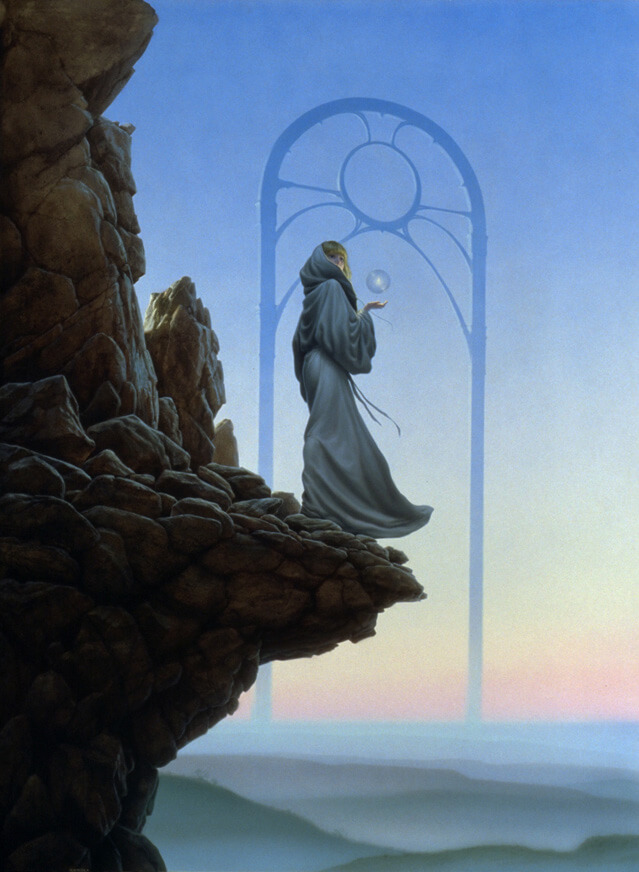

The final day at LTUE was especially enjoyable because Brandon Sanderson joined
us for a few panels. He's my major source of inspiration for my own writing and
this was my first opportunity to see, hear, and talk with him in person. So
while I've always been one to sit front and center, I made extra sure I could do
that for his sessions (and lots of other people did as well).

## The Beginner's Guide to Self-Editing

_Kelsy Thompson_

> You've finished your first draft. Congratulations! Now it's time to tap off
> your writer's cap and look at your novel with an editor's eye. This
> presentation will show you how to shape that fresh draft into the manuscript
> you want to share with the world.

This was a two hour session that had a lot of great tips and advice. Most of it
was reinforcement of things that I knew already, but much of it was really
helpful. There were some really practical pieces of advice and suggestions. Here
are some of the bits of advice from my notes:

- Challenge: Write down a one-sentence summary of each scene in your book.
- Avoid character names that are spelled/sound similar
- To fix too slow pacing: use foreshadowing and tension as well as dialogue.
- To fix too fast pacing: take in the senses, engage with the character
  emotionally, add details, add internal dialog.
- Don't tell readers how to feel or what to think or decide morals for the
  reader.
- Avoid "Hedging phrases": "frowned slightly" or "almost laughed" they undermine
  what you're trying to do.
- Use active voice. "was" and "were" words are passive. Put the subject first in
  the sentence.
- Use tone to differentiate POV characters.

Also:

https://twitter.com/kent_writes/status/1096813649870565376

## Kelly Barnhill Keynote

_Kelly Barnhill_

One of my favorite parts of Kelly's keynote was when she said this:

https://twitter.com/kent_writes/status/1096833522889764865

Writing is totally hard. But it's so rewarding and well worth all the effort.

Kelly told a few stories from her life. She saw ghosts and had some supernatural
experiences that influenced her and inspired her in the writing of her
fairy-tale stories.

I really appreciated Kelly's positivity and energy throughout the conference.
She was a wonderfully approachable author and I enjoyed chatting with her about
writing craft.

## Settings with Consequences

_McKelle George (M), L. E. Modesitt Jr., Maxwell Alexander Drake, Megan Lloyd,
Stacy Whitman, Brandon Sanderson_

> The setting is more than just window dressing. In some books like Dune and The
> Dispossessed, the setting is almost another character. How to weave the
> setting into your story.

https://twitter.com/kent_writes/status/1096848422932381696

This was the first session with Brandon as a member of the panel and I really
enjoyed it. I haven't read books by the other authors on the panel, but I know
that Brandon has incredible settings that really make his books come alive.

There was a part of the conversation that went to how much of the world do you
tell to the reader about and when do you tell them. The advice given was that
often it's useful to start with the character and share what matters to them as
it matters to them. I think an exception to this is when you need to foreshadow
something. But even that is not really an exception but really you just make
that thing important to the character at an earlier part in the book and you get
natural foreshadowing.

In Shurlan, there's a part of the magic system that the characters don't know
about and I want to reveal later. I don't want to make it feel contrived and
like I was getting bored with my magic system and decided to add something later
on, so I asked the panel what they do about something like that and Brandon
Sanderson said that he likes to treat magic systems like regular science works
in our world. We know there are things we don't know, but we're confident in
things we think we know. Then we regularly find that what we thought we knew
isn't quite accurate. So long as this comes across in the writing of your magic
system, then new discoveries don't feel contrived (especially if it's properly
foreshadowed).

At the end, I got right up and took my opportunity to get a signature from the
author that serves as my biggest inspiration in the world.

https://twitter.com/kent_writes/status/1096862975103651840

## The Spark That Lit the Fire: Major Influences on Major Authors

_Stephen L. Gashler (M), Aaron Johnston, Charlie N. Holmberg, M. Todd
Gallowglas, Mary Robinette Kowal, Brandon Sanderson_

> Many major authors get their inspiration from somewhere. Learn about the major
> works that gave these panelists and other published authors the vision and
> drive to explore new worlds.

https://twitter.com/kent_writes/status/1096862309660614656

I enjoyed this session. There were a few things that were helpful about where
authors derive inspiration. Sounded like children were a great source of
inspiration and ideas for these authors. It was fun to hear about the heroes of
heroes.

Brandon Sanderson told a story about when he was in the 8th grade. He wasn't
much of a reader, but his teacher recommended he read Dragonsbane by Barbara
Hambly. He went to the library and looked up books around the same title
(alphabetically) and luckily found two more "Dragon" books which continued to
capture his interest. Interestingly, they all had covers illustrated by
[Michael Whelan](https://www.michaelwhelan.com) and he decided to read more
books with covers illustrated by Michael. He even got his parents to buy him a
\$60 art book from Michael that had some book covers and other fine art. One
such creation was this work titled "Passage: Verge" which served as inspiration
for the seons in Elantris:

## Writing Excuses

_Dan Wells, Howard Tayler, Mary Robinette Kowal, Brandon Sanderson, Kelly
Barnhill, Natasha Ence, Jared Quan, Rosalyn Eves_

> Come listen to a live recording of writing's fab four: Brandon Sanderson, Dan
> Wells, Howard Tayler, and Mary Robinette Kowal.

https://twitter.com/kent_writes/status/1096899791420682240

I decided I wanted to write a novel in August 2018, just a few months ago. Since
then, I've listened to countless hours of the Writing Excuses podcast. So I was
really looking forward to seeing a live recording of four episodes of the
podcast.

I enjoyed the conversations and when the episodes are published you will as
well, but I want to mention one thing that was really impactful to me.

Dan Wells son and daughter were helping move the single microphone around the
panelists. Dan's son was helping in the middle of a recording and got up and
silently switched with his sister, then walked out of the room. Dan watched him
go with his brow furrowed, then (still during show) took off his recording
microphone and walked out to go check on him. What is impactful to me is I think
if I had been in that same situation I probably would have waited to check on my
son after the recording. I was impressed that Dan would stop what was pretty
important to go check on his son who is ultimately important. I still have a lot
to learn.

I had an awesome time at the conference. I learned a lot and I'm glad that I had
the opportunity to attend and meet so many awesome individuals. Especially my
personal writing inspiration, Brandon Sanderson:

https://twitter.com/kent_writes/status/1096918174581157888

_This is multi-part of a series of posts about LTUE 2019:_

- [Read Part 0](./first-conference-part-0)
- [Read Part 1](./first-conference-part-1)
- [Read Part 2](./first-conference-part-2)
- [Read Part 3](./first-conference-part-3)
- [Read Part 4 (that's this post)](./first-conference-part-4)
